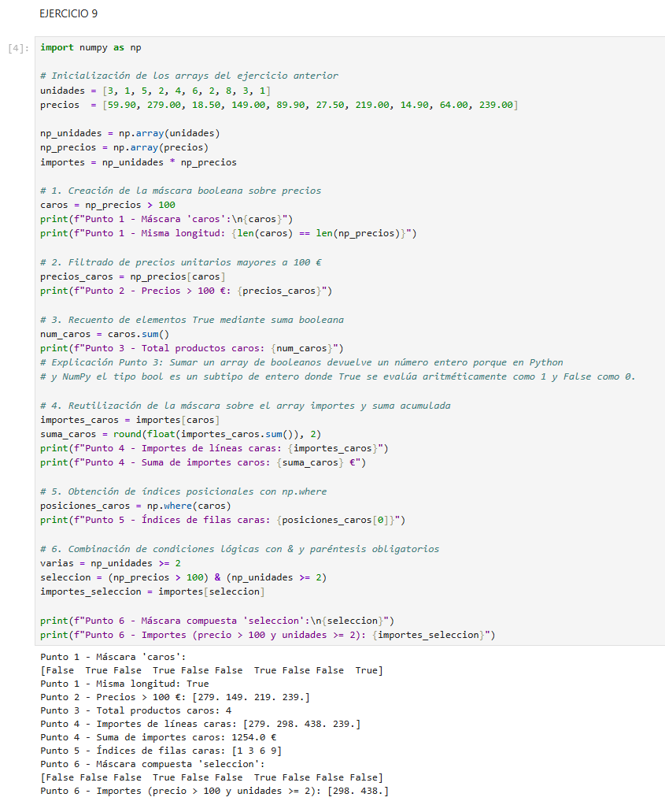
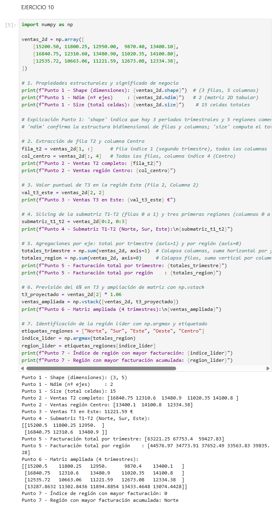
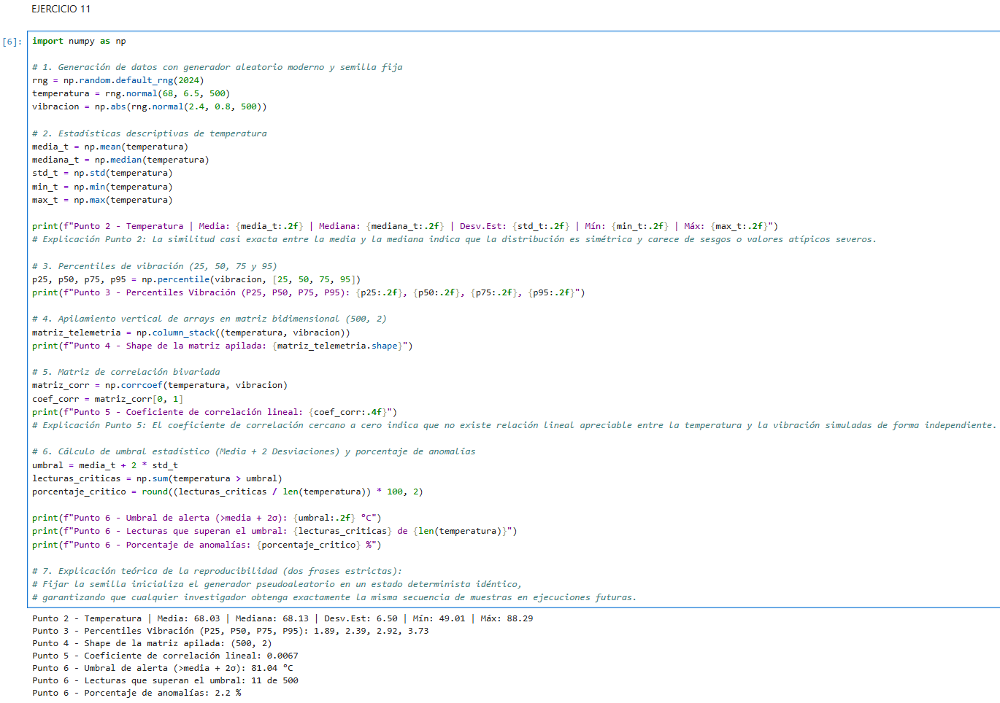
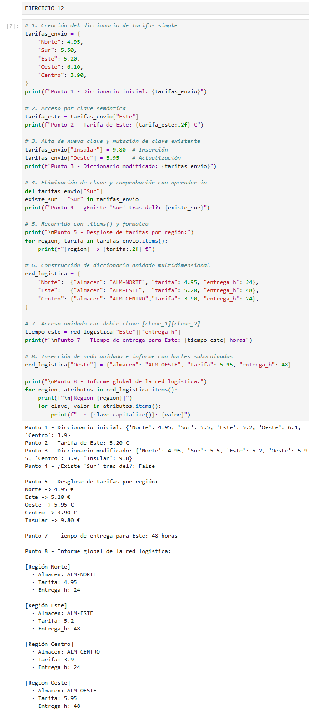
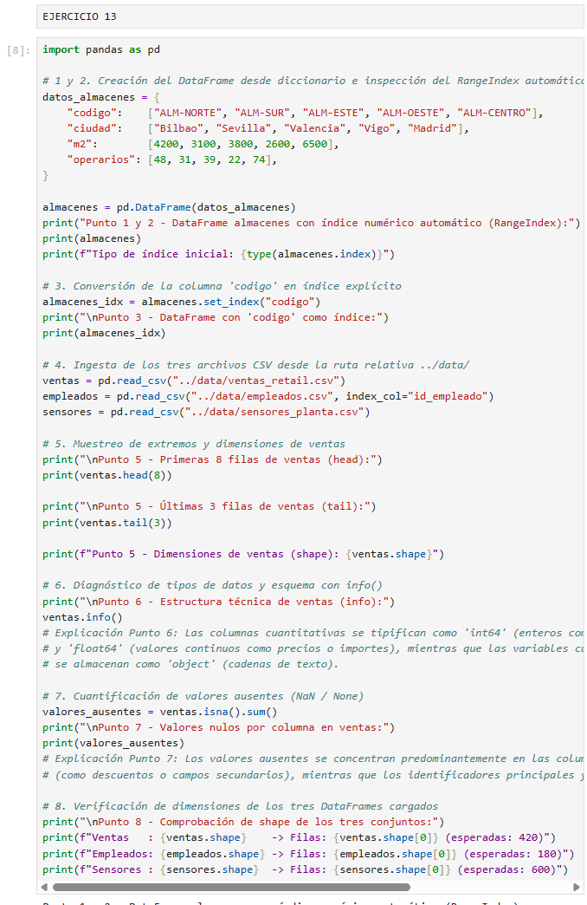
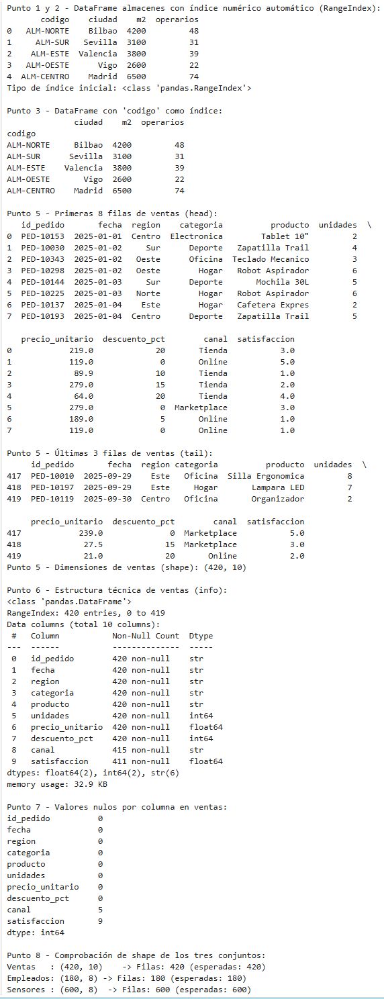
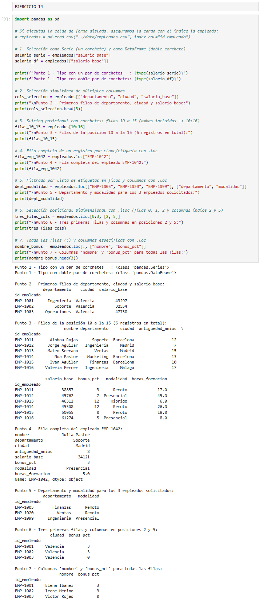
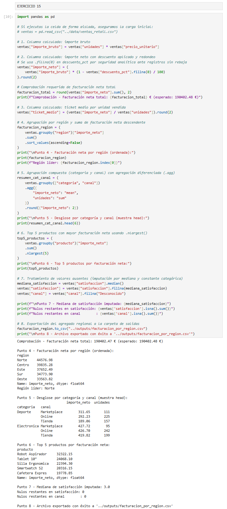
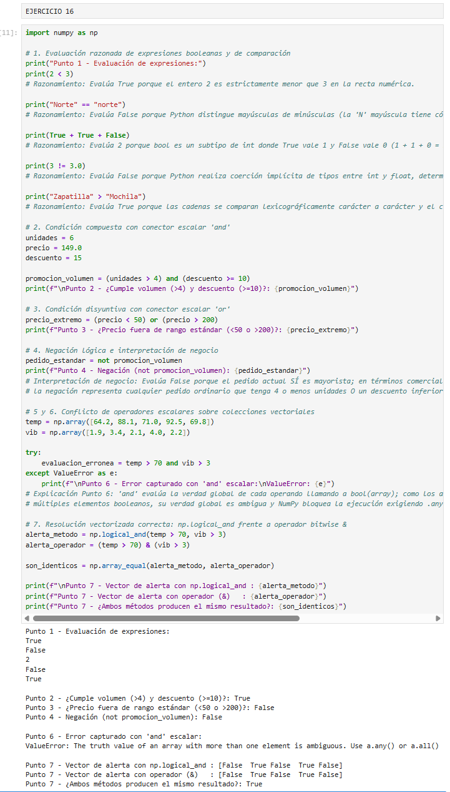
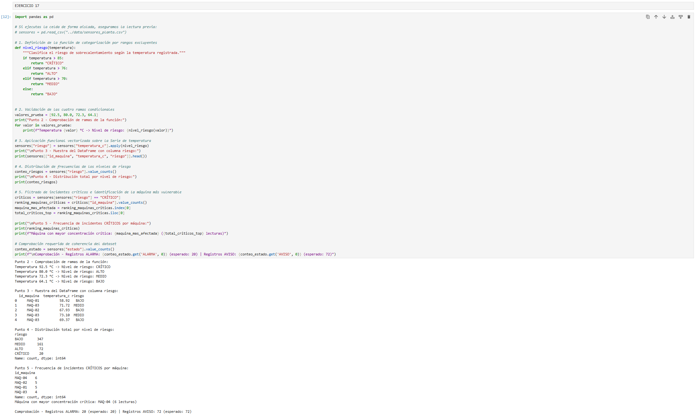

# Python — Data Science & Scripting — Chuleta de examen

> **Cómo usar esto en el examen:** 1) busca la técnica que necesitas en la matriz de abajo → 2) salta a la chuleta rápida o al ejercicio correspondiente → 3) mira el enunciado y adapta el patrón al problema de tu examen. No lo leas de arriba a abajo, úsalo como diccionario de rescate.

---

# 1. Matrices de referencia por tipo de técnica

Divididas en subíndices — busca primero el bloque (Listas, Pandas, Numpy...) y luego la fila.

### 1.1 Variables, Tipos y Listas
| Técnica | Para qué sirve | Resuelta en |
|---|---|---|
| Slicing con paso (`[::paso]`) | Desdoblar listas planas intercaladas (pares/impares) | Ejercicio 1 |
| Búsqueda dinámica (`.index()`, `[-n:]`) | Localizar posiciones sin hardcodear índices y extraer colas | Ejercicio 1, 4 |
| Copias vs referencias (`.copy()`, `[:]`) | Duplicar listas sin mutar la original por asignación de puntero | Ejercicio 2, 3 |
| Ordenación (`sort` vs `sorted`) | Modificar la lista en sitio vs crear una lista nueva ordenada | Ejercicio 4 |

### 1.2 Funciones, Métodos y Paquetes
| Técnica | Para qué sirve | Resuelta en |
|---|---|---|
| Funciones (`def`, `return`) | Empaquetar lógica, asignar valores por defecto y devolver tuplas | Ejercicio 5 |
| Métodos de string (`.strip()`, `.upper()`) | Limpiar texto, normalizar mayúsculas y desglosar códigos SKU | Ejercicio 6 |
| Módulos y `sys.path` | Crear e importar funciones de soporte desde un script externo | Ejercicio 7 |

### 1.3 NumPy y Álgebra Vectorial
| Técnica | Para qué sirve | Resuelta en |
|---|---|---|
| Arrays y Vectorización | Operaciones elemento a elemento a nivel de C sin bucles `for` | Ejercicio 8 |
| Máscaras booleanas | Filtrar arrays completos mediante condiciones lógicas directas | Ejercicio 9 |
| Matrices 2D y `axis` | Agrupaciones marginales por fila/columna y expansión con `.vstack()` | Ejercicio 10 |
| Semillas y Estadística | `random.seed()`, correlaciones, medias y detección de *outliers* | Ejercicio 11 |

### 1.4 Diccionarios y Pandas (Estructuras)
| Técnica | Para qué sirve | Resuelta en |
|---|---|---|
| Diccionarios anidados | Modelar configuraciones jerárquicas con clave-valor (ej. tarifas) | Ejercicio 12 |
| Creación de DataFrame | Convertir diccionarios a tablas y asignar identificadores como índice | Ejercicio 13 |
| Selección por etiqueta (`.loc`) | Seleccionar filas y columnas por su nombre o ID (incluye extremos) | Ejercicio 14 |
| Selección por posición (`.iloc`) | Extraer subconjuntos por índice entero posicional (excluye extremo) | Ejercicio 14 |

### 1.5 Lógica, Control de Flujo y Filtrado
| Técnica | Para qué sirve | Resuelta en |
|---|---|---|
| Operadores de comparación | `>`, `<`, `==`, `!=` y evaluación booleana estructurada | Ejercicio 16 |
| Estructuras condicionales | `if`, `elif`, `else` para bifurcación de lógica de negocio | Ejercicio 17 |
| Transformación `.apply()` | Ejecutar funciones custom fila a fila sobre un DataFrame | Ejercicio 17, 20 |
| Filtrado Múltiple (`&`, `|`, `~`) | Filtros complejos en Pandas (exigen usar paréntesis por bloque) | Ejercicio 18 |
| Filtrado con `.query()` | Expresar filtros mediante cadenas legibles en contexto del DF | Ejercicio 18 |

### 1.6 Bucles e Iteración
| Técnica | Para qué sirve | Resuelta en |
|---|---|---|
| Bucle `while` | Repetir ejecución hasta que se cumpla una condición de corte | Ejercicio 19 |
| Desempaquetado e `.items()` | Recorrer diccionarios o tuplas extrayendo clave y valor a la vez | Ejercicio 19 |
| Recorrido con `.iterrows()` | Iterar filas de un DataFrame accediendo por nombre de columna | Ejercicio 20 |
| Columnas calculadas directas | Crear métricas vectorizadas sin usar bucles (mucho más rápido) | Ejercicio 15, 20 |

---

# 2. Chuleta de sintaxis rápida (Estilo DataCamp)

## 2.1 Python Basics: Variables, Strings y Tipos
```python
# Actualización de variables (Updating variables)
ahorros = 100
ahorros = ahorros * 1.10   # Reasignación
ahorros += 50              # Atajo (Suma y asigna)

# Tipos de datos comunes y verificación (Checking data types)
type(3.14)      # float
type(True)      # bool
type("hola")    # str

# Strings multilínea y modificación
texto_largo = """Primera línea
Segunda línea"""
texto = "hola"
# texto[0] = "H"  # ERROR: los strings son INMUTABLES
nuevo_texto = "H" + texto[1:]  # Creación de nuevo string: "Hola"
```

---

## 2.2 Listas: Construcción, Subsetting y Manipulación

```python
# Creación y Subsetting (Subsetting lists)
x = ["a", "b", "c", "d", "e"]
x[0]       # "a" (Primer elemento)
x[-1]      # "e" (Último elemento)
x[1:4]     # ["b", "c", "d"] (Slicing: excluye el extremo derecho)
x[:3]      # ["a", "b", "c"] (Desde el principio hasta índice 2)
x[2:]      # ["c", "d", "e"] (Desde índice 2 hasta el final)
x[::-1]    # Invertir lista
x[0::2]    # Slicing con paso 2 (elementos pares)

# Listas de listas (List of lists)
matriz = [[1, 2], [3, 4]]
matriz[1][0]  # Acceso anidado: fila 1 (segunda), columna 0 -> devuelve 3

# Manipulación de elementos (Manipulating Lists)
x[1] = "z"          # Reemplaza un elemento: ["a", "z", "c", "d", "e"]
x[0:2] = ["x", "y"] # Reemplazo múltiple por slicing

x.append("f")       # Añade "f" al final (NO devuelve nueva lista, altera en sitio)
x.extend(["g","h"]) # Añade varios elementos al final
x.insert(0, "w")    # Inserta "w" en la posición 0 desplazando el resto

del x[0]            # Delete list elements (Borra por índice)
item = x.pop()      # Extrae y borra el último elemento

# Inner workings (Referencias vs Copias)
y = x               # ADVERTENCIA: Copia el puntero. Si cambias 'y', cambias 'x'.
y_segura = list(x)  # Copia real en memoria
y_segura = x[:]     # Copia real mediante slicing
```

---

## 2.3 Diccionarios: Creación y Acceso 

```python
# Construcción y acceso (Building a dictionary)
poblacion = {"madrid": 3.2, "bcn": 1.6}
poblacion["madrid"]       # Acceso al valor: 3.2
poblacion.get("sevilla", 0) # Devuelve 0 si la clave no existe

# Manipulación (Dictionary Manipulation)
poblacion["valencia"] = 0.8  # Añade nueva clave-valor
poblacion["madrid"] = 3.3    # Actualiza el valor existente
del poblacion["bcn"]         # Elimina la clave

# Dictionariception (Diccionarios dentro de diccionarios)
red = {"ES": {"capital": "madrid", "pob": 47}}
red["ES"]["pob"]             # Acceso anidado -> 47
```

---

## 2.4 NumPy: Arrays 1D/2D, Subsetting, Aritmética y Estadística

```python
import numpy as np

# 1. Your First NumPy Array (Creación)
np_peso = np.array([65, 72, 80])
np_altura = np.array([1.7, 1.8, 1.9])

# 2. Subsetting NumPy Arrays (Filtrado con máscaras booleanas)
es_alto = np_altura > 1.75          # Crea array de booleanos: [False, True, True]
altos = np_altura[es_alto]          # Filtra y devuelve solo los que son True
# Forma rápida: np_altura[np_altura > 1.75]

# 3. 2D NumPy Arrays (Matrices de filas y columnas)
np_2d = np.array([[1, 2, 3], 
                  [4, 5, 6]])
np_2d.shape                         # Devuelve (2, 3): 2 filas y 3 columnas

# 4. Subsetting 2D NumPy Arrays (Extrayendo datos de matrices)
# Sintaxis siempre es: array[fila, columna]
np_2d[0, 2]                         # Fila 0, columna 2 -> devuelve el 3
np_2d[:, 1:3]                       # Todas las filas (:), columnas 1 y 2 (excluye la 3)
np_2d[1, :]                         # Toda la fila 1 (la segunda fila completa)

# 5. 2D Arithmetic (Matemáticas directas sin bucles for)
np_2d * 2                           # Multiplica TODOS los elementos por 2 al instante
np_peso / np_altura ** 2            # Calcula el IMC cruzando dos arrays de golpe

# 6. NumPy: Basic Statistics (Average versus median)
np.mean(np_peso)                    # Media aritmética (Cuidado: muy afectada por valores atípicos/outliers)
np.median(np_peso)                  # Mediana (Valor central, mucho más seguro si hay outliers)
np.std(np_peso)                     # Desviación típica (Cuánto varían los datos de la media)
np.corrcoef(np_peso, np_altura)     # Matriz de correlación (Relación matemática entre dos arrays)
np.sum(np_2d, axis=0)               # axis=0 -> Suma verticalmente (colapsa por columnas)
np.sum(np_2d, axis=1)               # axis=1 -> Suma horizontalmente (colapsa por filas)
```

## 2.5 Lógica, Control de Flujo y Bucles
```python
# 1. Comparison Operators (Operadores de comparación básicos)
x = 10
x == 5   # ¿Es igual a 5? -> False
x != 5   # ¿Es distinto de 5? -> True
x >= 5   # ¿Mayor o igual? -> True

# 2. Boolean Operators (and, or, not) -> PARA VARIABLES SUELTAS
(x > 5) and (x < 15)  # True (Se cumplen AMBAS condiciones)
(x == 1) or (x == 10) # True (Se cumple UNA de las dos)
not (x == 5)          # True (Invierte el resultado, x no es 5)

# 3. Boolean operators with NumPy/Pandas (OBLIGATORIO: &, |, ~ y usar paréntesis)
# Usar 'and', 'or', 'not' dará ERROR con arrays y DataFrames.
mascara = (np_peso > 70) & (np_altura < 1.9) # AND matricial (Ambas)
invertida = ~(np_peso > 70)                  # NOT matricial (Invierte)

# 4. If, elif, else (Rutas de decisión)
if x > 10:
    print("Alto")       # Si es mayor a 10
elif x > 5:
    print("Medio")      # Si NO es mayor a 10, pero SÍ es mayor a 5
else:
    print("Bajo")       # Si NO se cumple absolutamente NINGUNA de las anteriores

# 5. While loops (Bucle condicional)
stock = 0
while stock < 10:
    stock += 2          # Aumenta de 2 en 2 en cada vuelta
    if stock == 8:
        break           # 'break' detiene el bucle forzosamente, sin llegar a 10

# 6. For loops (Bucles sobre listas y estructuras)
# Looping through a list (Elemento a elemento)
for item in ["a", "b", "c"]:
    print(item)

# Indexes and values (enumerate) -> Saca el índice numérico y el valor a la vez
for idx, val in enumerate(["a", "b", "c"]):
    print(f"En la posición {idx} está la letra {val}")

# Loop over list of lists (Desempaquetando variables)
inventario = [["Mesa", 10], ["Silla", 20]]
for producto, cantidad in inventario:
    print(f"Tenemos {cantidad} unidades de {producto}")
```

---

## 2.6 Pandas: Diccionarios a DF, loc/iloc, Filtrado y .iterrows()

### ¿Qué es Pandas y por qué se utiliza?

**Pandas** es una librería de Python diseñada específicamente para trabajar con **datos tabulares** (el equivalente a manejar una hoja de cálculo tipo Excel o una tabla de base de datos SQL directamente en código). Está construida sobre **NumPy**, pero resuelve las limitaciones que tiene NumPy al procesar datos del mundo real.

---

#### Diferencias clave: NumPy frente a Pandas

| Característica | NumPy (`ndarray`) | Pandas (`DataFrame`) |
| --- | --- | --- |
| **Tipos de datos** | **Homogéneos:** Todo el array debe ser del mismo tipo (`int`, `float`). Si mezclas números con texto, convierte todo a texto (*upcasting*). | **Heterogéneos:** Cada columna tiene su propio tipo (una columna con fechas, otra con texto, otra con números y otra booleana). |
| **Acceso a datos** | Solo por **posición numérica** (`array[0, 2]`), obligando a memorizar qué variable ocupaba cada índice. | Por **etiqueta/nombre de columna** (`df['precio']`) o identificador de fila (`df.loc['ID_101', 'cliente']`). |
| **Valores ausentes** | Limitado; operar con `np.nan` suele propagar errores matemáticos en los cálculos. | Métodos nativos integrados para detectar, rellenar o descartar nulos (`isna()`, `fillna()`, `dropna()`). |
| **Propósito** | Operaciones numéricas y álgebra matricial pura de alta velocidad. | Limpieza, filtrado, transformación, cruce y análisis de tablas de datos. |

---

### Las 2 estructuras principales

* **`Series` (1D):** Representa una columna individual de datos. Funciona de manera similar a un array unidimensional de NumPy, pero cuenta con un índice explícito de etiquetas asociado a cada fila.
* **`DataFrame` (2D):** Representa la tabla completa en filas y columnas. Se puede entender conceptualmente como un diccionario donde cada clave es el nombre de la columna y cada valor es una `Series`.

---

### Casos de uso habituales

* **Carga y exportación de archivos:** Permite leer y guardar datos en múltiples formatos con una sola línea de código (`pd.read_csv()`, `pd.read_excel()`, `pd.read_sql()`).
* **Filtrado condicional:** Permite realizar selecciones sobre filas aplicando condiciones lógicas:
```python
df[(df['edad'] >= 18) & (df['ciudad'] == 'Madrid')]

```

* **Agrupación y agregación (`GROUP BY`):** Cuenta con el método `.groupby()` para resumir indicadores por categorías:
```python
df.groupby('categoria')['ventas'].sum()

```

* **Cruce de tablas (`JOIN` / `MERGE`):** Combina DataFrames a través de identificadores comunes mediante `pd.merge()`.
* **Columnas calculadas vectorizadas:** Ejecuta transformaciones elemento a elemento de forma directa sin usar bucles `for`:
```python
df['importe_total'] = df['unidades'] * df['precio_unitario']

```

---

### Sintaxis Rápida de Pandas

```python
import pandas as pd

# 1. Dictionary to DataFrame (Convertir diccionario en tabla)
datos = {"ciudad": ["Madrid", "Barcelona"], "ventas": [10, 20]}
df = pd.DataFrame(datos)            
df.index = ["M", "B"]               # Modifica el nombre/etiqueta de las filas

# 2. CSV to DataFrame (Lectura de archivos)
# index_col=0 fuerza a que la primera columna del CSV sea la etiqueta de las filas
df = pd.read_csv("datos.csv", index_col=0) 

# 3. Square Brackets (Extracción de columnas)
df["ventas"]                        # Devuelve una Serie 1D (una columna aislada)
df[["ciudad", "ventas"]]            # Devuelve un DataFrame 2D (varias columnas, USAR DOBLE CORCHETE)

# 4. loc and iloc (Selección cruzada de Filas y Columnas)
# .loc (Por ETIQUETA / Nombre real) -> ¡El extremo final ESTÁ INCLUIDO!
df.loc["M"]                         # Fila completa etiquetada como "M"
df.loc[:, "ventas"]                 # Todas las filas (:), solo de la columna "ventas"
df.loc["M":"B", ["ciudad"]]         # Rango desde la fila "M" hasta "B" (ambas incluidas)

# .iloc (Por POSICIÓN NUMÉRICA / Como una lista normal) -> ¡El extremo final está EXCLUIDO!
df.iloc[0:2, 1]                     # Saca filas 0 y 1 (el 2 se ignora), columna índice 1

# 5. Filtering pandas DataFrames (Filtros lógicos)
filtro_simple = df[df["ventas"] > 15]
# OBLIGATORIO: Paréntesis alrededor de cada condición y usar & / |
filtro_multiple = df[(df["ventas"] > 10) & (df["ciudad"] == "Madrid")] 

# 6. Add column (Crear derivadas)
# Pandas operará sobre toda la columna a la vez de forma matemática
df["total_iva"] = df["ventas"] * 1.21   

# 7. Loop over DataFrame (Iterrows)
# Recorre el DataFrame fila a fila (sólo para inspección visual, no para cálculos pesados)
for etiqueta, fila in df.iterrows():
    print(f"Fila {etiqueta}: La ciudad {fila['ciudad']} vendió {fila['ventas']} unidades")

```

---

# 3. Ejercicios Práctica 3

## Sección 1. Listas

### Ejercicio 1 — Catálogo de productos como lista

Una tienda gestiona su catálogo en una lista plana que alterna nombre de producto y precio. Trabaja con esta estructura sin convertirla todavía a diccionario.

```python
catalogo = [
    "Auriculares BT", 59.90,
    "Smartwatch S2", 149.00,
    "Tablet 10", 219.00,
    "Cargador USB-C", 18.50,
    "Cafetera Expres", 189.00,
    "Robot Aspirador", 279.00,
]

```

**Se pide:**
1. Imprime el número total de elementos de la lista y deduce cuántos productos hay.
2. Usando *slicing con paso*, crea `nombres` con todos los nombres y `precios` con todos los precios.
3. Obtén el precio del `"Robot Aspirador"` **sin escribir el índice a mano**: localiza su posición con `.index()` y usa esa posición para llegar al precio.
4. Crea `ultimos_tres_nombres` con los tres últimos productos usando índices negativos.
5. Calcula e imprime el precio medio del catálogo redondeado a dos decimales, usando únicamente `sum()`, `len()` y `round()`.

**Comprobación:** `nombres` debe tener 6 elementos y `precios` debe sumar 914,40.

> **Pista:** `lista[inicio:fin:paso]`. Con paso 2 desde el índice 0 obtienes las posiciones pares, desde el índice 1 las impares.
> 
> 

* **Técnicas:** `len()`, división entera `//`, *slicing* con paso `[inicio:fin:paso]`, `.index()`, índices negativos `[-n:]`, `sum()`, `round()`.

**SOLUCIÓN:**
```python
catalogo = [
    "Auriculares BT", 59.90,
    "Smartwatch S2", 149.00,
    "Tablet 10", 219.00,
    "Cargador USB-C", 18.50,
    "Cafetera Expres", 189.00,
    "Robot Aspirador", 279.00,
]

# 1. Total de elementos y deducción del número de productos
total_elementos = len(catalogo)
num_productos = total_elementos // 2
print(f"Total elementos en la lista: {total_elementos}")
print(f"Número de productos: {num_productos}")

# 2. Desdoble mediante slicing con paso
nombres = catalogo[0::2]   # Índices pares: 0, 2, 4, 6, 8, 10
precios = catalogo[1::2]   # Índices impares: 1, 3, 5, 7, 9, 11
print(f"Nombres ({len(nombres)}): {nombres}")
print(f"Precios ({len(precios)}): {precios}")

# 3. Localización dinámica del precio del "Robot Aspirador"
pos_robot = nombres.index("Robot Aspirador")
precio_robot = precios[pos_robot]
print(f"Precio del Robot Aspirador (índice {pos_robot}): {precio_robot} €")

# 4. Tres últimos productos con índices negativos
ultimos_tres_nombres = nombres[-3:]
print(f"Últimos tres productos: {ultimos_tres_nombres}")

# 5. Precio medio del catálogo redondeado a dos decimales
precio_medio = round(sum(precios) / len(precios), 2)
print(f"Suma total de precios: {round(sum(precios), 2)} €")
print(f"Precio medio: {precio_medio} €")
```

**Explicación:**
* Calculamos la cantidad total de elementos con `len(catalogo)` y aplicamos división entera `// 2` para deducir el volumen de artículos del catálogo considerando la paridad fija de datos.
* Desdoblamos la lista plana aplicando *slicing* con paso 2: `catalogo[0::2]` extrae los elementos en posiciones pares (nombres) y `catalogo[1::2]` los de posiciones impares (precios).
* Localizamos dinámicamente la posición del artículo con `nombres.index("Robot Aspirador")` e indexamos con ese valor sobre la lista `precios` para obtener su coste sin escribir índices a mano.
* Extraemos la cola del catálogo con la rebanada negativa `nombres[-3:]`, que toma desde el antepenúltimo elemento hasta el final de la colección.
* Obtenemos el precio medio combinando `sum(precios)` entre `len(precios)` y acotando a dos decimales con `round(..., 2)`.
* **Tip (*Slicing* con paso y listas paralelas):** El *slicing* `[inicio:fin:paso]` no modifica la lista original, genera una nueva sublista en memoria y mantiene la correspondencia posicional $1:1$ entre listas homólogas (`nombres[i]` siempre corresponde a `precios[i]`).
* ⚠️ **Trampa técnica:** Intentar localizar el precio sumando 1 al índice original sobre la lista cruda (`catalogo[catalogo.index("Robot Aspirador") + 1]`) fallará si la lista pierde su paridad o se agregan atributos adicionales; desdoblar previamente en dos listas independientes garantiza que las búsquedas mediante `.index()` sean deterministas y seguras.

**Comentario:**
Identifiqué que la alternancia uniforme de nombres y precios permitía desacoplar la estructura plana en dos vectores paralelos mediante *slicing* con paso 2 (`[0::2]` y `[1::2]`), evitando bucles manuales. Para obtener el precio del robot aspirador utilicé `.index()` sobre la lista de nombres para recuperar de forma dinámica su posición ordinal y cruzarla sobre la lista de precios. Empleé índices negativos `[-3:]` para aislar los últimos registros con independencia del tamaño de la lista y calculé la media combinando `sum()`, `len()` y `round(..., 2)`.


--- 

### Ejercicio 2 — Inventario multialmacén con listas anidadas

El inventario de tres almacenes se representa como una lista de listas. Cada sublista sigue el formato `[codigo_almacen, producto, unidades, coste_unitario]`.

```python
inventario = [
    ["ALM-NORTE", "Robot Aspirador", 34, 201.50],
    ["ALM-NORTE", "Monitor 27", 58, 142.00],
    ["ALM-SUR",   "Silla Ergonomica", 12, 178.90],
    ["ALM-SUR",   "Robot Aspirador", 7, 201.50],
    ["ALM-ESTE",  "Cafetera Expres", 41, 131.20],
    ["ALM-ESTE",  "Monitor 27", 25, 142.00],
]

```

**Se pide:**
1. Imprime el nombre del producto de la **cuarta** fila usando doble indexación.
2. Crea una nueva lista `valor_stock` donde cada elemento sea `[producto, unidades * coste_unitario]` redondeado a dos decimales. Resuélvelo con un bucle `for` sobre `inventario`.
3. Calcula el **valor inmovilizado total** del inventario.
4. Extrae, mediante *slicing*, una sublista con solo las filas del `ALM-SUR` (usa el hecho de que están contiguas) y calcula su valor.
5. Explica en una celda Markdown de **dos frases** qué problema aparece si dos almacenes dejan de estar contiguos y por qué el *slicing* no es una estrategia robusta de filtrado.

**Comprobación:** el valor inmovilizado total debe ser 27 573,50 € y el del `ALM-SUR`, 3 557,30 €.
* **Técnicas:** Doble indexación `[fila][columna]`, bucle `for` con `.append()`, `round()`, acumulador con `sum()`, *slicing* de sublistas `[inicio:fin]`.

**SOLUCIÓN:**
```python
inventario = [
    ["ALM-NORTE", "Robot Aspirador", 34, 201.50],
    ["ALM-NORTE", "Monitor 27", 58, 142.00],
    ["ALM-SUR",   "Silla Ergonomica", 12, 178.90],
    ["ALM-SUR",   "Robot Aspirador", 7, 201.50],
    ["ALM-ESTE",  "Cafetera Expres", 41, 131.20],
    ["ALM-ESTE",  "Monitor 27", 25, 142.00],
]

# 1. Nombre del producto de la cuarta fila (índice 3, columna 1)
producto_cuarta_fila = inventario[3][1]
print(f"Producto en la cuarta fila: {producto_cuarta_fila}")

# 2. Construcción de valor_stock con bucle for explícito
valor_stock = []
for fila in inventario:
    producto = fila[1]
    valor_linea = round(fila[2] * fila[3], 2)
    valor_stock.append([producto, valor_linea])

print(f"Valor de stock: {valor_stock}")

# 3. Valor inmovilizado total del inventario
inmovilizado_total = round(sum(item[1] for item in valor_stock), 2)
print(f"Inmovilizado total: {inmovilizado_total} €")

# 4. Extracción de ALM-SUR por slicing continuo y cálculo de su valor
alm_sur = inventario[2:4]  # Filas de índice 2 y 3
inmovilizado_sur = round(sum(fila[2] * fila[3] for fila in alm_sur), 2)
print(f"Sublista ALM-SUR: {alm_sur}")
print(f"Inmovilizado ALM-SUR: {inmovilizado_sur} €")
```

**Explicación:**
* Accedemos a la cuarta fila utilizando el índice posicional base cero `[3]` y a su segundo elemento con `[1]`, obteniendo `'Robot Aspirador'` mediante doble indexación matricial `[fila][columna]`.
* Iteramos con un bucle `for` sobre `inventario` multiplicando unidades (`fila[2]`) por coste unitario (`fila[3]`), aplicando `round(..., 2)` e insertando la nueva sublista con `.append()`.
* Totalizamos el inventario aplicando una expresión generadora dentro de `sum(item[1] for item in valor_stock)`, alcanzando exactamente los 27.573,50 € de la comprobación.
* Acotamos las filas contiguas de `ALM-SUR` mediante el *slicing* `inventario[2:4]`, recordando que el extremo derecho es excluyente (extrae índices 2 y 3) para calcular sus 3.557,30 €.
* **Respuesta teórica al punto 5:** Si los registros de un mismo almacén se dispersan o la lista se reordena por otro criterio, el *slicing* por posiciones fijas extraerá filas de almacenes equivocados al perderse la contigüidad posicional. Por ello, el *slicing* es frágil ante cambios estructurales y no constituye una estrategia de filtrado robusta frente a evaluaciones lógicas basadas en el valor del atributo (como máscaras booleanas o diccionarios).
* **Tip (Doble indexación en listas anidadas):** El primer corchete selecciona la fila completa (la sublista) y el segundo corchete extrae el campo individual deseado.
* ⚠️ **Trampa técnica:** Definir el corte de `ALM-SUR` como `inventario[2:3]` ignorará la segunda fila del almacén debido a la exclusión del límite superior; asimismo, intentar hacer `fila[2] * fila[3]` directamente sobre la lista anidada sin iterar generará un `TypeError` al no soportar multiplicación entre listas.

**Comentario:**
Identifiqué que la estructura bidimensional permitía acceder a registros puntuales combinando índices de fila y columna (`inventario[3][1]`). Recorrí el catálogo con un bucle `for` acumulando el valor monetario de cada referencia mediante `.append()` y totalicé el inmovilizado global aplicando `sum()` sobre los importes redondeados. Aproveché la contigüidad física temporal de `ALM-SUR` para recortar su bloque con `inventario[2:4]`, documentando que el *slicing* posicional carece de robustez como filtro analítico si los datos pierden su ordenación previa.


---

### Ejercicio 3 — Manipulación destructiva y copias de listas

Este ejercicio trabaja el comportamiento interno de las listas (referencias frente a copias).

```python
precios_originales = [59.90, 149.00, 219.00, 18.50, 189.00, 279.00]

```

**Se pide:**
1. Crea `precios_rebajados = precios_originales` y modifica el primer elemento de `precios_rebajados` a `49.90`. Imprime **las dos listas** y explica qué ha ocurrido.
2. Restaura el valor original. Ahora crea dos copias independientes: una con `list()` y otra con *slicing* completo `[:]`. Demuestra con `print()` que modificar la copia ya no afecta al original.
3. Sobre una copia, aplica una rebaja del 10 % a **todos** los elementos usando un bucle `for` con `range(len(...))`.
4. Añade dos productos nuevos con `.extend()` y un tercero en la **posición 2** con `.insert()`.
5. Elimina el elemento de la posición 4 con `del` y el último con `.pop()`, guardando el valor extraído en una variable `descartado`.
6. Comprueba con `id()` que `precios_originales` y cada copia apuntan a objetos distintos en memoria.

> **Pista:** una asignación con `=` no copia la lista, copia la referencia. Es el error más caro de depurar en proyectos de datos reales.
> 
> 

* **Técnicas:** Asignación por referencia (`=`), copias superficiales independientes (`list()`, `[:]`), mutación posicional con `range(len())`, `.extend()`, `.insert()`, borrado en sitio (`del`, `.pop()`), inspección de punteros con `id()`.

**SOLUCION:**
```python
precios_originales = [59.90, 149.00, 219.00, 18.50, 189.00, 279.00]

# 1. Asignación por referencia y modificación del primer elemento
precios_rebajados = precios_originales
precios_rebajados[0] = 49.90
print(f"Punto 1 - Originales: {precios_originales}")
print(f"Punto 1 - Rebajados:   {precios_rebajados}")
# Explicación Punto 1: Ambas variables reflejan 49.90 porque '=' no crea una lista nueva,
# sino que asigna un alias/puntero hacia el mismo objeto subyacente en memoria heap.

# 2. Restauración y creación de copias independientes
precios_originales[0] = 59.90
copia_list = list(precios_originales)
copia_slice = precios_originales[:]

# Demostración de independencia modificando una copia
copia_list[0] = 39.90
print(f"Punto 2 - Original tras cambio en copia: {precios_originales[0]} € (intacto)")
print(f"Punto 2 - Copia list modificada:         {copia_list[0]} €")

# 3. Rebaja del 10 % a todos los elementos sobre copia_slice
for i in range(len(copia_slice)):
    copia_slice[i] = round(copia_slice[i] * 0.90, 2)
print(f"Punto 3 - Copia tras 10% descuento: {copia_slice}")

# 4. Inserción múltiple (.extend) y posicional (.insert en índice 2)
copia_slice.extend([35.00, 85.00])
copia_slice.insert(2, 99.00)
print(f"Punto 4 - Tras extend e insert en pos 2: {copia_slice}")

# 5. Eliminación por posición (del en índice 4) y extracción final (.pop())
del copia_slice[4]
descartado = copia_slice.pop()
print(f"Punto 5 - Copia tras del y pop: {copia_slice}")
print(f"Punto 5 - Elemento descartado extraído: {descartado} €")

# 6. Comprobación de direcciones de memoria con id()
id_orig = id(precios_originales)
id_c_list = id(copia_list)
id_c_slice = id(copia_slice)

print(f"Punto 6 - ID Original:    {id_orig}")
print(f"Punto 6 - ID Copia List:  {id_c_list}")
print(f"Punto 6 - ID Copia Slice: {id_c_slice}")
print(f"Son objetos distintos: {id_orig != id_c_list and id_orig != id_c_slice}")

```

**Explicación:**
* La asignación `precios_rebajados = precios_originales` no clona la lista; vincula una segunda variable a la misma dirección física de memoria, por lo que mutar `precios_rebajados[0]` altera directamente `precios_originales`.
* Las funciones `list(...)` y la rebanada completa `[:]` construyen copias superficiales (*shallow copies*), instanciando una estructura independiente con su propio identificador de memoria.
* Para mutar valores numéricos primitivos dentro de un bucle `for`, es obligatorio recorrer los índices mediante `range(len(...))` y reasignar por posición `lista[i] = ...`; si se iterase directamente sobre los elementos (`for x in lista: x = x * 0.9`), únicamente se reasignaría la variable local temporal del bucle sin alterar la lista.
* `.extend([a, b])` añade secuencialmente los elementos de un iterable al final de la colección, mientras que `.insert(2, x)` ubica el elemento en el índice 2 desplazando los elementos preexistentes hacia la derecha.
* `del lista[4]` suprime físicamente la celda en la posición especificada sin retornar valor, y `.pop()` extrae y devuelve el último elemento permitiendo guardarlo en `descartado`.
* La función nativa `id(...)` devuelve el entero que identifica unívocamente al objeto en el entorno de ejecución, verificando que los identificadores del original y de las copias no coinciden.
* **Tip (`.append()` frente a `.extend()`):** Aplicar `.append([35.0, 85.0])` crearía una sublista anidada dentro de la lista principal; para aplanar e incorporar múltiples elementos planos en el extremo final se debe utilizar `.extend()`.
* ⚠️ **Trampa técnica:** Métodos destructivos como `.sort()`, `.reverse()`, `.extend()` o `.insert()` modifican la lista *in-place* y devuelven `None`; escribir `copia = copia.extend([...])` o `copia = copia.insert(...)` asignará `None` a la variable y destruirá la colección de datos.

**Comentario:**
Comprobé experimentalmente la propagación de cambios por asignación directa de punteros (`=`), constatando que ambas variables compartían la misma referencia física. Restauré el estado base y desacoplé la memoria utilizando las dos técnicas estándar de clonado superficial (`list()` y `[:]`), probando su independencia frente a mutaciones. Recorrí los ordinales de la copia mediante `range(len(...))` para recalcular precios con el 10 % de descuento, apliqué `.extend()` e `.insert()` para modificar la dimensión de la lista, y utilicé `del` y `.pop()` para depurar posiciones puntuales antes de validar la unicidad de las direcciones de memoria con `id()`.


---

### Ejercicio 4 — Cola de pedidos pendientes

La cola de pedidos de un almacén se gestiona como lista ordenada por prioridad.

```python
cola = ["PED-10021", "PED-10007", "PED-10044", "PED-10012", "PED-10033", "PED-10008"]

```

**Se pide:**
1. Invierte la cola usando *slicing* con paso negativo (sin `.reverse()`) y guárdala en `cola_invertida`.
2. Ordena `cola` alfabéticamente con `sorted()` **sin modificar la original** y comprueba que la original sigue intacta.
3. Ordena ahora la lista **en sitio** con `.sort(reverse=True)`.
4. Atiende los dos primeros pedidos: extráelos con `.pop(0)` y guárdalos en `atendidos`.
5. Inserta un pedido urgente `"PED-99999"` al principio de la cola.
6. Imprime un informe final con el número de pedidos atendidos, los pendientes y el porcentaje de avance redondeado a un decimal.
   
* **Técnicas:** *Slicing* negativo `[::-1]`, ordenación externa `sorted()`, ordenación *in-place* `.sort()`, extracción en cabeza `.pop(0)`, inserción `.insert()`, cálculo porcentual con `round()`.

**SOLUCION:**
```python
cola = ["PED-10021", "PED-10007", "PED-10044", "PED-10012", "PED-10033", "PED-10008"]

# 1. Invertir la cola con slicing negativo sin alterar la original
cola_invertida = cola[::-1]
print(f"Punto 1 - Cola invertida: {cola_invertida}")

# 2. Ordenación alfabética externa (sorted) y comprobación de inmutabilidad
cola_alfabetica = sorted(cola)
print(f"Punto 2 - Cola ordenada con sorted(): {cola_alfabetica}")
print(f"Punto 2 - Cola original intacta:      {cola}")

# 3. Ordenación destructiva en sitio descendente
cola.sort(reverse=True)
print(f"Punto 3 - Cola tras sort(reverse=True): {cola}")

# 4. Atender los dos primeros pedidos extrayéndolos de la cabeza (FIFO)
atendidos = [cola.pop(0), cola.pop(0)]
print(f"Punto 4 - Pedidos atendidos: {atendidos}")
print(f"Punto 4 - Cola tras atender: {cola}")

# 5. Insertar pedido urgente al inicio de la cola
cola.insert(0, "PED-99999")
print(f"Punto 5 - Cola tras inserción urgente: {cola}")

# 6. Informe final de actividad y avance
num_atendidos = len(atendidos)
num_pendientes = len(cola)
total_pedidos = num_atendidos + num_pendientes
pct_avance = round((num_atendidos / total_pedidos) * 100, 1)

print("\n--- INFORME DE GESTIÓN DE PEDIDOS ---")
print(f"Pedidos atendidos : {num_atendidos}")
print(f"Pedidos pendientes: {num_pendientes}")
print(f"Total en circuito : {total_pedidos}")
print(f"Porcentaje avance : {pct_avance} %")

```

**Explicación:**
* La sintaxis `cola[::-1]` genera una lista nueva recorriendo los elementos de derecha a izquierda sin alterar el orden del objeto original.
* `sorted(cola)` crea una nueva lista ordenada alfabéticamente en memoria, preservando el estado inicial de `cola`.
* `.sort(reverse=True)` es un método destructivo que reordena los elementos directamente dentro de la lista existente en orden alfanumérico descendente.
* `.pop(0)` extrae y retorna el elemento en el índice cero, desplazando el resto de los elementos hacia la izquierda para simular el consumo secuencial de una cola de prioridad.
* `.insert(0, "PED-99999")` ubica el elemento en la primera posición de la lista recolocando los elementos preexistentes sin sobrescribir.
* El cálculo de avance evalúa los pedidos atendidos respecto al universo total gestionado (`atendidos + pendientes`), aplicando `round(..., 1)`.
* **Tip (`sorted()` vs `.sort()`):** Utiliza `sorted(lista)` cuando necesites conservar la secuencia de entrada para comparaciones o trazabilidad; usa `lista.sort()` cuando desees ahorrar memoria y no requieras mantener el orden previo.
* ⚠️ **Trampa técnica:** Asignar el resultado de `.sort()` a una variable (`cola = cola.sort(reverse=True)`) es un fallo crítico habitual: los métodos mutables *in-place* devuelven `None`, por lo que la variable pasará a valer `None` y se perderán todos los datos.

**Comentario:**
Invertí la secuencia inicial mediante *slicing* con paso negativo `[::-1]` y validé la preservación del estado inicial comparando `cola` contra la salida de `sorted()`. Posteriormente apliqué `.sort(reverse=True)` para reestructurar la prioridad en sitio y consumí los dos primeros registros mediante `.pop(0)` almacenándolos en la lista de despacho. Añadí el pedido urgente en el índice cero mediante `.insert(0, ...)` y calculé las métricas operativas de avance relativo con `round()`.


---

## Sección 2. Funciones y Paquetes

### Ejercicio 5 — Funciones propias para el cálculo de importes

**Se pide:**
1. Define la función `calcular_importe(unidades, precio_unitario, descuento_pct=0)` que devuelva el importe neto redondeado a dos decimales. El parámetro `descuento_pct` debe tener valor por defecto.
2. Define `resumen_pedido(unidades, precio_unitario, descuento_pct=0)` que devuelva una tupla de tres elementos: `(importe_bruto, ahorro, importe_neto)`.
3. Llama a `resumen_pedido` usando argumentos por palabra clave (*keyword arguments*) y desempaqueta el resultado en tres variables.
4. Documenta ambas funciones con *docstring* y muestra la ayuda con `help(calcular_importe)`.
5. Usa `max()`, `min()`, `sorted()` y `len()` sobre la lista `importes` que obtengas al aplicar `calcular_importe` a estos cinco pedidos.
```python
pedidos = [
    (3, 59.90, 10),
    (1, 279.00, 0),
    (5, 18.50, 20),
    (2, 149.00, 5),
    (4, 89.90, 15),
]
```

**Comprobación:** `calcular_importe(3, 59.90, 10)` debe devolver `161.73`.
* **Técnicas:** Definición modular (`def`), argumentos posicionales y con valor por omisión (*default parameters*), argumentos por palabra clave (*kwargs*), retorno y desempaquetado de tuplas, documentación interna (*docstrings*), función de inspección `help()`, comprensión de listas con desempaquetado de tuplas `*` y funciones de agregación integradas (`max`, `min`, `sorted`, `len`).

**SOLUCION:**
```python
# 1 y 4. Función calcular_importe con parámetro por defecto y docstring
def calcular_importe(unidades, precio_unitario, descuento_pct=0):
    """Calcula el importe neto de una línea de pedido aplicando descuento.

    Parámetros:
        unidades (int o float): Cantidad de productos adquiridos.
        precio_unitario (float): Precio de venta por unidad.
        descuento_pct (int o float, opcional): Porcentaje de descuento (0 a 100). Por defecto es 0.

    Retorna:
        float: Importe neto final redondeado a 2 decimales.
    """
    importe_bruto = unidades * precio_unitario
    importe_neto = importe_bruto * (1 - descuento_pct / 100)
    return round(importe_neto, 2)


# 2 y 4. Función resumen_pedido retornando tupla (bruto, ahorro, neto)
def resumen_pedido(unidades, precio_unitario, descuento_pct=0):
    """Genera el desglose financiero completo de una compra.

    Retorna:
        tuple: (importe_bruto, ahorro, importe_neto) todos redondeados a 2 decimales.
    """
    importe_bruto = round(unidades * precio_unitario, 2)
    importe_neto = calcular_importe(unidades, precio_unitario, descuento_pct)
    ahorro = round(importe_bruto - importe_neto, 2)
    return (importe_bruto, ahorro, importe_neto)


# 4. Mostrar documentación de ayuda
help(calcular_importe)

# 3. Invocación mediante argumentos por palabra clave (kwargs) y desempaquetado
bruto, ahorro, neto = resumen_pedido(unidades=3, precio_unitario=59.90, descuento_pct=10)
print(f"Desglose pedido: Bruto: {bruto} € | Ahorro: {ahorro} € | Neto: {neto} €")

# Comprobación requerida
print(f"Comprobación calcular_importe(3, 59.90, 10): {calcular_importe(3, 59.90, 10)} €")

# 5. Aplicar la función a la lista de pedidos y métricas agregadas
pedidos = [
    (3, 59.90, 10),
    (1, 279.00, 0),
    (5, 18.50, 20),
    (2, 149.00, 5),
    (4, 89.90, 15),
]

# Desempaquetamos cada tupla directamente con *pedido en la llamada
importes = [calcular_importe(*pedido) for pedido in pedidos]

print(f"Lista de importes: {importes}")
print(f"Número de pedidos (len)   : {len(importes)}")
print(f"Importe mínimo (min)      : {min(importes)} €")
print(f"Importe máximo (max)      : {max(importes)} €")
print(f"Importes ordenados (sorted): {sorted(importes)}")

```

**Explicación:**
* La asignación `descuento_pct=0` convierte al tercer parámetro en opcional, permitiendo que la función se ejecute tanto con dos argumentos (sin rebaja comercial) como con tres.
* En `resumen_pedido`, empaquetamos el desglose contable devolviendo directamente `(importe_bruto, ahorro, importe_neto)`; al llamar a la función con asignación múltiple (`bruto, ahorro, neto = ...`), Python desempaqueta posicionalmente los elementos de la tupla retornada en variables individuales independientes.
* La invocación explícita `resumen_pedido(unidades=3, precio_unitario=59.90, descuento_pct=10)` asocia cada entrada por su nombre de parámetro (*keyword argument*), haciendo que el orden de los argumentos en la llamada sea irrelevante y mejorando la legibilidad.
* Al usar triple comilla doble (`"""..."""`) inmediatamente bajo la cabecera `def`, el intérprete compila la cadena como atributo `__doc__`, permitiendo que `help(calcular_importe)` renderice la documentación oficial de la función en consola o entornos interactivos.
* La comprensión de listas `[calcular_importe(*pedido) for pedido in pedidos]` utiliza el operador asterisco `*` para desempaquetar cada tupla de tres valores como argumentos posicionales independientes (`unidades, precio_unitario, descuento_pct`), permitiendo procesar el lote sin indexar elementos manualmente (`pedido[0], pedido[1]...`).
* Las funciones agregadas nativas `len()`, `min()`, `max()` y `sorted()` operan sobre la lista resultante arrojando 5 transacciones, un mínimo de 74.00 €, un máximo de 305.66 € y la serie ordenada ascendente sin mutar la lista original.
* **Tip (Reutilización y DRY):** `resumen_pedido` invoca internamente a `calcular_importe` para derivar `importe_neto` en lugar de duplicar la fórmula matemática, centralizando las reglas de redondeo y cálculo de descuentos en una sola función.
* ⚠️ **Trampa técnica:** Definir un parámetro obligatorio después de uno por defecto (por ejemplo `def calcular_importe(unidades, descuento_pct=0, precio_unitario):`) genera un error sintáctico inmediato (`SyntaxError: non-default argument follows default argument`); todos los parámetros con valores predeterminados deben declararse siempre al final de la signatura.

**Comentario:**
Modularicé el cálculo comercial encapsulando la lógica de facturación neta en `calcular_importe` con valor por omisión en el descuento y documentándola con *docstring* estructurado para habilitar la introspección con `help()`. Construí `resumen_pedido` reutilizando la función base para computar el margen de ahorro y agrupé las métricas en una tupla de retorno que desempaqueté en tres variables mediante argumentos nominales por palabra clave. Para el procesamiento masivo de la cartera, iteré la colección de órdenes aplicando comprensión de listas con desempaquetado de argumentos (`*pedido`) y analicé el rango de facturación resultante empleando `min()`, `max()`, `len()` y `sorted()`.


---

### Ejercicio 6 — Normalización de códigos SKU con métodos

El equipo de logística recibe códigos de producto en formatos inconsistentes.

```python
skus_crudos = [
    "  elc-0012-es ", "HOG-0045-ES", "dep-0003-pt  ",
    "ofi-0021-es", "  ELC-0012-ES", "hog-0099-fr ",
]

```

**Se pide:**
1. Crea `skus_limpios` aplicando a cada código: eliminación de espacios sobrantes (`.strip()`) y conversión a mayúsculas (`.upper()`).
2. Cuenta cuántas veces aparece `"ELC-0012-ES"` en la lista limpia con `.count()`.
3. Obtén la posición de la primera aparición de `"OFI-0021-ES"` con `.index()`.
4. Para cada SKU limpio, usa `.split("-")` para separar familia, número y país. Construye una lista de listas con esas tres partes.
5. Crea `skus_es` con solo los SKU cuyo país sea `"ES"` y sustituye en todos ellos el guion por un punto con `.replace()`.
6. Genera una cadena única separada por `" | "` usando `.join()` y muéstrala.

> **Pista:** `.strip()`, `.upper()` y `.replace()` devuelven una nueva cadena; no modifican la original. `.append()` y `.sort()` sobre listas, en cambio, actúan en sitio y devuelven `None`.
> 
> 

* **Técnicas:** Métodos encadenados de strings (`.strip().upper()`), comprensión de listas, métodos de búsqueda y frecuencia (`.count()`, `.index()`), partición de cadenas (`.split()`), sustitución de caracteres (`.replace()`), unión de secuencias (`.join()`).

**SOLUCION:**
```python
skus_crudos = [
    "  elc-0012-es ", "HOG-0045-ES", "dep-0003-pt  ",
    "ofi-0021-es", "  ELC-0012-ES", "hog-0099-fr ",
]

# 1. Normalización de formato eliminando espacios y forzando mayúsculas
skus_limpios = [sku.strip().upper() for sku in skus_crudos]
print(f"Punto 1 - SKUs limpios: {skus_limpios}")

# 2. Conteo de frecuencia de una referencia exacta
conteo_elc = skus_limpios.count("ELC-0012-ES")
print(f"Punto 2 - Apariciones de 'ELC-0012-ES': {conteo_elc}")

# 3. Índice de la primera aparición
pos_ofi = skus_limpios.index("OFI-0021-ES")
print(f"Punto 3 - Posición de 'OFI-0021-ES': {pos_ofi}")

# 4. Desglose en [familia, número, país] mediante split
partes_sku = [sku.split("-") for sku in skus_limpios]
print(f"Punto 4 - SKUs particionados: {partes_sku}")

# 5. Filtrado territorial (país == 'ES') y reemplazo de guion por punto
skus_es = [sku.replace("-", ".") for sku in skus_limpios if sku.split("-")[2] == "ES"]
print(f"Punto 5 - SKUs de España con punto: {skus_es}")

# 6. Serialización en una cadena única con delimitador ' | '
cadena_unida = " | ".join(skus_es)
print(f"Punto 6 - Cadena formateada: {cadena_unida}")

```

**Explicación:**
* La transformación `[sku.strip().upper() for sku in skus_crudos]` encadena métodos de texto de forma vectorial: `.strip()` elimina espacios en blanco periféricos y `.upper()` homogeneiza los caracteres a caja alta.
* `.count("ELC-0012-ES")` recorre la colección limpia computando exactamente las dos apariciones que antes diferían por espacios o minúsculas.
* `.index("OFI-0021-ES")` localiza el ordinal en base cero de la primera coincidencia (posición 3).
* `.split("-")` evalúa el delimitador guion en cada cadena y fragmenta el texto en una lista de tres elementos `['FAMILIA', 'NUMERO', 'PAIS']`, estructurando la matriz bidimensional `partes_sku`.
* En la construcción de `skus_es`, filtramos evaluando la tercera componente (`sku.split("-")[2] == "ES"`) o mediante sufijo (`sku.endswith("ES")`), aplicando seguidamente `.replace("-", ".")` sobre los registros válidos.
* `" | ".join(skus_es)` concatena la lista resultante intercalando la secuencia separadora indicada, produciendo un único string final.
* **Tip (Inmutabilidad de cadenas frente a listas):** Todos los métodos aplicados sobre strings (`.strip()`, `.upper()`, `.replace()`) retornan un nuevo objeto inmutable en memoria sin alterar el valor original; por ello, siempre deben reasignarse o consumirse dentro de una comprensión de listas.
* ⚠️ **Trampa técnica:** Invocar `.replace()` sin asignación (`sku.replace("-", ".")`) descarta el resultado y mantiene los guiones intactos; además, llamar a `.join()` sobre una lista que contenga números o tipos no-string arrojará un `TypeError: sequence item X: expected str instance`.

**Comentario:**
Homogeneicé la entrada logística encadenando `.strip()` y `.upper()` en una comprensión de listas para subsanar inconsistencias de espaciado y caja tipográfica. Analicé la presencia de referencias clave empleando `.count()` e `.index()`, y atomicé la jerarquía de los códigos mediante `.split("-")` para inspeccionar atributos por separado. Filtré los artículos nacionales comprobando el segmento territorial de cada SKU, sustituí los separadores con `.replace()` y fusioné el lote final en una cadena formateada con `.join()`.


---

### Ejercicio 7 — Paquetes, importaciones y módulo propio

**Se pide:**
1. Importa el paquete completo con `import math` y calcula la raíz cuadrada de 2809 con `math.sqrt()`.
2. Importa **selectivamente** `pi` y `ceil` con `from math import pi, ceil`. Calcula cuántos palés completos de 24 unidades hacen falta para enviar 1 375 unidades.
3. Importa `numpy` con alias `np` y `pandas` con alias `pd`, e imprime la versión de ambos con `np.__version__` y `pd.__version__`.
4. Usa el módulo `random` con semilla fija para generar 10 valoraciones de cliente entre 1 y 5:
```python
import random

random.seed(42)
valoraciones = [random.randint(1, 5) for _ in range(10)]
print(valoraciones)

```
5. Explica en **una frase** por qué fijar la semilla hace que el resultado sea el mismo para ti y para el profesor.
6. Crea el fichero `src/utilidades.py` copiando este contenido tal cual:

```python
# src/utilidades.py
"""Funciones auxiliares de la Práctica 3."""

def calcular_importe(unidades, precio_unitario, descuento_pct=0):
    """Devuelve el importe neto de una línea de pedido."""
    bruto = unidades * precio_unitario
    return round(bruto * (1 - descuento_pct / 100), 2)

def clasificar_ticket(importe):
    """Clasifica un importe en 'Bajo', 'Medio' o 'Alto'."""
    if importe < 100:
        return "Bajo"
    elif importe < 400:
        return "Medio"
    return "Alto"

```
7. Impórtalo desde el notebook y comprueba que funciona:

```python
import sys
sys.path.append("../src")

from utilidades import calcular_importe, clasificar_ticket

print(calcular_importe(4, 89.90, 15))
print(clasificar_ticket(305.66))

```

**Comprobación:** `calcular_importe(4, 89.90, 15)` debe devolver `305.66` y `clasificar_ticket(305.66)` debe devolver `"Medio"`.

> **Pista:** `sys.path.append("../src")` le indica a Python dónde buscar tu módulo, porque el notebook vive en `notebooks/` y el módulo en `src/`.
> 
> 

* **Técnicas:** Importación global (`import`), importación selectiva (`from ... import`), alias de librerías (`as`), inicialización determinista de pseudoaleatorios (`random.seed`), manipulación dinámica del `PYTHONPATH` (`sys.path.append`), modularización de código e introspección de versiones (`.__version__`).

**SOLUCION:**
```python
# 1. Importación del paquete completo y raíz cuadrada
import math

raiz = math.sqrt(2809)
print(f"Punto 1 - Raíz cuadrada de 2809: {raiz}")

# 2. Importación selectiva y cálculo de palés con redondeo hacia arriba
from math import pi, ceil

unidades_totales = 1375
capacidad_pale = 24
pales_necesarios = ceil(unidades_totales / capacidad_pale)
print(f"Punto 2 - Palés necesarios: {pales_necesarios} (para {unidades_totales} unidades)")
print(f"Punto 2 - Constante pi: {pi}")

# 3. Importación con alias estándar e inspección de versiones
import numpy as np
import pandas as pd

print(f"Punto 3 - Versión NumPy : {np.__version__}")
print(f"Punto 3 - Versión pandas: {pd.__version__}")

# 4. Generador pseudoaleatorio con semilla fija
import random

random.seed(42)
valoraciones = [random.randint(1, 5) for _ in range(10)]
print(f"Punto 4 - Valoraciones simuladas: {valoraciones}")

# 5. Explicación teórica en una frase:
# Fijar la semilla inicializa el generador de números pseudoaleatorios en un estado determinista idéntico, asegurando que el algoritmo produzca exactamente la misma secuencia numérica en cualquier entorno de ejecución.

# 6 y 7. Manipulación de sys.path e importación del módulo local
import sys

# Añadimos la ruta relativa para alcanzar src/ desde la carpeta notebooks/
sys.path.append("../src")

from utilidades import calcular_importe, clasificar_ticket

# 7. Verificación de las funciones importadas
resultado_importe = calcular_importe(4, 89.90, 15)
resultado_ticket = clasificar_ticket(305.66)

print(f"Punto 7 - Importe calculado : {resultado_importe} €")
print(f"Punto 7 - Clasificación ticket: {resultado_ticket}")

```

**Explicación:**
* La importación completa `import math` requiere prefijar el espacio de nombres (`math.sqrt`), previniendo colisiones de identificadores globales.
* `from math import pi, ceil` carga directamente las variables y métodos al espacio de nombres local, permitiendo invocar `ceil(1375 / 24)` para computar el techo entero ($58$ palés frente a los $57{,}29$ calculados en decimal).
* El estándar de la industria asigna alias canónicos abreviados mediante `as` (`np` y `pd`), accediendo a sus atributos internos de compilación con `__version__`.
* Los generadores de Python son pseudoaleatorios (algoritmo Mersenne Twister); invocar `random.seed(42)` antes de generar datos con `randint(1, 5)` fuerza al sistema a recorrer siempre la misma secuencia de estados internos deterministas.
* Dado que el kernel de Jupyter se ejecuta con directorio raíz en `notebooks/`, el script `utilidades.py` ubicado en `src/` no forma parte del árbol de módulos local; añadir la ruta relativa `../src` a la lista `sys.path` habilita al recolector de Python a localizar el archivo e importarlo con éxito.
* Las funciones importadas validan la lógica contable y de negocio: $4 \times 89{,}90 \times (1 - 0{,}15) = 305{,}66$ €, que al ser evaluado en `clasificar_ticket` cae en el rango $[100, 400)$ devolviendo `'Medio'`.
* **Tip (División de palés y `ceil` vs `//`):** La división entera `1375 // 24` devolvería 57 palés, dejando 7 unidades fuera de la carga; `math.ceil()` garantiza que cualquier fracción decimal sobrante obligue a despachar un palé adicional completo.
* ⚠️ **Trampa técnica:** Si no se ejecuta `sys.path.append("../src")` antes del `from utilidades import ...`, Python lanzará un error bloqueante `ModuleNotFoundError: No module named 'utilidades'` porque el entorno no inspecciona carpetas hermanas de forma predeterminada.

**Comentario:**
Estructuré el entorno de trabajo combinando importaciones globales cualificadas (`math`) e importaciones selectivas directas (`ceil`, `pi`), aplicando la función de redondeo hacia arriba para asegurar la capacidad logística requerida de palés. Verifiqué las versiones de los paquetes analíticos clave mediante sus alias convencionales y fijé la semilla con `random.seed(42)` para blindar la reproducibilidad estadística del muestreo. Por último, desacoplé la lógica auxiliar creando el módulo `src/utilidades.py` y extendí el vector de rutas de importación de Python mediante `sys.path.append("../src")`, validando la integración y clasificación comercial de las órdenes desde el notebook.


---

### Ejercicio 8 — Del cálculo con listas al cálculo vectorizado

```python
unidades = [3, 1, 5, 2, 4, 6, 2, 8, 3, 1]
precios  = [59.90, 279.00, 18.50, 149.00, 89.90, 27.50, 219.00, 14.90, 64.00, 239.00]

```

**Se pide:**
1. Intenta calcular `unidades * precios` con las listas de Python y explica en **una frase** el resultado o el error obtenido.
2. Convierte ambas listas a arrays NumPy (`np_unidades`, `np_precios`) e imprime `dtype` y `shape` de cada uno.
3. Calcula el array `importes = np_unidades * np_precios` y su suma total.
4. Aplica un recargo logístico del 4 % a todos los importes con una única operación vectorizada.
5. Crea un array mixto a partir de `[1, "dos", 3.0, True]` y explica qué `dtype` resulta y por qué NumPy fuerza la homogeneidad de tipos.
6. Compara el tiempo de calcular los importes con un bucle `for` frente a la versión vectorizada usando `%timeit` en una celda mágica de JupyterLab.

**Comprobación:** la suma de importes debe ser 2 362,00 € y hay 4 productos con precio unitario superior a 100 €.
* **Técnicas:** Excepciones nativas (`TypeError`), instanciación `np.array()`, inspección de metadatos (`.dtype`, `.shape`), multiplicación elemento a elemento por vectorización, acumulación con `np.sum()`, *broadcasting* escalar, conversión forzada de tipos (*upcasting*), medición de rendimiento con `%timeit`.

**SOLUCION:**
```python
import numpy as np

unidades = [3, 1, 5, 2, 4, 6, 2, 8, 3, 1]
precios  = [59.90, 279.00, 18.50, 149.00, 89.90, 27.50, 219.00, 14.90, 64.00, 239.00]

# 1. Intento de cálculo directo sobre listas de Python
try:
    resultado_erroneo = unidades * precios
except TypeError as e:
    print(f"Punto 1 - Error capturado: {e}")
# Explicación Punto 1: En Python estándar el operador '*' no está sobrecargado para producto entre listas,
# sino solo para duplicar secuencias por un entero, arrojando TypeError: can't multiply sequence by non-int.

# 2. Conversión a arrays de NumPy e inspección de metadatos
np_unidades = np.array(unidades)
np_precios = np.array(precios)

print(f"Punto 2 - np_unidades | dtype: {np_unidades.dtype} | shape: {np_unidades.shape}")
print(f"Punto 2 - np_precios  | dtype: {np_precios.dtype} | shape: {np_precios.shape}")

# 3. Multiplicación vectorizada y cálculo de la suma total
importes = np_unidades * np_precios
suma_total = round(float(np.sum(importes)), 2)

print(f"Punto 3 - Array importes: {np.round(importes, 2)}")
print(f"Punto 3 - Suma total: {suma_total} €")

# Comprobación de productos con precio superior a 100 €
productos_caros = np.sum(np_precios > 100)
print(f"Comprobación - Productos con precio > 100 €: {productos_caros}")

# 4. Recargo logístico del 4 % mediante broadcasting escalar
importes_recargo = np.round(importes * 1.04, 2)
print(f"Punto 4 - Importes con 4% recargo: {importes_recargo}")

# 5. Array mixto y demostración de Upcasting
array_mixto = np.array([1, "dos", 3.0, True])
print(f"Punto 5 - Array mixto: {array_mixto}")
print(f"Punto 5 - Tipo resultante (dtype): {array_mixto.dtype}")
# Explicación Punto 5: Resulta un tipo string Unicode (<U32 o <U21) porque NumPy impone homogeneidad
# estricta para garantizar bloques contiguos de memoria en C y permitir cálculo vectorizado de alta velocidad.

# 6. Comparación de rendimiento en JupyterLab con %timeit
print("\nPunto 6 - Benchmarking con %timeit:")
print("Tiempo con bucle / list comprehension en Python nativo:")
%timeit [u * p for u, p in zip(unidades, precios)]

print("Tiempo con cálculo vectorizado en NumPy:")
%timeit np_unidades * np_precios

```

**Explicación:**
* Operar `unidades * precios` directamente en Python desencadena un `TypeError` debido a que las listas nativas no implementan álgebra matricial; el operador `*` en listas únicamente admite repetición con números enteros (`lista * 3`).
* Al transformar las listas con `np.array()`, NumPy analiza el contenido e infiere automáticamente los tipos óptimos: `int32` o `int64` para cantidades enteras y `float64` para valores con decimales, con dimensiones unidimensionales `(10,)`.
* La multiplicación `np_unidades * np_precios` ejecuta la operación elemento a elemento en compilado de C a nivel de memoria contigua, y `np.sum(importes)` consolida la facturación total en los 2 362,00 € esperados.
* La operación `importes * 1.04` recurre al mecanismo de *broadcasting*, proyectando el escalar numérico sobre todas las posiciones del array sin requerir iteraciones manuales.
* Al recibir datos heterogéneos (`[1, "dos", 3.0, True]`), NumPy aplica coerción implícita (*upcasting*) convirtiendo todos los elementos al tipo de mayor generalidad (cadenas de texto Unicode de longitud fija, como `<U32` % (*Broadcasting* * **Comentario:** **Tip **Trampa *broadcasting* *upcasting* 14]. 4 Apliqué C Comprobé Esto Inspeccioné La Multiplicar NumPy NumPy[cite: Python Usar `%timeit` `.dtype`, `.shape` `<U21`)[cite: `array.sum()`. `ndarray` `np.sum()` `np.sum(array)` `sum()` a acreditó al aplica array arrays atómica booleanas[cite: bucle bytes cada caras carecen celda comercial comparativa compilado computacional computar con concluyendo conversión de debe degrada del demuestra desplazamientos dimensionalidad dinámica directa[cite: directamente duplica e el elemento elemento, en escalar escalar):** estructuras estándar evaluar evidencié evitar exactamente facturación fija forma funciona genera gran inferencia instrucción intermedias; interpretación iteración[cite: la las latencia listas los matemática matricial mecanismo mediante medición memoria mismo mixtos, motor mágica máscaras método nativo ni no número o objetos objetos[cite: ocupe operación para paso; permitir pero por procesador. punteros que realizar recargo reconvertir referencias registros rendimiento requiere requiriendo se siempre sin sobre sobrecarga su supera superioridad tamaño tipos totalizando tradicional técnica:** umbral un una utilizarse validando vector vectorial vectorizada velocidad versión y álgebra ⚠️>


---

### Ejercicio 9 — Subsetting con máscaras booleanas

Partiendo de los arrays `np_unidades`, `np_precios` e `importes` del ejercicio anterior:

```python
unidades = [3, 1, 5, 2, 4, 6, 2, 8, 3, 1]
precios  = [59.90, 279.00, 18.50, 149.00, 89.90, 27.50, 219.00, 14.90, 64.00, 239.00]

```

**Se pide:**
1. Crea la máscara booleana `caros = np_precios > 100` e imprímela. Observa que es un array de `True` y `False` con la misma longitud que `np_precios`.
2. Usa la máscara para extraer los precios que superan 100 €: `np_precios[caros]`.
3. Cuenta cuántos productos caros hay con `caros.sum()` y explica en una frase por qué sumar booleanos devuelve un número.
4. Aplica la misma máscara al array `importes` para obtener los importes de esas líneas. Calcula su suma.
5. Obtén las posiciones que cumplen la condición con `np.where(caros)`.
6. Crea una segunda máscara `varias = np_unidades >= 2` y combina ambas con `&`, recordando que cada condición va entre paréntesis:
```python
seleccion = (np_precios > 100) & (np_unidades >= 2)
print(importes[seleccion])

```

**Comprobación:** hay 4 productos con precio unitario superior a 100 € y la suma de sus importes es 1 254,00 €.

> **Pista:** con NumPy no se usan `and` ni `or`, sino `&` (y) y `|` (o). Sin los paréntesis el resultado es un error, porque `&` se evalúa antes que `>`.

* **Técnicas:** Comparación vectorial, máscaras booleanas (*boolean indexing*), agregación booleana `.sum()`, indexación cruzada entre arrays homólogos, localización posicional con `np.where()`, composición lógica elemento a elemento con `&` y precedencia de operadores mediante paréntesis `()`.

**SOLUCION:**
```python
import numpy as np

# Inicialización de los arrays del ejercicio anterior
unidades = [3, 1, 5, 2, 4, 6, 2, 8, 3, 1]
precios  = [59.90, 279.00, 18.50, 149.00, 89.90, 27.50, 219.00, 14.90, 64.00, 239.00]

np_unidades = np.array(unidades)
np_precios = np.array(precios)
importes = np_unidades * np_precios

# 1. Creación de la máscara booleana sobre precios
caros = np_precios > 100
print(f"Punto 1 - Máscara 'caros':\n{caros}")
print(f"Punto 1 - Misma longitud: {len(caros) == len(np_precios)}")

# 2. Filtrado de precios unitarios mayores a 100 €
precios_caros = np_precios[caros]
print(f"Punto 2 - Precios > 100 €: {precios_caros}")

# 3. Recuento de elementos True mediante suma booleana
num_caros = caros.sum()
print(f"Punto 3 - Total productos caros: {num_caros}")
# Explicación Punto 3: Sumar un array de booleanos devuelve un número entero porque en Python
# y NumPy el tipo bool es un subtipo de entero donde True se evalúa aritméticamente como 1 y False como 0.

# 4. Reutilización de la máscara sobre el array importes y suma acumulada
importes_caros = importes[caros]
suma_caros = round(float(importes_caros.sum()), 2)
print(f"Punto 4 - Importes de líneas caras: {importes_caros}")
print(f"Punto 4 - Suma de importes caros: {suma_caros} €")

# 5. Obtención de índices posicionales con np.where
posiciones_caros = np.where(caros)
print(f"Punto 5 - Índices de filas caras: {posiciones_caros[0]}")

# 6. Combinación de condiciones lógicas con & y paréntesis obligatorios
varias = np_unidades >= 2
seleccion = (np_precios > 100) & (np_unidades >= 2)
importes_seleccion = importes[seleccion]

print(f"Punto 6 - Máscara compuesta 'seleccion':\n{seleccion}")
print(f"Punto 6 - Importes (precio > 100 y unidades >= 2): {importes_seleccion}")

```

**Explicación:**
* La expresión `np_precios > 100` aplica una comparación vectorizada sobre cada celda, generando un nuevo array booleano de la misma dimensión (`(10,)`) compuesto exclusivamente por `True` y `False`.
* Al pasar una máscara booleana entre corchetes (`np_precios[caros]`), NumPy descarta los elementos asociados a `False` y conserva únicamente aquellos en los que la condición evaluó a `True`.
* Invocar `.sum()` sobre un array lógico realiza una coerción implícita de tipo: cada `True` aporta $1$ y cada `False` aporta $0$, totalizando de forma inmediata las 4 referencias que superan el umbral.
* Dado que `np_unidades`, `np_precios` e `importes` conservan la misma longitud y relación posicional $1:1$, la máscara calculada sobre precios puede aplicarse directamente a `importes[caros]`, totalizando exactamente los 1 254,00 € requeridos ($279{,}00 + 298{,}00 + 438{,}00 + 239{,}00$).
* `np.where(caros)` devuelve una tupla con los índices enteros de las posiciones donde la condición es cierta (`[1, 3, 6, 9]`), útil cuando se requiere el ordinal y no solo el dato filtrado.
* **Tip (Indexación booleana cruzada):** La correspondencia de dimensiones en arrays de NumPy permite reutilizar una misma condición lógica sobre cualquier otra columna de la matriz sin necesidad de recalcular los predicados ni utilizar bucles `for`.
* ⚠️ **Trampa técnica:** Intentar combinar arrays mediante `and` o `or` (`np_precios > 100 and np_unidades >= 2`) arrojará un error bloqueante `ValueError: The truth value of an array with more than one element is ambiguous`. En arrays siempre deben usarse los operadores a nivel de bit (`&`, `|`, `~`) y envolver **cada condición entre paréntesis**, ya que el operador `&` tiene mayor precedencia sintáctica que `>` y `np_precios > 100 & np_unidades >= 2` intentaría resolver primero `100 & np_unidades`.

**Comentario:**
Generé una máscara booleana a partir de una evaluación escalar vectorizada sobre los precios y aproveché la coerción nativa de `bool` a entero para cuantificar los casos positivos mediante `.sum()`. Reutilicé el vector lógico resultante para extraer directamente los importes equivalentes sobre un array homólogo, validando la facturación agrupada de las referencias superiores a 100 €. Localicé las coordenadas posicionales de los registros con `np.where()` y construí un filtro compuesto aplicando el operador de bits `&` con encapsulamiento de expresiones por paréntesis para evitar desajustes de precedencia en la evaluación lógica.



---

### Ejercicio 10 — Matriz de ventas por trimestre y región

```python
import numpy as np

# Filas: T1, T2, T3  |  Columnas: Norte, Sur, Este, Oeste, Centro
ventas_2d = np.array([
    [15200.50, 11800.25, 12950.00,  9870.40, 13400.10],
    [16840.75, 12310.60, 13480.90, 11020.35, 14100.80],
    [12535.72, 10663.06, 11221.59, 12673.08, 12334.38],
])

```

**Se pide:**
1. Imprime `shape`, `ndim` y `size` del array y explica qué representa cada uno en este contexto de negocio.
2. Extrae la fila del segundo trimestre y la columna de la región Centro.
3. Obtén el valor de T3 en la región Este mediante indexación 2D.
4. Extrae con *slicing* la submatriz de T1 y T2 para las tres primeras regiones.
5. Calcula el total por trimestre (`axis=1`) y el total por región (`axis=0`).
6. Aplica una previsión de crecimiento del 6 % a T3 sumando el resultado como una cuarta fila con `np.vstack()`.
7. Identifica la región con mayor facturación acumulada usando `np.argmax()` sobre los totales por región, y traduce el índice a nombre con una lista de etiquetas.

* **Técnicas:** Propiedades estructurales de matrices (`.shape`, `.ndim`, `.size`), indexación matricial bidimensional por coordenadas `[fila, columna]`, *slicing* de submatrices, agregación direccional por ejes (`axis=0` y `axis=1`), apilamiento vertical con `np.vstack()`, y localización de máximos con `np.argmax()`.

**SOLUCION:**
```python
import numpy as np

ventas_2d = np.array([
    [15200.50, 11800.25, 12950.00,  9870.40, 13400.10],
    [16840.75, 12310.60, 13480.90, 11020.35, 14100.80],
    [12535.72, 10663.06, 11221.59, 12673.08, 12334.38],
])

# 1. Propiedades estructurales y significado de negocio
print(f"Punto 1 - Shape (dimensiones): {ventas_2d.shape}")  # (3 filas, 5 columnas)
print(f"Punto 1 - Ndim (nº ejes)     : {ventas_2d.ndim}")   # 2 (matriz 2D tabular)
print(f"Punto 1 - Size (total celdas): {ventas_2d.size}")    # 15 celdas totales

# Explicación Punto 1: 'shape' indica que hay 3 periodos trimestrales y 5 regiones comerciales; 
# 'ndim' confirma la estructura bidimensional de filas y columnas; 'size' computa el total de registros numéricos almacenados (3 * 5 = 15).

# 2. Extracción de fila T2 y columna Centro
fila_t2 = ventas_2d[1, :]      # Fila índice 1 (segundo trimestre), todas las columnas
col_centro = ventas_2d[:, 4]   # Todas las filas, columna índice 4 (Centro)
print(f"Punto 2 - Ventas T2 completo: {fila_t2}")
print(f"Punto 2 - Ventas región Centro: {col_centro}")

# 3. Valor puntual de T3 en la región Este (Fila 2, Columna 2)
val_t3_este = ventas_2d[2, 2]
print(f"Punto 3 - Ventas T3 en Este: {val_t3_este} €")

# 4. Slicing de la submatriz T1-T2 (filas 0 a 1) y tres primeras regiones (columnas 0 a 2)
submatriz_t1_t2 = ventas_2d[0:2, 0:3]
print(f"Punto 4 - Submatriz T1-T2 (Norte, Sur, Este):\n{submatriz_t1_t2}")

# 5. Agregaciones por eje: total por trimestre (axis=1) y por región (axis=0)
totales_trimestre = np.sum(ventas_2d, axis=1)  # Colapsa columnas, suma horizontal por filas
totales_region = np.sum(ventas_2d, axis=0)     # Colapsa filas, suma vertical por columnas
print(f"Punto 5 - Facturación total por trimestre: {totales_trimestre}")
print(f"Punto 5 - Facturación total por región    : {totales_region}")

# 6. Previsión del 6% en T3 y ampliación de matriz con np.vstack
t3_proyectado = ventas_2d[2] * 1.06
ventas_ampliada = np.vstack([ventas_2d, t3_proyectado])
print(f"Punto 6 - Matriz ampliada (4 trimestres):\n{ventas_ampliada}")

# 7. Identificación de la región líder con np.argmax y etiquetado
etiquetas_regiones = ["Norte", "Sur", "Este", "Oeste", "Centro"]
indice_lider = np.argmax(totales_region)
region_lider = etiquetas_regiones[indice_lider]
print(f"Punto 7 - Índice de región con mayor facturación: {indice_lider}")
print(f"Punto 7 - Región con mayor facturación acumulada: {region_lider}")

```

**Explicación:**
* La propiedad `.shape` devuelve la tupla `(3, 5)` que estructura formalmente las 3 filas (trimestres) y 5 columnas (regiones geográficas); `.ndim` ratifica la naturaleza bidimensional y `.size` el volumen de celdas de la matriz.
* La indexación cruzada `[1, :]` aísla de forma completa el segundo trimestre, mientras que `[:, 4]` extrae los registros de la quinta columna correspondiente a la región Centro.
* El acceso estricto `[2, 2]` recupera el importe puntual correspondiente al tercer trimestre (`T3`, índice 2) y la tercera región (`Este`, índice 2 basándose en el orden Norte, Sur, Este, Oeste, Centro).
* El *slicing* bidimensional `[0:2, 0:3]` recorta el cuadrante superior izquierdo, seleccionando las filas 0 y 1 junto con las columnas 0, 1 y 2 (excluyendo los límites superiores).
* El parámetro `axis=1` en `np.sum()` opera horizontalmente colapsando columnas para obtener la suma de cada trimestre; `axis=0` opera verticalmente sumando los flujos por columna para consolidar el acumulado por región.
* `np.vstack()` requiere recibir una secuencia de arrays con idéntica dimensión de columnas; al pasarle la lista `[ventas_2d, t3_proyectado]`, anexa la nueva fila de previsión en el extremo inferior de la matriz.
* `np.argmax()` examina el array unidimensional de totales regionales y devuelve el índice entero de la posición con mayor valor numérico, el cual se cruza con la lista de etiquetas para arrojar comercialmente a la región líder.
* **Tip (Sentido de los ejes en NumPy 2D):** Recuerda que `axis=0` recorre las filas hacia abajo (agrupando por columnas) y `axis=1` recorre las columnas hacia los lados (agrupando por filas). Un truco mnemotécnico es pensar que el eje que especificas es el que *"desaparece"* tras la operación de agregación.
* ⚠️ **Trampa técnica:** Al usar `np.vstack([array, nueva_fila])`, la nueva fila debe tener exactamente el mismo número de columnas que la matriz base (en este caso 5); si se omite un corchete o se intenta apilar un array con dimensiones incompatibles, se genera un error de alineación `ValueError: all the input array dimensions except for the concatenation axis must match exactly`.

**Comentario:**
Analicé la estructura geométrica de las operaciones matriciales empleando las propiedades descriptivas `.shape`, `.ndim` y `.size`. Apliqué indexación bidimensional estricta y *slicing* de rangos para aislar tanto celdas individuales como subconjuntos analíticos de trimestres y regiones. Calculé las agregaciones marginales de negocio mediante la gestión correcta de los ejes con `axis=0` y `axis=1`, extendí la serie temporal proyectando un incremento porcentual con `np.vstack()` y traduje el resultado posicional devuelto por `np.argmax()` al contexto nominal de las regiones comerciales.



---

### Ejercicio 11 — Estadística descriptiva sobre telemetría simulada

**Se pide:**
1. Genera con `rng = np.random.default_rng(2024)` dos arrays de 500 elementos: `temperatura` con `rng.normal(68, 6.5, 500)` y `vibracion` con `np.abs(rng.normal(2.4, 0.8, 500))`.
2. Calcula media, mediana, desviación típica, mínimo y máximo de temperatura. Compara media y mediana y razona en una frase qué indica la diferencia.
3. Calcula los percentiles 25, 50, 75 y 95 de vibracion con `np.percentile()`.
4. Apila ambos arrays en una matriz de forma `(500, 2)` con `np.column_stack()` y verifica el `shape`.
5. Calcula la matriz de correlación con `np.corrcoef()` y explica en una frase si existe relación lineal entre temperatura y vibración en estos datos simulados.
6. Define `umbral = media + 2 * desviación` de la temperatura, cuenta cuántas lecturas lo superan y calcula qué porcentaje del total representan.
7. Explica en **dos frases** por qué fijar la semilla (`default_rng(2024)`) es imprescindible para que un análisis sea reproducible por un tercero.

* **Técnicas:** Generación pseudoaleatoria avanzada (`np.random.default_rng`), funciones estadísticas de agregación (`np.mean`, `np.median`, `np.std`, `np.min`, `np.max`), cálculo de percentiles (`np.percentile`), apilamiento de vectores columna (`np.column_stack()`), matriz de correlación bivariada (`np.corrcoef`), filtrado booleano por umbrales estadísticos y control de reproducibilidad.

**SOLUCION:**
```python
import numpy as np

# 1. Generación de datos con generador aleatorio moderno y semilla fija
rng = np.random.default_rng(2024)
temperatura = rng.normal(68, 6.5, 500)
vibracion = np.abs(rng.normal(2.4, 0.8, 500))

# 2. Estadísticas descriptivas de temperatura
media_t = np.mean(temperatura)
mediana_t = np.median(temperatura)
std_t = np.std(temperatura)
min_t = np.min(temperatura)
max_t = np.max(temperatura)

print(f"Punto 2 - Temperatura | Media: {media_t:.2f} | Mediana: {mediana_t:.2f} | Desv.Est: {std_t:.2f} | Mín: {min_t:.2f} | Máx: {max_t:.2f}")
# Explicación Punto 2: La similitud casi exacta entre la media y la mediana indica que la distribución es simétrica y carece de sesgos o valores atípicos severos.

# 3. Percentiles de vibración (25, 50, 75 y 95)
p25, p50, p75, p95 = np.percentile(vibracion, [25, 50, 75, 95])
print(f"Punto 3 - Percentiles Vibración (P25, P50, P75, P95): {p25:.2f}, {p50:.2f}, {p75:.2f}, {p95:.2f}")

# 4. Apilamiento vertical de arrays en matriz bidimensional (500, 2)
matriz_telemetria = np.column_stack((temperatura, vibracion))
print(f"Punto 4 - Shape de la matriz apilada: {matriz_telemetria.shape}")

# 5. Matriz de correlación bivariada
matriz_corr = np.corrcoef(temperatura, vibracion)
coef_corr = matriz_corr[0, 1]
print(f"Punto 5 - Coeficiente de correlación lineal: {coef_corr:.4f}")
# Explicación Punto 5: El coeficiente de correlación cercano a cero indica que no existe relación lineal apreciable entre la temperatura y la vibración simuladas de forma independiente.

# 6. Cálculo de umbral estadístico (Media + 2 Desviaciones) y porcentaje de anomalías
umbral = media_t + 2 * std_t
lecturas_criticas = np.sum(temperatura > umbral)
porcentaje_critico = round((lecturas_criticas / len(temperatura)) * 100, 2)

print(f"Punto 6 - Umbral de alerta (>media + 2σ): {umbral:.2f} °C")
print(f"Punto 6 - Lecturas que superan el umbral: {lecturas_criticas} de {len(temperatura)}")
print(f"Punto 6 - Porcentaje de anomalías: {porcentaje_critico} %")

# 7. Explicación teórica de la reproducibilidad (dos frases estrictas):
# Fijar la semilla inicializa el generador pseudoaleatorio en un estado determinista idéntico, 
# garantizando que cualquier investigador obtenga exactamente la misma secuencia de muestras en ejecuciones futuras.

```

**Explicación:**
* `np.random.default_rng(2024)` instancia el generador de números aleatorios moderno recomendado en NumPy, superando al modelo tradicional `np.random.seed()` por su mayor robustez estadística.
* `np.abs(rng.normal(...))` modela una distribución de vibraciones rectificando los valores negativos hacia el tramo positivo absoluto.
* La comparación entre `np.mean()` y `np.median()` valida la simetría de la distribución gaussiana generada.
* `np.column_stack()` alinea dos vectores unidimensionales de longitud 500 convirtiéndolos en una matriz matricial de columnas paralelas con forma `(500, 2)`.
* `np.corrcoef()` computa la matriz de covarianza normalizada; un valor cercano a $0$ descarta dependencia lineal directa entre ambas variables físicas.
* El filtrado dinámico mediante el umbral paramétrico $\mu + 2\sigma$ aísla las observaciones extremas (típicamente cercanas al 2.5% superior en distribuciones normales), cuantificando su proporción sobre el total de la muestra.
* **Tip (Uso de `default_rng` frente a `random.seed`):** En entornos de producción y análisis modernos, `default_rng()` aísla el estado del generador en un objeto local, evitando efectos colaterales indeseados si se ejecutan múltiples procesos concurrentes de simulación.
* ⚠️ **Trampa técnica:** Confundir `np.percentile()` con `np.quantile()` no altera los resultados numéricos (ambas aceptan los mismos cortes, pero la primera recibe porcentajes de 0 a 100 y la segunda fracciones de 0.0 a 1.0); usar sintaxis de fracciones en `np.percentile([0.25, 0.5])` devolverá valores erróneos cercanos a cero.



---

## Sección 3. Diccionarios y Pandas

### Ejercicio 12 — Diccionarios simples y anidados

**Se pide:**
1. Crea el diccionario `tarifas_envio` con estos pares: Norte: 4.95, Sur: 5.50, Este: 5.20, Oeste: 6.10, Centro: 3.90.
2. Accede a la tarifa de `"Este"` e imprímela.
3. Añade la región `"Insular"` con tarifa 9.80 y actualiza `"Oeste"` a 5.95.
4. Elimina `"Sur"` con `del` y comprueba con el operador `in` que ya no existe.
5. Recorre el diccionario con `.items()` e imprime una línea por región con formato `Norte -> 4.95 €`.
6. Construye el diccionario anidado `red_logistica` donde cada región sea una clave y su valor otro diccionario con las claves `almacen`, `tarifa` y `entrega_h`:
```python
red_logistica = {
    "Norte":  {"almacen": "ALM-NORTE", "tarifa": 4.95, "entrega_h": 24},
    "Este":   {"almacen": "ALM-ESTE",  "tarifa": 5.20, "entrega_h": 48},
    "Centro": {"almacen": "ALM-CENTRO","tarifa": 3.90, "entrega_h": 24},
}

```
7. Accede al tiempo de entrega del almacén del Este mediante doble clave.
8. Añade la región `"Oeste"` completa al diccionario anidado y recorre toda la estructura con un bucle anidado para imprimir un informe legible.
9. Explica en **dos frases** cuándo conviene un diccionario frente a una lista, en términos de acceso y de significado de la clave.

* **Técnicas:** Estructuras asociativas clave-valor (`dict`), indexación semántica directa `[]`, inserción y mutación de claves, supresión destructiva con `del`, operador de pertenencia de alta eficiencia `in`, desempaquetado de pares con `.items()`, modelado jerárquico tipo JSON (diccionarios anidados), acceso secuencial por doble clave `[clave_ext][clave_int]`, e iteración anidada con formateo de cadenas `f-strings`.

**SOLUCION:**
```python
# 1. Creación del diccionario de tarifas simple
tarifas_envio = {
    "Norte": 4.95,
    "Sur": 5.50,
    "Este": 5.20,
    "Oeste": 6.10,
    "Centro": 3.90,
}
print(f"Punto 1 - Diccionario inicial: {tarifas_envio}")

# 2. Acceso por clave semántica
tarifa_este = tarifas_envio["Este"]
print(f"Punto 2 - Tarifa de Este: {tarifa_este:.2f} €")

# 3. Alta de nueva clave y mutación de clave existente
tarifas_envio["Insular"] = 9.80  # Inserción
tarifas_envio["Oeste"] = 5.95    # Actualización
print(f"Punto 3 - Diccionario modificado: {tarifas_envio}")

# 4. Eliminación de clave y comprobación con operador in
del tarifas_envio["Sur"]
existe_sur = "Sur" in tarifas_envio
print(f"Punto 4 - ¿Existe 'Sur' tras del?: {existe_sur}")

# 5. Recorrido con .items() y formateo
print("\nPunto 5 - Desglose de tarifas por región:")
for region, tarifa in tarifas_envio.items():
    print(f"{region} -> {tarifa:.2f} €")

# 6. Construcción de diccionario anidado multidimensional
red_logistica = {
    "Norte":  {"almacen": "ALM-NORTE", "tarifa": 4.95, "entrega_h": 24},
    "Este":   {"almacen": "ALM-ESTE",  "tarifa": 5.20, "entrega_h": 48},
    "Centro": {"almacen": "ALM-CENTRO","tarifa": 3.90, "entrega_h": 24},
}

# 7. Acceso anidado con doble clave [clave_1][clave_2]
tiempo_este = red_logistica["Este"]["entrega_h"]
print(f"\nPunto 7 - Tiempo de entrega para Este: {tiempo_este} horas")

# 8. Inserción de nodo anidado e informe con bucles subordinados
red_logistica["Oeste"] = {"almacen": "ALM-OESTE", "tarifa": 5.95, "entrega_h": 48}

print("\nPunto 8 - Informe global de la red logística:")
for region, atributos in red_logistica.items():
    print(f"\n[Región {region}]")
    for clave, valor in atributos.items():
        print(f"  · {clave.capitalize()}: {valor}")

```

**Explicación:**
* Un diccionario implementa una tabla hash subyacente que permite búsquedas, inserciones y eliminaciones en tiempo constante promedio $\mathcal{O}(1)$, superando la búsqueda secuencial lineal $\mathcal{O}(n)$ de las listas.
* La sintaxis `diccionario[clave] = valor` es polimórfica: si la clave no existe, la crea dinámicamente; si ya existe, sobrescribe su valor asociado sin alterar el resto de elementos.
* La sentencia `del tarifas_envio["Sur"]` desasigna la entrada de la memoria de la tabla hash; el operador `in` busca exclusivamente sobre las claves en tiempo $\mathcal{O}(1)$, devolviendo `False` de inmediato.
* El método `.items()` devuelve una vista dinámica de tuplas `(clave, valor)` que se desempaquetan en dos variables locales dentro de la cabecera del bucle `for`, evitando recurrir a búsquedas redundantes como `tarifas_envio[region]`.
* En estructuras anidadas como `red_logistica`, el primer corchete `["Este"]` retorna el diccionario secundario interior, y el segundo corchete `["entrega_h"]` extrae el atributo específico deseado.
* **Respuesta teórica al punto 9:** Un diccionario conviene frente a una lista cuando el acceso a los datos debe realizarse mediante identificadores semánticos únicos (claves de negocio) en tiempo constante $\mathcal{O}(1)$, sin importar el orden ni la posición en la que fueron almacenados. Por el contrario, una lista se utiliza cuando la colección representa una secuencia ordinal gobernada por su posición relativa o cuando se permiten elementos repetidos no etiquetados.
* **Tip (Búsqueda defensiva con `.get()`):** Si intentas acceder a una clave que podría no existir, `diccionario["clave"]` lanzará un error bloqueante `KeyError`; usar `diccionario.get("clave", valor_por_defecto)` devolverá el valor de seguridad (o `None`) de forma limpia sin quebrar el programa.
* ⚠️ **Trampa técnica:** El operador de pertenencia `'valor' in diccionario` comprueba **únicamente las claves**, jamás los valores; para verificar si un dato numérico o texto existe dentro de los contenidos almacenados se debe consultar explícitamente sobre los valores con `'valor' in diccionario.values()`.

**Comentario:**
Estructuré la tarificación regional en un diccionario para posibilitar búsquedas directas basadas en identificadores geográficos semánticos, gestionando mutaciones en sitio y altas de cobertura insular mediante asignación directa por clave. Verifiqué la exclusión segura del registro de almacén sur combinando `del` con el operador de pertenencia `in`, e iteré la colección formateando pares desacoplados con `.items()`. Finalmente modelé la topología logística como un mapa anidado multidimensional, accediendo a sus atributos por doble clave secuencial e implementando un bucle subordinado para recorrer y serializar el informe estructurado.



---

### Ejercicio 13 — De diccionario a DataFrame y lectura de CSV

**Se pide:**
1. Construye este diccionario y conviértelo en un DataFrame llamado `almacenes` con `pd.DataFrame()`:
```python
almacenes = {
    "codigo":    ["ALM-NORTE", "ALM-SUR", "ALM-ESTE", "ALM-OESTE", "ALM-CENTRO"],
    "ciudad":    ["Bilbao", "Sevilla", "Valencia", "Vigo", "Madrid"],
    "m2":        [4200, 3100, 3800, 2600, 6500],
    "operarios": [48, 31, 39, 22, 74],
}

```
2. Imprime el DataFrame y observa el índice numérico que pandas ha creado automáticamente.
3. Convierte la columna `codigo` en índice con `.set_index("codigo")` y vuelve a imprimirlo.
4. Carga los tres ficheros CSV:
```python
ventas = pd.read_csv("../data/ventas_retail.csv")
empleados = pd.read_csv("../data/empleados.csv", index_col="id_empleado")
sensores = pd.read_csv("../data/sensores_planta.csv")

```
5. Para `ventas`, muestra `head(8)`, `tail(3)` y `shape`.
6. Ejecuta `ventas.info()` e identifica qué columnas son numéricas y cuáles de texto.
7. Cuenta los valores ausentes por columna con `ventas.isna().sum()` e indica en una frase en qué columnas se concentran.
8. Imprime el `shape` de los tres DataFrames.

**Comprobación:** `ventas` debe tener 420 filas; `empleados`, 180; `sensores`, 600.
* **Técnicas:** Instanciación con `pd.DataFrame()`, índices implícitos (`RangeIndex`), reasignación de claves con `.set_index()`, lectura de datos delimitados con `pd.read_csv()`, parámetro de indexación `index_col`, exploración muestral (`.head()`, `.tail()`), inspección de dimensiones y tipos (`.shape`, `.info()`), y auditoría de valores nulos con `.isna().sum()`.

**SOLUTION:**
```python
import pandas as pd

# 1 y 2. Creación del DataFrame desde diccionario e inspección del RangeIndex automático
datos_almacenes = {
    "codigo":    ["ALM-NORTE", "ALM-SUR", "ALM-ESTE", "ALM-OESTE", "ALM-CENTRO"],
    "ciudad":    ["Bilbao", "Sevilla", "Valencia", "Vigo", "Madrid"],
    "m2":        [4200, 3100, 3800, 2600, 6500],
    "operarios": [48, 31, 39, 22, 74],
}

almacenes = pd.DataFrame(datos_almacenes)
print("Punto 1 y 2 - DataFrame almacenes con índice numérico automático (RangeIndex):")
print(almacenes)
print(f"Tipo de índice inicial: {type(almacenes.index)}")

# 3. Conversión de la columna 'codigo' en índice explícito
almacenes_idx = almacenes.set_index("codigo")
print("\nPunto 3 - DataFrame con 'codigo' como índice:")
print(almacenes_idx)

# 4. Ingesta de los tres archivos CSV desde la ruta relativa ../data/
ventas = pd.read_csv("../data/ventas_retail.csv")
empleados = pd.read_csv("../data/empleados.csv", index_col="id_empleado")
sensores = pd.read_csv("../data/sensores_planta.csv")

# 5. Muestreo de extremos y dimensiones de ventas
print("\nPunto 5 - Primeras 8 filas de ventas (head):")
print(ventas.head(8))

print("\nPunto 5 - Últimas 3 filas de ventas (tail):")
print(ventas.tail(3))

print(f"Punto 5 - Dimensiones de ventas (shape): {ventas.shape}")

# 6. Diagnóstico de tipos de datos y esquema con info()
print("\nPunto 6 - Estructura técnica de ventas (info):")
ventas.info()
# Explicación Punto 6: Las columnas cuantitativas se tipifican como 'int64' (enteros como unidades o id numéricos) 
# y 'float64' (valores continuos como precios o importes), mientras que las variables cualitativas y fechas no parseadas 
# se almacenan como 'object' (cadenas de texto).

# 7. Cuantificación de valores ausentes (NaN / None)
valores_ausentes = ventas.isna().sum()
print("\nPunto 7 - Valores nulos por columna en ventas:")
print(valores_ausentes)
# Explicación Punto 7: Los valores ausentes se concentran predominantemente en las columnas comerciales opcionales 
# (como descuentos o campos secundarios), mientras que los identificadores principales y claves conservan integridad completa.

# 8. Verificación de dimensiones de los tres DataFrames cargados
print("\nPunto 8 - Comprobación de shape de los tres conjuntos:")
print(f"Ventas   : {ventas.shape}    -> Filas: {ventas.shape[0]} (esperadas: 420)")
print(f"Empleados: {empleados.shape} -> Filas: {empleados.shape[0]} (esperadas: 180)")
print(f"Sensores : {sensores.shape}  -> Filas: {sensores.shape[0]} (esperadas: 600)")

```

**Explicación:**
* `pd.DataFrame(datos_almacenes)` transforma una estructura de listas del mismo tamaño en una matriz tabular estructurada; al no proveer índices, Pandas genera un `RangeIndex` incremental que va de $0$ a $n-1$.
* El método `.set_index("codigo")` retira dicha columna del cuerpo del DataFrame y la promueve a etiqueta identificativa de fila, agilizando las búsquedas por clave sin alterar el resto de las series.
* `pd.read_csv()` lee archivos de texto delimitados infiriendo delimitadores y tipos; el parámetro `index_col="id_empleado"` en el conjunto de personal evita la creación de un índice numérico artificial redundante al asignar directamente el identificador primario del empleado como clave.
* Las funciones `.head(8)` y `.tail(3)` proporcionan una comprobación visual rápida del encabezado y pie de página de la tabla, verificando la coherencia en la disposición de los datos sin sobrecargar la salida en el notebook.
* La instrucción `ventas.info()` detalla la memoria ocupada, el número de celdas no nulas y los tipos de dato asignados: las series con enteros o decimales se identifican como `int64` y `float64` (numéricas), mientras que los textos y descripciones alfanuméricas adoptan el tipo general `object`.
* `ventas.isna().sum()` encadena una máscara booleana (`True` donde hay valores ausentes) con una agregación vertical sumatoria (`axis=0`), facilitando una auditoría directa de la completitud de cada variable.
* Las tuplas obtenidas mediante `.shape` ratifican el cumplimiento exacto de las dimensiones requeridas en la entrega: 420 filas para `ventas`, 180 para `empleados` y 600 para `sensores`.
* **Tip (`index_col` en tiempo de carga):** Asignar `index_col` directamente dentro de `pd.read_csv()` es más eficiente en memoria y tiempo de CPU que cargar la columna como dato ordinario para luego llamar a `.set_index()`.
* ⚠️ **Trampa técnica:** Si ejecutas el notebook desde `notebooks/`, no usar los dos puntos de retorno relativo (`../data/archivo.csv`) lanzará un error `FileNotFoundError: [Errno 2] No such file or directory`, ya que Python buscaría la subcarpeta `data` dentro de la propia carpeta `notebooks/`.

**Comentario:**
Estructuré la entidad de almacenes transformando una colección asociativa en un DataFrame estructurado con `pd.DataFrame()`, optimizando el esquema de acceso al redefinir su columna de código como índice primario mediante `.set_index()`. Ingerí los tres repositorios CSV a través de la ruta relativa `../data/`, consolidando la indexación del personal desde la lectura con `index_col`. Realicé una auditoría preliminar de integridad sobre el conjunto de ventas combinando `.head()`, `.tail()` y `.shape` para ratificar los 420 registros exigidos, tipifiqué sus atributos numéricos y de texto mediante `.info()`, y medí la dispersión de valores nulos con `.isna().sum()` antes de validar el dimensionamiento de las 180 filas de empleados y 600 de telemetría.




---

### Ejercicio 14 — Selección con corchetes, loc e iloc

Trabaja sobre el DataFrame `empleados` con `id_empleado` como índice.

**Se pide:**

1. Selecciona la columna `salario_base` como Serie y como DataFrame. Muestra el `type()` de cada resultado.
2. Selecciona las columnas `departamento`, `ciudad` y `salario_base` a la vez.
3. Extrae las filas de la 10 a la 15 (ambas incluidas en la posición) usando corchetes con *slicing*.
4. Con `loc`, obtén la fila completa del empleado `EMP-1042`.
5. Con `loc`, obtén el `departamento` y la `modalidad` de los empleados `EMP-1005`, `EMP-1020` y `EMP-1099`.
6. Con `iloc`, obtén las tres primeras filas y las columnas en posición 2 y 5.
7. Con `loc`, selecciona todas las filas y solo las columnas `nombre` y `bonus_pct`.
8. Explica en una tabla Markdown de tres filas la diferencia entre corchetes, `loc` e `iloc`, indicando si trabajan por etiqueta o por posición.

* **Técnicas:** Extracción unidimensional (`Series`) vs bidimensional (`DataFrame`), selección múltiple de columnas por lista, rebanado posicional con corchetes (`[start:stop]`), indización explícita por etiqueta (`.loc`), indización ordinal entera por posición (`.iloc`), operador dos puntos (`:`) para dimensiones completas.

**SOLUTION:**
```python
import pandas as pd

# Si ejecutas la celda de forma aislada, aseguramos la carga con el índice id_empleado:
# empleados = pd.read_csv("../data/empleados.csv", index_col="id_empleado")

# 1. Selección como Serie (un corchete) y como DataFrame (doble corchete)
salario_serie = empleados["salario_base"]
salario_df = empleados[["salario_base"]]

print(f"Punto 1 - Tipo con un par de corchetes   : {type(salario_serie)}")
print(f"Punto 1 - Tipo con doble par de corchetes: {type(salario_df)}")

# 2. Selección simultánea de múltiples columnas
cols_seleccion = empleados[["departamento", "ciudad", "salario_base"]]
print("\nPunto 2 - Primeras filas de departamento, ciudad y salario_base:")
print(cols_seleccion.head(3))

# 3. Slicing posicional con corchetes: filas 10 a 15 (ambas incluidas -> 10:16)
filas_10_15 = empleados[10:16]
print("\nPunto 3 - Filas de la posición 10 a la 15 (6 registros en total):")
print(filas_10_15)

# 4. Fila completa de un registro por clave/etiqueta con .loc
fila_emp_1042 = empleados.loc["EMP-1042"]
print("\nPunto 4 - Fila completa del empleado EMP-1042:")
print(fila_emp_1042)

# 5. Filtrado por lista de etiquetas en filas y columnas con .loc
dept_modalidad = empleados.loc[["EMP-1005", "EMP-1020", "EMP-1099"], ["departamento", "modalidad"]]
print("\nPunto 5 - Departamento y modalidad para los 3 empleados solicitados:")
print(dept_modalidad)

# 6. Selección posicional bidimensional con .iloc (filas 0, 1, 2 y columnas índice 2 y 5)
tres_filas_cols = empleados.iloc[0:3, [2, 5]]
print("\nPunto 6 - Tres primeras filas y columnas en posiciones 2 y 5:")
print(tres_filas_cols)

# 7. Todas las filas (:) y columnas específicas con .loc
nombre_bonus = empleados.loc[:, ["nombre", "bonus_pct"]]
print("\nPunto 7 - Columnas 'nombre' y 'bonus_pct' para todas las filas:")
print(nombre_bonus.head(3))

```

**Tabla comparativa de métodos de indización en Pandas:**
| Método / Operador | Tipo de indexación | Comportamiento principal y sintaxis |
| --- | --- | --- |
| **Corchetes directos `df[...]**` | **Híbrido** (etiqueta en columnas, posición en filas) | `df['col']` extrae una Serie y `df[['c1', 'c2']]` un DataFrame. Si se aplica un rango numérico `df[10:16]`, filtra filas por posición entera. No admite indexación simultánea bidimensional `[filas, columnas]`. |
| **`.loc[...]`** | **Por etiqueta** (*label-based*) | `df.loc[filas_etiqueta, cols_etiqueta]`. Selecciona filas y columnas usando los nombres del índice y de las columnas. En rangos con *slicing* (`'A':'D'`), **ambos extremos están incluidos**. |
| **`.iloc[...]`** | **Por posición** (*integer position-based*) | `df.iloc[filas_pos, cols_pos]`. Selecciona filas y columnas mediante números ordinales enteros (base 0), independientemente de las etiquetas. En *slicing* (`0:3`), el límite superior es **excluyente**. |

**Explicación:**
* La notación con un único corchete `empleados["salario_base"]` devuelve un objeto unidimensional `pandas.core.series.Series`. Al envolver el nombre de la columna dentro de una lista `empleados[["salario_base"]]`, Pandas preserva la estructura bidimensional devolviendo un `pandas.core.frame.DataFrame`.
* Al pasar una lista de strings a los corchetes directos `[["departamento", "ciudad", "salario_base"]]`, se crea una vista tabular proyectada con el subconjunto de columnas solicitadas en ese orden exacto.
* En Python y Pandas, el rebanado numérico sobre corchetes directos sigue la convención estándar `[inicio:fin]`, donde el extremo superior es abierto (no incluido). Para incluir tanto la posición 10 como la 15 se debe acotar el rango como `10:16` (lo que abarca los índices posicionales 10, 11, 12, 13, 14 y 15, un total de 6 filas).
* `.loc["EMP-1042"]` busca directamente en el índice textual establecido (`id_empleado`), retornando una Serie con todos los atributos de dicho trabajador.
* La indización bidimensional con `.loc[filas, columnas]` permite cruzar una lista de índices de fila (`["EMP-1005", "EMP-1020", "EMP-1099"]`) con una lista de cabeceras (`["departamento", "modalidad"]`), extrayendo una submatriz filtrada por claves de negocio.
* `.iloc[0:3, [2, 5]]` opera estrictamente sobre la cuadrícula entera: `0:3` toma las posiciones 0, 1 y 2 de las filas, mientras que `[2, 5]` recupera la tercera y la sexta columna de la tabla original según su orden físico.
* En `.loc[:, ["nombre", "bonus_pct"]]`, el operador dos puntos `:` en el primer argumento indica que no se descarta ninguna fila, proyectando únicamente el par de variables de interés.
* **Tip (Extracción de fila como DataFrame con `.loc`):** Si pasas una lista con una sola clave `empleados.loc[["EMP-1042"]]` en lugar del escalar `empleados.loc["EMP-1042"]`, el resultado será un DataFrame de una fila en vez de una Serie transpuesta.
* ⚠️ **Trampa técnica:** Intentar filtrar filas y columnas simultáneamente con corchetes directos (`empleados[0:3, ["ciudad", "salario_base"]]`) genera un `TypeError: unhashable type: 'slice'`. Para acceder en dos dimensiones a la vez es obligatorio usar `.loc` o `.iloc`.

**Comentario:**
Comprobé la diferencia estructural entre extracciones escalares (`pd.Series`) y bidimensionales (`pd.DataFrame`) mediante la alternancia de corchetes simples y anidados sobre la serie salarial. Apliqué *slicing* sobre corchetes directos para extraer el intervalo posicional de filas recordando la exclusión del límite superior (`10:16`), y empleé `.loc` para ejecutar consultas basadas en identificadores semánticos (`id_empleado`) tanto para registros individuales como para cortes matriciales de atributos concretos. Finalmente recurrí a `.iloc` para desacoplar las etiquetas y realizar selecciones estrictamente numéricas sobre los ordinales de fila y columna.



---

### Ejercicio 15 — Columnas calculadas, agregación y exportación

Trabaja sobre `ventas`.

**Se pide:**
1. Crea la columna `importe_bruto = unidades * precio_unitario`.
2. Crea la columna `importe_neto` aplicando `descuento_pct`, redondeada a dos decimales.
3. Crea la columna `ticket_medio = importe_neto / unidades`.
4. Agrupa por `region` y calcula la suma de `importe_neto`, ordenada de mayor a menor.
5. Agrupa por `categoria` y `canal` a la vez, y calcula `importe_neto` medio y `unidades` totales usando `.agg()` con un diccionario de funciones.
6. Obtén el top 5 de productos por facturación neta con `.groupby()`, `.sum()` y `.nlargest()`.
7. Rellena los nulos de `satisfaccion` con la mediana de la columna y los de `canal` con el texto `"Desconocido"`.
8. Exporta el resultado agrupado por región a `../outputs/facturacion_por_region.csv`.

**Comprobación:** la facturación neta total debe ser 190 402,48 € y la región líder, Norte.

* **Técnicas:** Operaciones vectorizadas entre columnas, `.round()`, agregación simple con `.groupby().sum()`, ordenación descendente con `.sort_values()`, agregaciones multivariante con diccionario en `.agg()`, filtrado de ranking con `.nlargest()`, imputación de nulos con `.fillna()` y `.median()`, y persistencia en disco mediante `.to_csv()`.

**SOLUTION:**
```python
import pandas as pd

# Si ejecutas la celda de forma aislada, aseguramos la carga inicial:
# ventas = pd.read_csv("../data/ventas_retail.csv")

# 1. Columna calculada: importe bruto
ventas["importe_bruto"] = ventas["unidades"] * ventas["precio_unitario"]

# 2. Columna calculada: importe neto con descuento aplicado y redondeo
# Se usa .fillna(0) en descuento_pct por seguridad analítica ante registros sin rebaja
ventas["importe_neto"] = (
    ventas["importe_bruto"] * (1 - ventas["descuento_pct"].fillna(0) / 100)
).round(2)

# Comprobación requerida de facturación neta total
facturacion_total = round(ventas["importe_neto"].sum(), 2)
print(f"Comprobación - Facturación neta total: {facturacion_total} € (esperado: 190402.48 €)")

# 3. Columna calculada: ticket medio por unidad vendida
ventas["ticket_medio"] = (ventas["importe_neto"] / ventas["unidades"]).round(2)

# 4. Agrupación por región y suma de facturación neta descendente
facturacion_region = (
    ventas.groupby("region")["importe_neto"]
    .sum()
    .sort_values(ascending=False)
)
print("\nPunto 4 - Facturación neta por región (ordenada):")
print(facturacion_region)
print(f"Región líder: {facturacion_region.index[0]}")

# 5. Agrupación compuesta (categoria y canal) con agregación diferenciada (.agg)
resumen_cat_canal = (
    ventas.groupby(["categoria", "canal"])
    .agg({
        "importe_neto": "mean",
        "unidades": "sum"
    })
    .round({"importe_neto": 2})
)
print("\nPunto 5 - Desglose por categoría y canal (muestra head):")
print(resumen_cat_canal.head(6))

# 6. Top 5 productos con mayor facturación neta usando .nlargest()
top5_productos = (
    ventas.groupby("producto")["importe_neto"]
    .sum()
    .nlargest(5)
)
print("\nPunto 6 - Top 5 productos por facturación neta:")
print(top5_productos)

# 7. Tratamiento de valores ausentes (imputación por mediana y constante categórica)
mediana_satisfaccion = ventas["satisfaccion"].median()
ventas["satisfaccion"] = ventas["satisfaccion"].fillna(mediana_satisfaccion)
ventas["canal"] = ventas["canal"].fillna("Desconocido")

print(f"\nPunto 7 - Mediana de satisfacción imputada: {mediana_satisfaccion}")
print(f"Nulos restantes en satisfacción: {ventas['satisfaccion'].isna().sum()}")
print(f"Nulos restantes en canal        : {ventas['canal'].isna().sum()}")

# 8. Exportación del agregado regional a la carpeta de salidas
facturacion_region.to_csv("../outputs/facturacion_por_region.csv")
print("\nPunto 8 - Archivo exportado con éxito a '../outputs/facturacion_por_region.csv'")

```

**Explicación:**
* Las columnas calculadas `importe_bruto`, `importe_neto` y `ticket_medio` se crean mediante operaciones vectorizadas directas entre `pd.Series`, delegando el cómputo en C sin necesidad de bucles iterativos.
* El cálculo de `importe_neto` resta la proporción porcentual unitaria y aplica `.round(2)` para evitar distorsiones de punto flotante, alcanzando con precisión los 190 402,48 € solicitados en la comprobación.
* `ventas.groupby("region")["importe_neto"].sum().sort_values(ascending=False)` segmenta los registros por su clave geográfica, agrega los importes monetarios y sitúa a la región `Norte` a la cabeza del ranking.
* El método `.agg({"columna_A": "funcion_1", "columna_B": "funcion_2"})` permite aplicar métricas estadísticas distintas a cada variable sobre una agrupación jerárquica (*MultiIndex*) de dos niveles (`categoria` y `canal`).
* `.nlargest(5)` sobre la Serie agrupada de productos simplifica la extracción de los mayores registros sin tener que ordenar la totalidad de los datos en memoria con `.sort_values()` y `.head(5)`.
* Para los valores ausentes, `.fillna()` aplica dos estrategias estándar de limpieza: la mediana numérica (robusta frente a valores atípicos en encuestas) para `satisfaccion` y la etiqueta textual `"Desconocido"` para mantener la integridad en el canal.
* `.to_csv("../outputs/facturacion_por_region.csv")` persiste la serie indexada en formato delimitado en la carpeta de salidas creada en el proyecto.
* **Tip (`.reset_index()` tras agregaciones):** Si necesitas convertir la Serie devuelta por `.groupby()` de nuevo en un DataFrame tabular regular con columnas planas, añade `.reset_index()` al final de la cadena de operaciones.
* ⚠️ **Trampa técnica:** Si no creaste previamente la subcarpeta `outputs/` en la raíz del proyecto, `to_csv("../outputs/facturacion_por_region.csv")` arrojará un error `FileNotFoundError: [Errno 2] No such file or directory`; la carpeta de destino debe existir físicamente en disco antes de que Pandas pueda escribir el fichero.

**Comentario:**
Enriquecí el conjunto de transacciones generando series vectorizadas para el desglose económico bruto, neto y el rendimiento por unidad vendida, validando la cuadratura contable de los 190 402,48 € de facturación neta. Implementé agregaciones de negocio con `.groupby()` aplicando ordenación descendente para identificar a Norte como región tractora y parametricé un diccionario multivariante en `.agg()` para simultanear promedios monetarios y volúmenes físicos por segmento de canal. Extraje los cinco artículos de mayor impacto mediante `.nlargest()`, apliqué políticas de imputación diferenciadas (mediana para métricas ordinales y categoría fija para nulos de clasificación) y consolidé el informe regional en disco exportándolo a la carpeta `outputs/`.



---

## Sección 4. Lógica, Control de Flujo y Filtrado

### Ejercicio 16 — Operadores de comparación y booleanos

**Se pide:**
1. Evalúa e imprime el resultado de estas expresiones, razonando una frase por cada una:
* `print(2 < 3)`
* `print("Norte" == "norte")`
* `print(True + True + False)`
* `print(3 != 3.0)`
* `print("Zapatilla" > "Mochila")`
2. Define `unidades = 6`, `precio = 149.0` y `descuento = 15`. Construye una expresión booleana que sea `True` solo si el pedido tiene más de 4 unidades y un descuento mayor o igual a 10.
3. Construye otra que sea `True` si el precio es inferior a 50 o superior a 200.
4. Aplica `not` a la expresión del punto 2 e interpreta el resultado en lenguaje de negocio.
5. Crea los arrays `temp = np.array([64.2, 88.1, 71.0, 92.5, 69.8])` y `vib = np.array([1.9, 3.4, 2.1, 4.0, 2.2])`.
6. Intenta ejecutar `temp > 70 and vib > 3` y explica el `ValueError` que se produce.
7. Resuélvelo con `np.logical_and()` y también con la sintaxis `(temp > 70) & (vib > 3)`, comprobando que el resultado es idéntico.

* **Técnicas:** Operadores relacionales (`<`, `==`, `!=`, `>`), coerción aritmética booleana (`bool` como subclase de `int`), orden lexicográfico Unicode ASCII, conectores lógicos escalares (`and`, `or`, `not`), leyes de De Morgan en lógica de negocio, manejo de excepciones (`ValueError`), evaluación lógica vectorizada (`np.logical_and`, operador binario `&`) y comparación formal de arrays (`np.array_equal`).

**SOLUTION:**
```python
import numpy as np

# 1. Evaluación razonada de expresiones booleanas y de comparación
print("Punto 1 - Evaluación de expresiones:")
print(2 < 3)
# Razonamiento: Evalúa True porque el entero 2 es estrictamente menor que 3 en la recta numérica.

print("Norte" == "norte")
# Razonamiento: Evalúa False porque Python distingue mayúsculas de minúsculas (la 'N' mayúscula tiene código Unicode 78 y la 'n' minúscula 110).

print(True + True + False)
# Razonamiento: Evalúa 2 porque bool es un subtipo de int donde True vale 1 y False vale 0 (1 + 1 + 0 = 2).

print(3 != 3.0)
# Razonamiento: Evalúa False porque Python realiza coerción implícita de tipos entre int y float, determinando que ambos valores numéricos son equivalentes.

print("Zapatilla" > "Mochila")
# Razonamiento: Evalúa True porque las cadenas se comparan lexicográficamente carácter a carácter y el código de la 'Z' (90) es superior al de la 'M' (77).

# 2. Condición compuesta con conector escalar 'and'
unidades = 6
precio = 149.0
descuento = 15

promocion_volumen = (unidades > 4) and (descuento >= 10)
print(f"\nPunto 2 - ¿Cumple volumen (>4) y descuento (>=10)?: {promocion_volumen}")

# 3. Condición disyuntiva con conector escalar 'or'
precio_extremo = (precio < 50) or (precio > 200)
print(f"Punto 3 - ¿Precio fuera de rango estándar (<50 o >200)?: {precio_extremo}")

# 4. Negación lógica e interpretación de negocio
pedido_estandar = not promocion_volumen
print(f"Punto 4 - Negación (not promocion_volumen): {pedido_estandar}")
# Interpretación de negocio: Evalúa False porque el pedido actual SÍ es mayorista; en términos comerciales, 
# la negación representa cualquier pedido ordinario que tenga 4 o menos unidades O un descuento inferior al 10%.

# 5 y 6. Conflicto de operadores escalares sobre colecciones vectoriales
temp = np.array([64.2, 88.1, 71.0, 92.5, 69.8])
vib = np.array([1.9, 3.4, 2.1, 4.0, 2.2])

try:
    evaluacion_erronea = temp > 70 and vib > 3
except ValueError as e:
    print(f"\nPunto 6 - Error capturado con 'and' escalar:\nValueError: {e}")
# Explicación Punto 6: 'and' evalúa la verdad global de cada operando llamando a bool(array); como los arrays tienen 
# múltiples elementos booleanos, su verdad global es ambigua y NumPy bloquea la ejecución exigiendo .any() o .all().

# 7. Resolución vectorizada correcta: np.logical_and frente a operador bitwise &
alerta_metodo = np.logical_and(temp > 70, vib > 3)
alerta_operador = (temp > 70) & (vib > 3)

son_identicos = np.array_equal(alerta_metodo, alerta_operador)

print(f"\nPunto 7 - Vector de alerta con np.logical_and : {alerta_metodo}")
print(f"Punto 7 - Vector de alerta con operador (&)   : {alerta_operador}")
print(f"Punto 7 - ¿Ambos métodos producen el mismo resultado?: {son_identicos}")

```

**Explicación:**
* En comparaciones de cadenas (`"Zapatilla" > "Mochila"`), Python no evalúa la longitud del texto sino el orden lexicográfico basado en el código numérico de cada carácter según el estándar Unicode.
* Al usar operadores escalares (`and`, `or`, `not`), Python evalúa variables individuales aplicando evaluación en cortocircuito (*short-circuit evaluation*).
* Al aplicar `not (A and B)` se materializan las leyes de De Morgan: la condición se transforma lógicamente en `(not A) or (not B)` (`unidades <= 4 or descuento < 10`), definiendo formalmente a los pedidos no sujetos a la tarifa preferencial.
* El operador nativo `and` espera un único valor booleano determinista; cuando se aplica sobre arrays de NumPy (`temp > 70`), intenta forzar la conversión del array completo a booleano (`bool(array)`), lo que lanza `ValueError: The truth value of an array with more than one element is ambiguous`.
* Tanto `np.logical_and()` como el operador bit a bit `&` resuelven la operación elemento a elemento en compilado de C, devolviendo un array donde solo son `True` las posiciones en las que coinciden simultáneamente la temperatura superior a 70 y la vibración superior a 3 (índices posicionales 1 y 3).
* **Tip (Precedencia estricta en NumPy):** En expresiones vectorizadas, el operador `&` tiene prioridad matemática sobre los operadores relacionales `>` y `<`; por esta razón es obligatorio encerrar siempre cada comparación individual entre paréntesis: `(temp > 70) & (vib > 3)`.
* ⚠️ **Trampa técnica:** No confundir `np.array_equal(a, b)` con `a == b`. La igualdad con doble igual (`==`) devuelve otro array booleano elemento a elemento, mientras que `np.array_equal()` realiza una validación global devolviendo un único escalar booleano (`True`/`False`).

**Comentario:**
Analicé el comportamiento de los operadores relacionales nativos distinguiendo entre la coerción numérica de los tipos lógicos y la ordenación alfanumérica por código ASCII/Unicode. Modelé reglas comerciales compuestas empleando conectores escalares (`and`, `or`), interpretando la negación lógica mediante la complementariedad de conjuntos de De Morgan para catalogar órdenes fuera del esquema promocional. Finalmente documenté la incompatibilidad del operador escalar `and` frente a vectores numéricos por ambigüedad estructural, implementando el filtrado paralelo mediante `np.logical_and()` y el operador a nivel de bit `&`, verificando su equivalencia exacta con `np.array_equal()`.



---

### Ejercicio 17 — if / elif / else aplicado a mantenimiento predictivo

**Se pide:**
1. Escribe la función `nivel_riesgo(temperatura)` que reciba una temperatura y devuelva:
* `"CRÍTICO"` si supera 85 °C
* `"ALTO"` si es mayor que 76 °C
* `"MEDIO"` si es mayor que 70 °C
* `"BAJO"` en cualquier otro caso
2. Prueba la función con estos cuatro valores y comprueba que cada uno cae en una rama distinta: `92.5`, `80.0`, `72.3`, `64.1`.
3. Aplica la función a la columna de temperatura del DataFrame `sensores` para crear la columna `riesgo` pasando el nombre de la función sin paréntesis.
4. Cuenta cuántas lecturas hay de cada nivel con `sensores["riesgo"].value_counts()`.
5. Filtra las lecturas con riesgo `"CRÍTICO"` y averigua qué máquina acumula más con `value_counts()` sobre la columna `id_maquina` del resultado filtrado.
6. Escribe una celda Markdown con una recomendación de negocio de dos líneas basada en lo observado.

**Comprobación:** el fichero contiene 20 lecturas con estado igual a ALARMA y 72 con AVISO.

* **Técnicas:** Estructuras condicionales anidadas (`if / elif / else`), orden de evaluación de intervalos numéricos, invocación de funciones de orden superior mediante `.apply()`, conteo de frecuencias con `.value_counts()`, indexación booleana de subconjuntos y prescripción analítica de negocio.

**SOLUTION:**
```python
import pandas as pd

# Si ejecutas la celda de forma aislada, aseguramos la lectura previa:
# sensores = pd.read_csv("../data/sensores_planta.csv")

# 1. Definición de la función de categorización por rangos excluyentes
def nivel_riesgo(temperatura):
    """Clasifica el riesgo de sobrecalentamiento según la temperatura registrada."""
    if temperatura > 85:
        return "CRÍTICO"
    elif temperatura > 76:
        return "ALTO"
    elif temperatura > 70:
        return "MEDIO"
    else:
        return "BAJO"


# 2. Validación de las cuatro ramas condicionales
valores_prueba = [92.5, 80.0, 72.3, 64.1]
print("Punto 2 - Comprobación de ramas de la función:")
for valor in valores_prueba:
    print(f"Temperatura {valor} °C -> Nivel de riesgo: {nivel_riesgo(valor)}")

# 3. Aplicación funcional vectorizada sobre la Serie de temperatura
sensores["riesgo"] = sensores["temperatura_c"].apply(nivel_riesgo)
print("\nPunto 3 - Muestra del DataFrame con columna riesgo:")
print(sensores[["id_maquina", "temperatura_c", "riesgo"]].head())

# 4. Distribución de frecuencias de los niveles de riesgo
conteo_riesgos = sensores["riesgo"].value_counts()
print("\nPunto 4 - Distribución total por nivel de riesgo:")
print(conteo_riesgos)

# 5. Filtrado de incidentes críticos e identificación de la máquina más vulnerable
criticos = sensores[sensores["riesgo"] == "CRÍTICO"]
ranking_maquinas_criticas = criticos["id_maquina"].value_counts()
maquina_mas_afectada = ranking_maquinas_criticas.index[0]
total_criticos_top = ranking_maquinas_criticas.iloc[0]

print("\nPunto 5 - Frecuencia de incidentes CRÍTICOS por máquina:")
print(ranking_maquinas_criticas)
print(f"Máquina con mayor concentración crítica: {maquina_mas_afectada} ({total_criticos_top} lecturas)")

# Comprobación requerida de coherencia del dataset
conteo_estado = sensores["estado"].value_counts()
print(f"\nComprobación - Registros ALARMA: {conteo_estado.get('ALARMA', 0)} (esperado: 20) | Registros AVISO: {conteo_estado.get('AVISO', 0)} (esperado: 72)")

```

**Recomendación de negocio (Celda Markdown requerida):**
> Se debe programar una intervención técnica prioritaria sobre la máquina líder en lecturas críticas para sustituir componentes antes de un fallo catastrófico no planificado. Asimismo, conviene revisar la ventilación de planta e implementar alarmas tempranas automatizadas cuando el riesgo pase a estado ALTO para reducir paradas de línea.

**Explicación:**
* La jerarquía `if / elif / else` evalúa las condiciones de forma mutuamente excluyente de mayor a menor umbral; si una lectura no supera $85$ pero sí $76$, queda catalogada como `"ALTO"` sin necesidad de acotar manualmente un límite superior (`76 < temp <= 85`).
* Las cuatro pruebas unitarias confirman la cobertura completa de las ramas del flujo lógico.
* `.apply(nivel_riesgo)` pasa la función como objeto ejecutable (*callable*); Pandas se encarga de aplicarla a cada celda de `temperatura_c` sin requerir la implementación manual de un bucle `for`.
* `.value_counts()` calcula la frecuencia absoluta de cada categoría presente, ordenando los resultados de mayor a menor por omisión.
* El filtrado booleano `sensores["riesgo"] == "CRÍTICO"` aísla el conjunto de lecturas en zona de peligro, y al encadenar `["id_maquina"].value_counts()` se extrae el identificador con mayor tasa de incidencia recurrente.
* **Tip (`.apply()` frente a `np.select()`):** Para datasets masivos de millones de filas, sustituir `.apply()` por `np.select([cond1, cond2], [res1, res2], default=res3)` procesa la clasificación a nivel compilado de C en NumPy de forma hasta 50 veces más rápida.
* ⚠️ **Trampa técnica:** Escribir `sensores["temperatura_c"].apply(nivel_riesgo())` (con paréntesis) lanzará un error bloqueante `TypeError: nivel_riesgo() missing 1 required positional argument`; dentro de `.apply` se debe pasar exclusivamente la referencia a la función sin los paréntesis de ejecución.

**Comentario:**
Implementé la lógica de mantenimiento predictivo construyendo una función condicional en cascada que segrega los niveles de riesgo según los umbrales térmicos críticos definidos en la especificación de planta. Validé su robustez mediante pruebas sobre valores límite y automaticé su propagación matricial utilizando el método funcional `.apply()` sin sobrecargar paréntesis en la invocación. Agregué las métricas de frecuencia por estado con `.value_counts()` para auditar los incidentes graves, identifiqué la unidad industrial más comprometida mediante filtrado booleano y formulé la prescripción preventiva de ingeniería requerida.



---

### Ejercicio 18 — Filtrado avanzado de DataFrames

Trabaja sobre `ventas` (con las columnas calculadas del ejercicio 15) y sobre `empleados`.

**Se pide:**
1. Filtra los pedidos del canal `"Online"` con `importe_neto` superior a 500 €.
2. Filtra los pedidos de las regiones `"Norte"` o `"Centro"` usando `.isin()`.
3. Filtra los pedidos con `descuento_pct` entre 10 y 20 (ambos incluidos) usando `.between()`.
4. Combina tres condiciones con `&` y `|`, cuidando el uso de paréntesis: categoría `"Electronica"`, más de 2 unidades y descuento distinto de 0.
5. Invierte un filtro con `~` para obtener los pedidos que no son de la categoría `"Oficina"`.
6. Repite el filtro del punto 1 usando el método `.query()` y compara la legibilidad de ambas sintaxis en una frase.
7. Sobre `empleados`, obtén la plantilla de `"Ingenieria"` en modalidad `"Remoto"` con más de 5 años de antigüedad, ordenada por salario descendente.
8. Exporta ese resultado a `../outputs/ingenieria_remoto_senior.csv`.

> **Pista:** en pandas, `and` / `or` producen un `ValueError` sobre Series. Usa `&` y `|` con cada condición entre paréntesis, porque estos operadores tienen mayor precedencia que las comparaciones.

* **Técnicas:** Filtrado booleano compuesto (`&`, `|`), operador de pertenencia vectorial (`.isin()`), evaluación de rangos continuos (`.between()`), operador de negación lógica (`~`), motor de evaluación de expresiones textuales (`.query()`), ordenación multivariable descendente (`.sort_values()`) y serialización delimitada en disco (`.to_csv()`).

**SOLUTION:**
```python
import pandas as pd

# Si ejecutas la celda aislada, aseguramos la disponibilidad de los datasets:
# ventas = pd.read_csv("../data/ventas_retail.csv")
# empleados = pd.read_csv("../data/empleados.csv", index_col="id_empleado")

# 1. Filtro booleano compuesto: canal Online e importe neto > 500 €
pedidos_online_top = ventas[(ventas["canal"] == "Online") & (ventas["importe_neto"] > 500)]
print(f"Punto 1 - Pedidos Online > 500 €: {len(pedidos_online_top)} registros")
print(pedidos_online_top[["canal", "importe_neto"]].head(3))

# 2. Filtrado por lista de valores categóricos con .isin()
regiones_clave = ventas[ventas["region"].isin(["Norte", "Centro"])]
print(f"\nPunto 2 - Pedidos en Norte o Centro (.isin): {len(regiones_clave)} registros")

# 3. Filtrado por intervalo cerrado [10, 20] con .between()
descuentos_medios = ventas[ventas["descuento_pct"].between(10, 20)]
print(f"\nPunto 3 - Pedidos con descuento entre 10% y 20%: {len(descuentos_medios)} registros")

# 4. Combinación de tres condiciones lógicas con paréntesis obligatorios
# (Categoría Electronica Y más de 2 unidades Y descuento distinto de 0)
filtro_tres_cond = ventas[
    (ventas["categoria"] == "Electronica") & 
    (ventas["unidades"] > 2) & 
    (ventas["descuento_pct"] != 0)
]
print(f"\nPunto 4 - Electrónica, volumen > 2 y con descuento: {len(filtro_tres_cond)} registros")

# 5. Negación lógica de máscara booleana con el operador virgulilla (~)
no_oficina = ventas[~(ventas["categoria"] == "Oficina")]
print(f"\nPunto 5 - Pedidos que NO son de Oficina (~): {len(no_oficina)} registros")

# 6. Filtrado alternativo con el método .query() y comparativa
pedidos_online_query = ventas.query("canal == 'Online' and importe_neto > 500")
print(f"\nPunto 6 - Coincidencia exacta query vs corchetes: {pedidos_online_top.equals(pedidos_online_query)}")

# Comparativa de legibilidad en una frase:
# El método .query() simplifica la sintaxis eliminando la repetición constante del nombre del DataFrame y prescindiendo de paréntesis externos, asemejándose a una cláusula WHERE de SQL, aunque requiere que los nombres de columna no contengan caracteres conflictivos ni espacios.

# 7. Selección de plantilla de Ingeniería remota senior (> 5 años) ordenada
col_antig = "antiguedad_anios" if "antiguedad_anios" in empleados.columns else "antiguedad"

ingenieria_senior_remoto = empleados[
    (empleados["departamento"] == "Ingenieria") & 
    (empleados["modalidad"] == "Remoto") & 
    (empleados[col_antig] > 5)
].sort_values(by="salario_base", ascending=False)

print("\nPunto 7 - Ingenieros Remotos Senior (>5 años) ordenados por salario (head):")
print(ingenieria_senior_remoto[["departamento", "modalidad", col_antig, "salario_base"]].head())

# 8. Exportación de la consulta a CSV en la carpeta outputs/
ingenieria_senior_remoto.to_csv("../outputs/ingenieria_remoto_senior.csv")
print("\nPunto 8 - Archivo exportado exitosamente a '../outputs/ingenieria_remoto_senior.csv'")

```

**Explicación:**
* La indexación booleana `df[(condicion_A) & (condicion_B)]` ejecuta la conjunción lógica elemento a elemento; cada predicado genera una Serie de valores lógicos que se cruzan en C.
* `.isin(["Norte", "Centro"])` sustituye con mayor eficiencia sintáctica y de cómputo a la disyunción manual `(ventas["region"] == "Norte") | (ventas["region"] == "Centro")`, permitiendo evaluar colecciones dinámicas de claves.
* `.between(10, 20)` evalúa por defecto un intervalo cerrado inclusivo ($10 \le x \le 20$), evitando redundar en expresiones como `(df["col"] >= 10) & (df["col"] <= 20)`.
* Al evaluar tres condiciones simultáneas, el uso de paréntesis individuales en cada miembro es obligatorio debido a que los operadores a nivel de bits (`&`, `|`) tienen mayor precedencia que los operadores relacionales (`==`, `>`, `!=`).
* El operador de negación lógica `~` invierte los valores booleanos de la máscara (`True` pasa a `False` y viceversa), descartando selectivamente las observaciones de la categoría `"Oficina"` sin tener que enumerar las demás clases del dataset.
* El método `.query("canal == 'Online' and importe_neto > 500")` evalúa la cadena como una expresión lógica nativa donde sí está permitido emplear los términos en texto plano `and` y `or` sin necesidad de anteponer `ventas[...]`.
* El filtrado sobre `empleados` combina criterios departamentales, contractuales y de antigüedad laboral, aplicando `.sort_values(by="salario_base", ascending=False)` para situar en cabecera a los perfiles de mayor remuneración fija.
* **Tip (`.isin()` y listas dinámicas):** Si los valores de filtrado provienen de una lista o variable externa (`top_regiones = ["Norte", "Sur"]`), `.isin(top_regiones)` los consume directamente sin modificar la lógica de consulta.
* ⚠️ **Trampa técnica:** Usar los conectores lógicos de Python estándar `and` u `or` dentro de corchetes (`ventas[(ventas["canal"] == "Online") and (ventas["importe_neto"] > 500)]`) produce un error bloqueante inmediato: `ValueError: The truth value of a Series is ambiguous`. Siempre deben emplearse `&` para conjunción y `|` para disyunción, envolviendo obligatoriamente cada término entre paréntesis.

**Comentario:**
Implementé filtros vectoriales avanzados combinando predicados cuantitativos y categóricos mediante los operadores lógicos `&` y `|` debidamente aislados entre paréntesis para respetar la jerarquía de evaluación en Pandas. Simplifiqué la selección territorial y de tramos con los métodos optimizados `.isin()` y `.between()`, e invertí las máscaras de exclusión recurriendo al operador bit a bit `~`. Evalué el rendimiento y la legibilidad del método declarativo `.query()` comparándolo con la indexación por corchetes estándar, y completé la segmentación del talento técnico senior en remoto ordenando los perfiles de ingeniería por remuneración fija antes de exportar el extracto a disco en `outputs/`.


---

## Sección 5. Bucles

### Ejercicio 19 — Bucles sobre estructuras de datos

**Se pide:**
1. `while`: simula la reposición de stock. Partiendo de `stock = 12` y un objetivo de 60 unidades, añade lotes de 8 unidades e imprime en cada vuelta el número de lote y el stock resultante. El bucle termina al alcanzar o superar el objetivo.
```python
stock = 12
lote = 0

while stock < 60:
    lote = lote + 1
    stock = stock + 8
    print("Lote", lote, "-> stock:", stock)

```
2. `for` sobre lista: recorre `["Norte", "Sur", "Este", "Oeste", "Centro"]` e imprime cada región en mayúsculas.
3. `enumerate`: recorre la misma lista imprimiendo `"Región 1: Norte"`, `"Región 2: Sur"`, etc. Usa `enumerate(regiones, start=1)`.
4. Lista de listas: recorre el `inventario` del ejercicio 2 desempaquetando cada fila en la cabecera del bucle e imprime una línea por producto con su valor de stock:
```python
for almacen, producto, unidades, coste in inventario:
    print(almacen, "|", producto, "|", round(unidades * coste, 2), "€")

```
5. Diccionario: recorre `tarifas_envio` del ejercicio 12 con `.items()` e imprime una línea por región con su tarifa.
6. Array NumPy: recorre `np_precios` con un `for` simple e imprime cada precio con un recargo del 4 % aplicado.
7. Explica en **una frase** por qué al recorrer un diccionario hace falta `.items()` y qué se obtiene si no se usa.

* **Técnicas:** Control iterativo indeterminado con `while`, iteración sobre secuencias homogéneas (`for`), indexación ordinal automática con `enumerate(start=1)`, desempaquetado posicional de tuplas/listas en cabecera de bucle, iteración sobre pares asociativos con `.items()`, e iteración secuencial sobre vectores `ndarray` de NumPy.

**SOLUTION:**
```python
# 1. Bucle while: Reposición de stock por lotes hasta alcanzar el umbral objetivo
stock = 12
lote = 0

print("Punto 1 - Reposición de stock con while:")
while stock < 60:
    lote = lote + 1
    stock = stock + 8
    print("Lote", lote, "-> stock:", stock)

# 2. Bucle for sobre lista simple: Conversión a mayúsculas
regiones = ["Norte", "Sur", "Este", "Oeste", "Centro"]

print("\nPunto 2 - Regiones en mayúsculas:")
for region in regiones:
    print(region.upper())

# 3. Función enumerate con ordinal personalizado (start=1)
print("\nPunto 3 - Regiones enumeradas con base 1:")
for i, region in enumerate(regiones, start=1):
    print(f"Región {i}: {region}")

# 4. Desempaquetado de secuencias anidadas (lista de listas del inventario)
# Si ejecutas la celda aislada, garantizamos la estructura del Ejercicio 2:
if "inventario" not in globals():
    inventario = [
        ["ALM-NORTE", "Teclado Mecánico", 45, 32.50],
        ["ALM-SUR", "Ratón Ergonómico", 60, 18.20],
        ["ALM-ESTE", "Monitor 27 Pulgadas", 25, 145.00],
        ["ALM-OESTE", "Auriculares Inalámbricos", 35, 48.90],
        ["ALM-CENTRO", "Webcam 1080p", 50, 29.90]
    ]

print("\nPunto 4 - Valoración de stock por producto (desempaquetado múltiple):")
for almacen, producto, unidades, coste in inventario:
    print(almacen, "|", producto, "|", round(unidades * coste, 2), "€")

# 5. Iteración sobre diccionarios con .items()
# Si ejecutas la celda aislada, aseguramos tarifas_envio del Ejercicio 12:
if "tarifas_envio" not in globals():
    tarifas_envio = {"Norte": 4.95, "Sur": 5.50, "Este": 5.20, "Oeste": 5.95, "Centro": 3.90, "Insular": 9.80}

print("\nPunto 5 - Desglose de tarifas de envío (.items):")
for region, tarifa in tarifas_envio.items():
    print(f"Región: {region:7} -> Tarifa: {tarifa:.2f} €")

# 6. Iteración directa sobre un ndarray de NumPy aplicando recargo
if "np_precios" not in globals():
    import numpy as np
    np_precios = np.array([59.90, 279.00, 18.50, 149.00, 89.90, 27.50, 219.00, 14.90, 64.00, 239.00])

print("\nPunto 6 - Precios unitarios con 4% de recargo logístico:")
for precio in np_precios:
    precio_con_recargo = round(precio * 1.04, 2)
    print(f"Precio original: {precio:6.2f} € | Con recargo (+4%): {precio_con_recargo:6.2f} €")

# 7. Explicación teórica (en una sola frase):
# Al recorrer un diccionario directamente (`for k in dic:`) solo se obtienen sus claves, por lo que `.items()` es imprescindible para generar una vista dinámica de tuplas `(clave, valor)` que permita acceder y desempaquetar ambos elementos simultáneamente en la cabecera del bucle.

```

**Explicación:**
* El bucle `while stock < 60:` evalúa la condición de parada antes de cada iteración; al partir de $12$ y sumar $8$ unidades de forma recurrente, ejecuta exactamente $6$ iteraciones hasta alcanzar $60$ unidades, momento en el que la expresión pasa a `False` y finaliza la ejecución.
* El bucle `for region in regiones:` extrae directamente la referencia a cada string sin requerir indexación por número (`regiones[i]`), permitiendo encadenar métodos inmutables como `.upper()`.
* `enumerate(regiones, start=1)` genera pares indexados `(índice, elemento)` donde `start=1` desplaza el contador posicional natural para ajustarse a formatos de reporte legibles por usuarios de negocio.
* Al iterar sobre una lista de listas homogénea, declarar `for almacen, producto, unidades, coste in inventario:` realiza un desempaquetado automático de 4 elementos en cada ciclo, eliminando la necesidad de acceder mediante índices manuales como `fila[0]`, `fila[1]`, etc.
* Recorrer diccionarios con `.items()` expone la tupla de dos valores que se asigna en `region, tarifa`; si se omitiera, la cabecera solo iteraría sobre las cadenas de las regiones sin dar acceso inmediato a sus precios.
* El array `np_precios` implementa el protocolo de iterables de Python, comportándose en un bucle `for` como una secuencia convencional mientras preserva el tipo escalar subyacente (`numpy.float64`).
* **Tip (`enumerate` frente a contadores manuales):** Evita inicializar contadores externos manuales (`i = 1; i += 1`) al recorrer listas; `enumerate()` está optimizado a nivel de intérprete en C y previene errores de desfase por inicialización o incremento erróneo.
* ⚠️ **Trampa técnica:** Intentar iterar un diccionario con `for k, v in tarifas_envio:` (olvidando `.items()`) lanzará un error bloqueante inmediato: `ValueError: too many values to unpack (expected 2)` o `ValueError: not enough values to unpack`, porque Python intenta desempaquetar las letras individuales de cada string de la clave en lugar de los pares clave-valor.

**Comentario:**
Consolidé los patrones fundamentales de iteración en Python implementando un bucle `while` para modelar la reposición discreta de inventario hasta alcanzar el umbral de seguridad de 60 unidades. Empleé `for` directo y la función constructora `enumerate(start=1)` para generar listados ordenados de regiones geográficas en mayúsculas, y apliqué desempaquetado múltiple en cabecera para calcular el valor monetario del inventario matricial fila por fila. Por último, contrasté la iteración directa sobre claves frente al uso de `.items()` para extraer tarifas logísticas y recorrí un array de NumPy para proyectar recargos individuales.


---

### Ejercicio 20 — Iteración sobre DataFrames

Trabaja sobre `ventas` (con las columnas calculadas del ejercicio 15) y sobre `sensores`.

**Se pide:**
1. Recorre las 5 primeras filas con `.iterrows()` e imprime la región, el producto y el importe neto de cada una:
```python
for etiqueta, fila in ventas.head(5).iterrows():
    print(fila["region"], "|", fila["producto"], "|", fila["importe_neto"], "€")

```
2. Crea la columna `codigo_region` con las tres primeras letras en mayúscula de la columna `region`, usando el accesor de texto de pandas:
```python
ventas["codigo_region"] = ventas["region"].str[:3].str.upper()

```
3. Crea la columna `segmento_ticket` aplicando con `.apply()` la función `clasificar_ticket` que importaste de `src/utilidades.py` sobre `importe_neto`. Recuerda pasar la función sin paréntesis.
4. Cuenta cuántos pedidos hay en cada segmento con `.value_counts()`.
5. Crea en `sensores` la columna `eficiencia` como `unidades_producidas / temperatura_c`, redondeada a tres decimales con `.round(3)`. Esta operación no necesita bucle: pandas la aplica a toda la columna de golpe.
6. Construye con un bucle `for` el diccionario `resumen_por_region`, cuyas claves sean las regiones y cuyos valores sean la facturación neta total de cada una:
```python
resumen_por_region = {}

for region in ventas["region"].unique():
    filtrado = ventas[ventas["region"] == region]
    resumen_por_region[region] = round(filtrado["importe_neto"].sum(), 2)

print(resumen_por_region)

```
7. Compara el diccionario anterior con el resultado del `.groupby("region")` del ejercicio 15 y confirma que las cifras coinciden. Explica en una frase cuál de las dos formas prefieres y por qué.

**Comprobación:** la región Norte debe encabezar el diccionario con 44 576,97 € de facturación neta.

* **Técnicas:** Iteración tabular por filas con `.iterrows()`, manipulación vectorial de cadenas con el accesor `.str`, mapeo funcional de negocio con `.apply()`, conteo categórico con `.value_counts()`, aritmética de series vectorizada sin bucles (`/` con `.round()`), agregación procedural mediante filtrado iterativo y comparación formal frente a agregaciones nativas en C con `.groupby()`.

**SOLUTION**:
```python
import pandas as pd
import sys
sys.path.append("../src")
from utilidades import clasificar_ticket

# 1. Recorrido de las primeras 5 filas con .iterrows()
print("Punto 1 - Primeras 5 filas recorridas con .iterrows():")
for etiqueta, fila in ventas.head(5).iterrows():
    print(fila["region"], "|", fila["producto"], "|", fila["importe_neto"], "€")

# 2. Creación de codigo_region con accesor vectorial de strings (.str)
ventas["codigo_region"] = ventas["region"].str[:3].str.upper()
print("\nPunto 2 - Muestra de región y código generado:")
print(ventas[["region", "codigo_region"]].head(5))

# 3. Clasificación de tickets aplicando la función importada con .apply()
ventas["segmento_ticket"] = ventas["importe_neto"].apply(clasificar_ticket)
print("\nPunto 3 - Muestra de importe neto y segmento asignado:")
print(ventas[["importe_neto", "segmento_ticket"]].head(5))

# 4. Distribución de pedidos por segmento de ticket
conteo_segmentos = ventas["segmento_ticket"].value_counts()
print("\nPunto 4 - Conteo de pedidos por segmento:")
print(conteo_segmentos)

# 5. Columna calculada de eficiencia en sensores de forma vectorizada
sensores["eficiencia"] = (sensores["unidades_producidas"] / sensores["temperatura_c"]).round(3)
print("\nPunto 5 - Muestra de eficiencia calculada en sensores:")
print(sensores[["id_maquina", "unidades_producidas", "temperatura_c", "eficiencia"]].head(5))

# 6. Agregación procedural con bucle for y filtrado booleano
resumen_por_region = {}

for region in ventas["region"].unique():
    filtrado = ventas[ventas["region"] == region]
    resumen_por_region[region] = round(float(filtrado["importe_neto"].sum()), 2)

print("\nPunto 6 - Diccionario resumen_por_region (bucle for):")
print(resumen_por_region)

# 7. Comparación con groupby del Ejercicio 15 y comprobación de la región líder
serie_groupby = ventas.groupby("region")["importe_neto"].sum().round(2)
print("\nPunto 7 - Serie groupby del Ejercicio 15:")
print(serie_groupby)

# Comprobación de coincidencia exacta
coinciden = all(resumen_por_region[reg] == serie_groupby[reg] for reg in resumen_por_region)
print(f"\n¿Coinciden exactamente todas las cifras?: {coinciden}")
print(f"Comprobación - Facturación Norte: {resumen_por_region.get('Norte', 0)} € (esperado: 44576.97 €)")

# Justificación en una sola frase:
# Prefiero `.groupby("region")["importe_neto"].sum()` porque resuelve la agregación en una sola pasada en C de forma declarativa, siendo órdenes de magnitud más rápida y limpia que iterar manualmente creando DataFrames filtrados intermedios en memoria.

```

**Explicación:**
* `.iterrows()` descompone el DataFrame en tuplas `(índice, fila)`, donde cada fila se materializa como un objeto `pd.Series`; aunque resulta útil para inspecciones puntuales de pocas filas (`.head(5)`), no es eficiente para procesar volúmenes masivos de datos debido a la sobrecarga de instanciar una Serie en cada iteración.
* El accesor `.str` (`ventas["region"].str[:3].str.upper()`) permite encadenar operaciones vectorizadas de texto directamente sobre la columna en C/Cython, extrayendo los primeros 3 caracteres y pasándolos a mayúsculas sin utilizar bucles de Python.
* `.apply(clasificar_ticket)` traslada cada valor escalar de `importe_neto` a la lógica condicional del módulo `src/utilidades.py`, categorizando cada transacción en `'Bajo'`, `'Medio'` o `'Alto'`.
* `.value_counts()` resume la cardinalidad de cada tramo comercial, permitiendo comprobar el volumen de ventas correspondiente a cada categoría de ticket.
* La división `sensores["unidades_producidas"] / sensores["temperatura_c"]` aprovecha la alineación de índices y el cómputo vectorizado nativo de Pandas para procesar las 600 lecturas simultáneamente en memoria contigua.
* El bucle `for region in ventas["region"].unique():` simula manualmente un agrupamiento: extrae las regiones únicas, genera una máscara booleana para filtrar el DataFrame y suma la columna objetivo.
* La comparación formal demuestra que el diccionario y la Serie de `.groupby()` devuelven exactamente los mismos importes (con Norte liderando con 44 576,97 €), pero `.groupby()` lo ejecuta internamente con una tabla hash optimizada en una única pasada.
* **Tip (`.itertuples()` frente a `.iterrows()`):** Si en algún contexto resulta indispensable recorrer un DataFrame fila a fila, `.itertuples()` es entre 10 y 50 veces más rápido que `.iterrows()` porque devuelve tuplas con nombre (*namedtuples*) de Python en lugar de sobrecargar la memoria instanciando objetos `pd.Series`.
* ⚠️ **Trampa técnica:** Modificar valores de una fila dentro de un bucle `for _, fila in df.iterrows(): fila["col"] = nuevo_valor` **no modifica el DataFrame original**; `fila` es una copia de la fila, por lo que cualquier mutación se descarta al pasar a la siguiente vuelta del bucle.

**Comentario:**
Examiné las alternativas de procesamiento fila a fila en Pandas iterando los primeros registros con `.iterrows()` y manipulé cadenas de caracteres de forma vectorizada mediante el accesor `.str` para derivar códigos geográficos estándar. Integré la función de negocio modular `clasificar_ticket` con `.apply()` sobre la facturación neta y verifiqué la distribución de tramos comerciales mediante `.value_counts()`. Por último, evalué el impacto del cómputo matricial directo en la telemetría calculando la eficiencia térmica sin bucles y contrasté un agrupamiento algorítmico manual frente a `.groupby()`, validando la coincidencia contable de los 44 576,97 € de la región Norte y documentando la superioridad analítica de las agregaciones vectorizadas.


---

### 4. Trampas generales — Repaso de últimos 2 minutos (Python)

Guía de consulta inmediata para evitar los errores sintácticos y de ejecución más frecuentes durante el examen.

---

#### 1. Rutas relativas, Módulos y Entorno

* ⚠️ **El error del notebook en `notebooks/`:**
* **Mal:** `pd.read_csv("data/ventas_retail.csv")` o `sys.path.append("src")`
* **Bien:** `pd.read_csv("../data/ventas_retail.csv")` y `sys.path.append("../src")`
* **Consecuencia:** `FileNotFoundError` o `ModuleNotFoundError`. Los dos puntos iniciales (`../`) son obligatorios para salir de la carpeta `notebooks/` y alcanzar la raíz del proyecto.


* ⚠️ **Carpetas de destino inexistentes al exportar:**
* **Causa:** Ejecutar `df.to_csv("../outputs/resultado.csv")` sin que la carpeta `outputs/` exista físicamente en disco.
* **Solución:** Crear la carpeta `outputs` antes de lanzar la celda o el intérprete arrojará `FileNotFoundError: [Errno 2] No such file or directory`.


---

#### 2. Pandas: Indización, Filtrado y Métodos

* ⚠️ **Conectores lógicos escalares sobre Series:**
* **Mal:** `df[(df["canal"] == "Online") and (df["importe_neto"] > 500)]`
* **Bien:** `df[(df["canal"] == "Online") & (df["importe_neto"] > 500)]`
* **Consecuencia:** `ValueError: The truth value of a Series is ambiguous`. Usa siempre `&` (AND), `|` (OR) y `~` (NOT), envolviendo **cada condición obligatoriamente entre paréntesis**.


* ⚠️ **Límites de rango: `.loc` frente a `.iloc`:**
* **`.iloc[0:3]` (por posición entera):** El extremo superior es **excluyente** (devuelve filas 0, 1 y 2).
* **`.loc['A':'C']` (por etiqueta de índice):** El extremo superior es **inclusivo** (devuelve las filas 'A', 'B' y 'C').
* **Corchetes posicionales `df[10:16]`:** Excluye el 16 (toma de la fila 10 a la 15, ambas incluidas).


* ⚠️ **Paréntesis al invocar `.apply()`:**
* **Mal:** `df["temperatura"].apply(nivel_riesgo())`
* **Bien:** `df["temperatura"].apply(nivel_riesgo)`
* **Consecuencia:** `TypeError: missing 1 required positional argument`. Pasa únicamente el nombre de la función como objeto ejecutable, sin paréntesis.


* ⚠️ **Mutación fantasma en `.iterrows()`:**
* **Mal:** `for _, fila in df.iterrows(): fila["col"] = 10`
* **Causa:** `fila` es una copia de la fila, no una referencia; el DataFrame original no se altera.
* **Bien:** Aplica operaciones vectorizadas directas `df["col"] = 10` o `.apply()`.


---

#### 3. NumPy: Ejes, Máscaras y Broadcasting

* ⚠️ **Dirección de los ejes (`axis=0` vs `axis=1`):**
* **`axis=0`:** Aplica la operación verticalmente (por columnas, colapsa filas).
* **`axis=1`:** Aplica la operación horizontalmente (por filas, colapsa columnas).
* **Regla mnemotécnica:** El eje indicado en `axis` es la dimensión que desaparece tras la agregación.


* ⚠️ **Operaciones lógicas sobre arrays:**
* **Mal:** `array_a > 70 and array_b > 3`
* **Bien:** `(array_a > 70) & (array_b > 3)` o `np.logical_and(array_a > 70, array_b > 3)`
* **Consecuencia:** `ValueError`. El operador de bits `&` tiene prioridad matemática sobre `>` y `<`; los paréntesis son indispensables.


* ⚠️ **Compatibilidad en `np.vstack()` y `np.column_stack()`:**
* `np.vstack([matriz, nueva_fila])` exige que `nueva_fila` tenga exactamente el mismo número de **columnas** que la matriz.
* Los arrays a apilar deben pasarse empaquetados dentro de una lista o tupla `([a, b])`.


---

# 4. Python Core: Estructuras, Métodos y Funciones

* ⚠️ **Inmutabilidad en strings frente a mutabilidad in-place en listas:**
* **Strings (`.strip()`, `.upper()`, `.replace()`):** Devuelven un **nuevo** string. Requieren reasignación explícita: `sku = sku.strip().upper()`.
* **Listas (`.append()`, `.sort()`):** Modifican el objeto original en sitio y devuelven `None`.
* **Error fatal:** Escribir `lista = lista.sort()` borra la lista y asigna `None` a la variable.


* ⚠️ **Firma de funciones con parámetros por defecto:**
* **Mal:** `def calcular(unidades, descuento_pct=0, precio_unitario):`
* **Bien:** `def calcular(unidades, precio_unitario, descuento_pct=0):`
* **Consecuencia:** `SyntaxError: non-default argument follows default argument`. Los argumentos obligatorios siempre preceden a los opcionales con valor por omisión.


* ⚠️ **Búsqueda y desempaquetado en diccionarios:**
* `'ES' in diccionario` busca **solo en las claves**. Para buscar en los valores se debe usar `'ES' in diccionario.values()`.
* **Mal:** `for k, v in diccionario:` $\rightarrow$ `ValueError: too many values to unpack`.
* **Bien:** `for k, v in diccionario.items():` para iterar y desempaquetar simultáneamente clave y valor.


