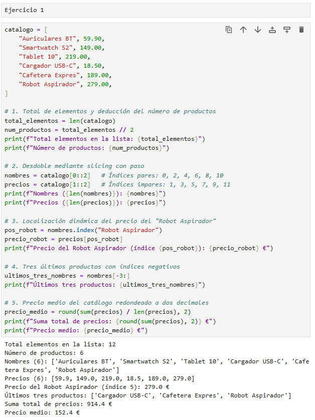
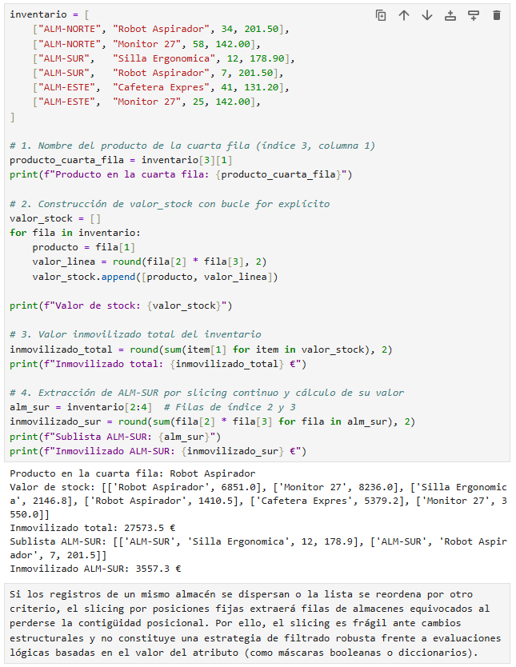
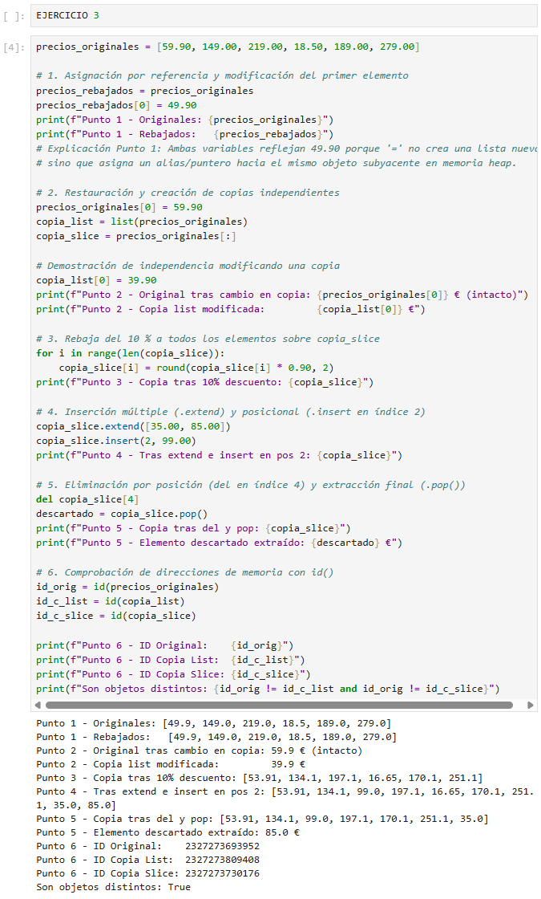
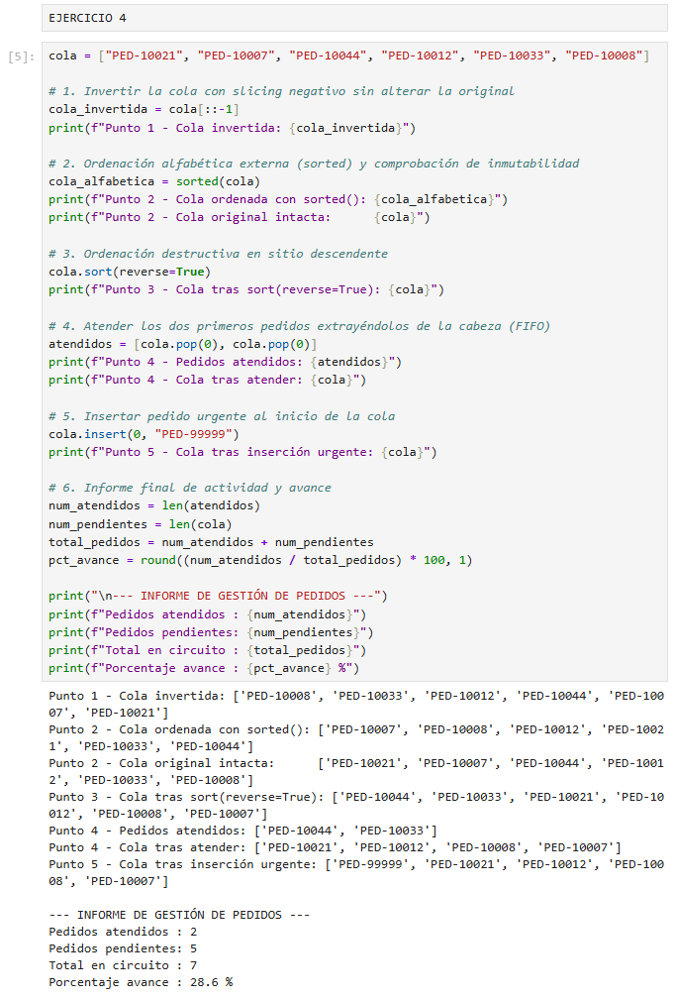
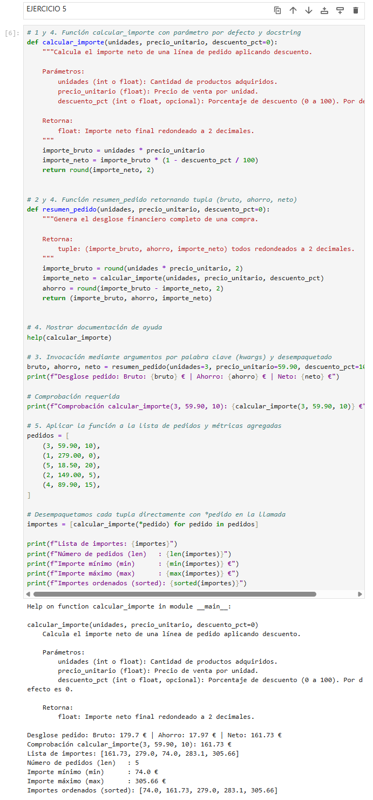
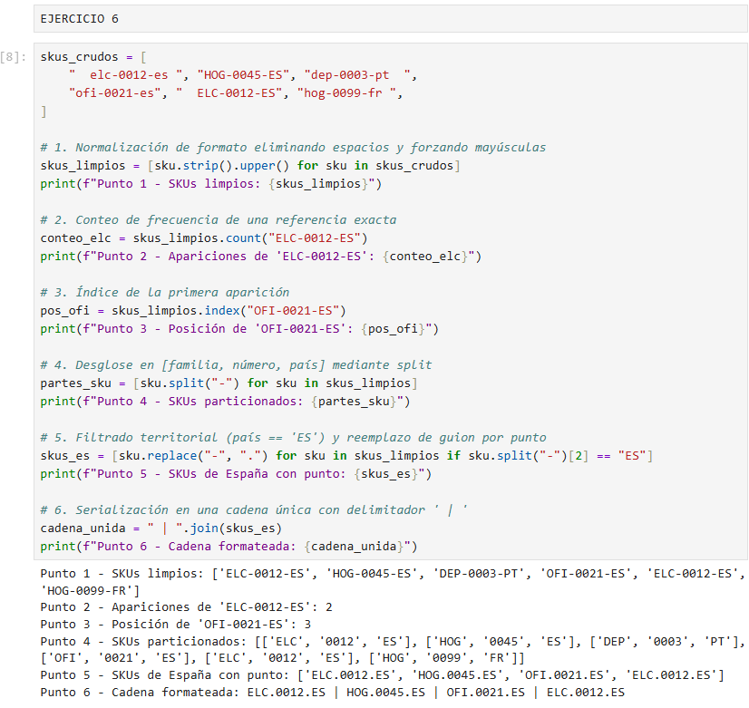
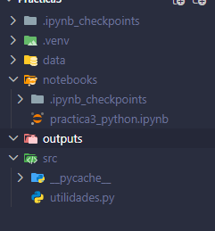
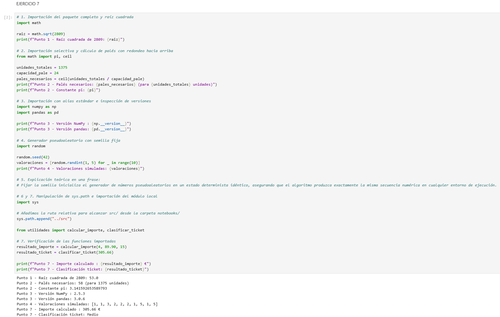
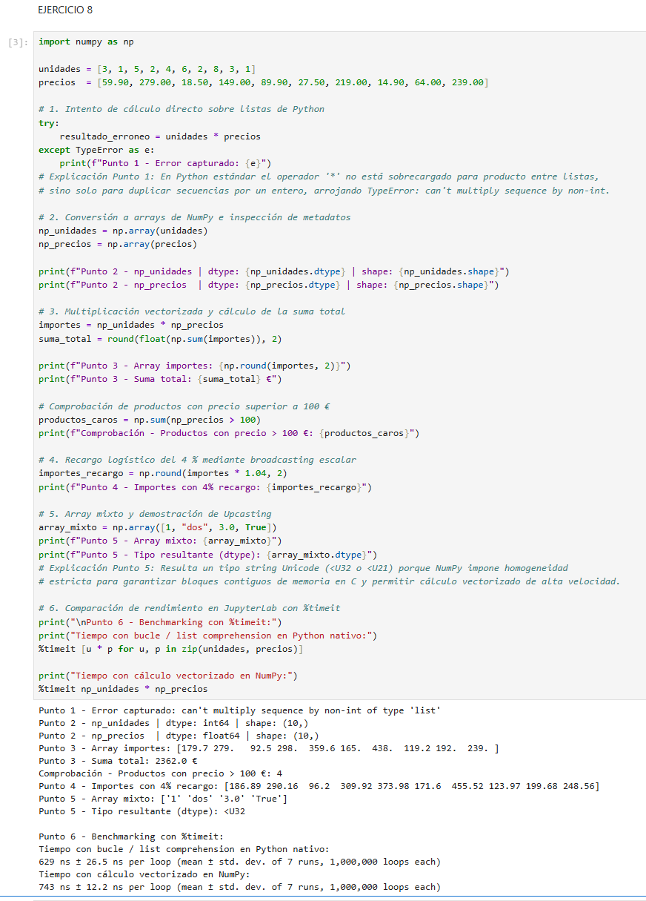

# Python — Data Science & Scripting — Chuleta de examen

> **Cómo usar esto en el examen:** 1) busca la técnica que necesitas en la matriz de abajo → 2) salta a la chuleta rápida o al ejercicio correspondiente → 3) mira el enunciado y adapta el patrón al problema de tu examen. No lo leas de arriba a abajo, úsalo como diccionario de rescate.

---

# 1. Matrices de referencia por tipo de técnica

Divididas en subíndices — busca primero el bloque (Listas, Pandas, Numpy...) y luego la fila.

### 1.1 Variables, Tipos y Listas
| Técnica | Para qué sirve | Resuelta en |
|---|---|---|
| Slicing con paso (`[::paso]`) | Desdoblar listas planas intercaladas (pares/impares) | Ejercicio 1 |
| Búsqueda dinámica (`.index()`, `[-n:]`) | Localizar posiciones sin hardcodear índices y extraer colas | Ejercicio 1, 4 |
| Copias vs referencias (`.copy()`, `[:]`) | Duplicar listas sin mutar la original por asignación de puntero | Ejercicio 2, 3 |
| Ordenación (`sort` vs `sorted`) | Modificar la lista en sitio vs crear una lista nueva ordenada | Ejercicio 4 |

### 1.2 Funciones, Métodos y Paquetes
| Técnica | Para qué sirve | Resuelta en |
|---|---|---|
| Funciones (`def`, `return`) | Empaquetar lógica, asignar valores por defecto y devolver tuplas | Ejercicio 5 |
| Métodos de string (`.strip()`, `.upper()`) | Limpiar texto, normalizar mayúsculas y desglosar códigos SKU | Ejercicio 6 |
| Módulos y `sys.path` | Crear e importar funciones de soporte desde un script externo | Ejercicio 7 |

### 1.3 NumPy y Álgebra Vectorial
| Técnica | Para qué sirve | Resuelta en |
|---|---|---|
| Arrays y Vectorización | Operaciones elemento a elemento a nivel de C sin bucles `for` | Ejercicio 8 |
| Máscaras booleanas | Filtrar arrays completos mediante condiciones lógicas directas | Ejercicio 9 |
| Matrices 2D y `axis` | Agrupaciones marginales por fila/columna y expansión con `.vstack()` | Ejercicio 10 |
| Semillas y Estadística | `random.seed()`, correlaciones, medias y detección de *outliers* | Ejercicio 11 |

### 1.4 Diccionarios y Pandas (Estructuras)
| Técnica | Para qué sirve | Resuelta en |
|---|---|---|
| Diccionarios anidados | Modelar configuraciones jerárquicas con clave-valor (ej. tarifas) | Ejercicio 12 |
| Creación de DataFrame | Convertir diccionarios a tablas y asignar identificadores como índice | Ejercicio 13 |
| Selección por etiqueta (`.loc`) | Seleccionar filas y columnas por su nombre o ID (incluye extremos) | Ejercicio 14 |
| Selección por posición (`.iloc`) | Extraer subconjuntos por índice entero posicional (excluye extremo) | Ejercicio 14 |

### 1.5 Lógica, Control de Flujo y Filtrado
| Técnica | Para qué sirve | Resuelta en |
|---|---|---|
| Operadores de comparación | `>`, `<`, `==`, `!=` y evaluación booleana estructurada | Ejercicio 16 |
| Estructuras condicionales | `if`, `elif`, `else` para bifurcación de lógica de negocio | Ejercicio 17 |
| Transformación `.apply()` | Ejecutar funciones custom fila a fila sobre un DataFrame | Ejercicio 17, 20 |
| Filtrado Múltiple (`&`, `|`, `~`) | Filtros complejos en Pandas (exigen usar paréntesis por bloque) | Ejercicio 18 |
| Filtrado con `.query()` | Expresar filtros mediante cadenas legibles en contexto del DF | Ejercicio 18 |

### 1.6 Bucles e Iteración
| Técnica | Para qué sirve | Resuelta en |
|---|---|---|
| Bucle `while` | Repetir ejecución hasta que se cumpla una condición de corte | Ejercicio 19 |
| Desempaquetado e `.items()` | Recorrer diccionarios o tuplas extrayendo clave y valor a la vez | Ejercicio 19 |
| Recorrido con `.iterrows()` | Iterar filas de un DataFrame accediendo por nombre de columna | Ejercicio 20 |
| Columnas calculadas directas | Crear métricas vectorizadas sin usar bucles (mucho más rápido) | Ejercicio 15, 20 |

---

# 2. Chuleta de sintaxis rápida (Estilo DataCamp)

## 2.1 Python Basics: Variables, Strings y Tipos
```python
# Actualización de variables (Updating variables)
ahorros = 100
ahorros = ahorros * 1.10   # Reasignación
ahorros += 50              # Atajo (Suma y asigna)

# Tipos de datos comunes y verificación (Checking data types)
type(3.14)      # float
type(True)      # bool
type("hola")    # str

# Strings multilínea y modificación
texto_largo = """Primera línea
Segunda línea"""
texto = "hola"
# texto[0] = "H"  # ERROR: los strings son INMUTABLES
nuevo_texto = "H" + texto[1:]  # Creación de nuevo string: "Hola"
```

---

## 2.2 Listas: Construcción, Subsetting y Manipulación

```python
# Creación y Subsetting (Subsetting lists)
x = ["a", "b", "c", "d", "e"]
x[0]       # "a" (Primer elemento)
x[-1]      # "e" (Último elemento)
x[1:4]     # ["b", "c", "d"] (Slicing: excluye el extremo derecho)
x[:3]      # ["a", "b", "c"] (Desde el principio hasta índice 2)
x[2:]      # ["c", "d", "e"] (Desde índice 2 hasta el final)
x[::-1]    # Invertir lista
x[0::2]    # Slicing con paso 2 (elementos pares)

# Listas de listas (List of lists)
matriz = [[1, 2], [3, 4]]
matriz[1][0]  # Acceso anidado: fila 1 (segunda), columna 0 -> devuelve 3

# Manipulación de elementos (Manipulating Lists)
x[1] = "z"          # Reemplaza un elemento: ["a", "z", "c", "d", "e"]
x[0:2] = ["x", "y"] # Reemplazo múltiple por slicing

x.append("f")       # Añade "f" al final (NO devuelve nueva lista, altera en sitio)
x.extend(["g","h"]) # Añade varios elementos al final
x.insert(0, "w")    # Inserta "w" en la posición 0 desplazando el resto

del x[0]            # Delete list elements (Borra por índice)
item = x.pop()      # Extrae y borra el último elemento

# Inner workings (Referencias vs Copias)
y = x               # ADVERTENCIA: Copia el puntero. Si cambias 'y', cambias 'x'.
y_segura = list(x)  # Copia real en memoria
y_segura = x[:]     # Copia real mediante slicing
```

---

## 2.3 Diccionarios: Creación y Acceso 

```python
# Construcción y acceso (Building a dictionary)
poblacion = {"madrid": 3.2, "bcn": 1.6}
poblacion["madrid"]       # Acceso al valor: 3.2
poblacion.get("sevilla", 0) # Devuelve 0 si la clave no existe

# Manipulación (Dictionary Manipulation)
poblacion["valencia"] = 0.8  # Añade nueva clave-valor
poblacion["madrid"] = 3.3    # Actualiza el valor existente
del poblacion["bcn"]         # Elimina la clave

# Dictionariception (Diccionarios dentro de diccionarios)
red = {"ES": {"capital": "madrid", "pob": 47}}
red["ES"]["pob"]             # Acceso anidado -> 47
```

---

## 2.4 NumPy: Arrays 1D/2D, Subsetting, Aritmética y Estadística

```python
import numpy as np

# 1. Your First NumPy Array (Creación)
np_peso = np.array([65, 72, 80])
np_altura = np.array([1.7, 1.8, 1.9])

# 2. Subsetting NumPy Arrays (Filtrado con máscaras booleanas)
es_alto = np_altura > 1.75          # Crea array de booleanos: [False, True, True]
altos = np_altura[es_alto]          # Filtra y devuelve solo los que son True
# Forma rápida: np_altura[np_altura > 1.75]

# 3. 2D NumPy Arrays (Matrices de filas y columnas)
np_2d = np.array([[1, 2, 3], 
                  [4, 5, 6]])
np_2d.shape                         # Devuelve (2, 3): 2 filas y 3 columnas

# 4. Subsetting 2D NumPy Arrays (Extrayendo datos de matrices)
# Sintaxis siempre es: array[fila, columna]
np_2d[0, 2]                         # Fila 0, columna 2 -> devuelve el 3
np_2d[:, 1:3]                       # Todas las filas (:), columnas 1 y 2 (excluye la 3)
np_2d[1, :]                         # Toda la fila 1 (la segunda fila completa)

# 5. 2D Arithmetic (Matemáticas directas sin bucles for)
np_2d * 2                           # Multiplica TODOS los elementos por 2 al instante
np_peso / np_altura ** 2            # Calcula el IMC cruzando dos arrays de golpe

# 6. NumPy: Basic Statistics (Average versus median)
np.mean(np_peso)                    # Media aritmética (Cuidado: muy afectada por valores atípicos/outliers)
np.median(np_peso)                  # Mediana (Valor central, mucho más seguro si hay outliers)
np.std(np_peso)                     # Desviación típica (Cuánto varían los datos de la media)
np.corrcoef(np_peso, np_altura)     # Matriz de correlación (Relación matemática entre dos arrays)
np.sum(np_2d, axis=0)               # axis=0 -> Suma verticalmente (colapsa por columnas)
np.sum(np_2d, axis=1)               # axis=1 -> Suma horizontalmente (colapsa por filas)
```

## 2.5 Lógica, Control de Flujo y Bucles
```python
# 1. Comparison Operators (Operadores de comparación básicos)
x = 10
x == 5   # ¿Es igual a 5? -> False
x != 5   # ¿Es distinto de 5? -> True
x >= 5   # ¿Mayor o igual? -> True

# 2. Boolean Operators (and, or, not) -> PARA VARIABLES SUELTAS
(x > 5) and (x < 15)  # True (Se cumplen AMBAS condiciones)
(x == 1) or (x == 10) # True (Se cumple UNA de las dos)
not (x == 5)          # True (Invierte el resultado, x no es 5)

# 3. Boolean operators with NumPy/Pandas (OBLIGATORIO: &, |, ~ y usar paréntesis)
# Usar 'and', 'or', 'not' dará ERROR con arrays y DataFrames.
mascara = (np_peso > 70) & (np_altura < 1.9) # AND matricial (Ambas)
invertida = ~(np_peso > 70)                  # NOT matricial (Invierte)

# 4. If, elif, else (Rutas de decisión)
if x > 10:
    print("Alto")       # Si es mayor a 10
elif x > 5:
    print("Medio")      # Si NO es mayor a 10, pero SÍ es mayor a 5
else:
    print("Bajo")       # Si NO se cumple absolutamente NINGUNA de las anteriores

# 5. While loops (Bucle condicional)
stock = 0
while stock < 10:
    stock += 2          # Aumenta de 2 en 2 en cada vuelta
    if stock == 8:
        break           # 'break' detiene el bucle forzosamente, sin llegar a 10

# 6. For loops (Bucles sobre listas y estructuras)
# Looping through a list (Elemento a elemento)
for item in ["a", "b", "c"]:
    print(item)

# Indexes and values (enumerate) -> Saca el índice numérico y el valor a la vez
for idx, val in enumerate(["a", "b", "c"]):
    print(f"En la posición {idx} está la letra {val}")

# Loop over list of lists (Desempaquetando variables)
inventario = [["Mesa", 10], ["Silla", 20]]
for producto, cantidad in inventario:
    print(f"Tenemos {cantidad} unidades de {producto}")
```

---

## 2.6 Pandas: Diccionarios a DF, loc/iloc, Filtrado y .iterrows()

### ¿Qué es Pandas y por qué se utiliza?

**Pandas** es una librería de Python diseñada específicamente para trabajar con **datos tabulares** (el equivalente a manejar una hoja de cálculo tipo Excel o una tabla de base de datos SQL directamente en código). Está construida sobre **NumPy**, pero resuelve las limitaciones que tiene NumPy al procesar datos del mundo real.

---

#### Diferencias clave: NumPy frente a Pandas

| Característica | NumPy (`ndarray`) | Pandas (`DataFrame`) |
| --- | --- | --- |
| **Tipos de datos** | **Homogéneos:** Todo el array debe ser del mismo tipo (`int`, `float`). Si mezclas números con texto, convierte todo a texto (*upcasting*). | **Heterogéneos:** Cada columna tiene su propio tipo (una columna con fechas, otra con texto, otra con números y otra booleana). |
| **Acceso a datos** | Solo por **posición numérica** (`array[0, 2]`), obligando a memorizar qué variable ocupaba cada índice. | Por **etiqueta/nombre de columna** (`df['precio']`) o identificador de fila (`df.loc['ID_101', 'cliente']`). |
| **Valores ausentes** | Limitado; operar con `np.nan` suele propagar errores matemáticos en los cálculos. | Métodos nativos integrados para detectar, rellenar o descartar nulos (`isna()`, `fillna()`, `dropna()`). |
| **Propósito** | Operaciones numéricas y álgebra matricial pura de alta velocidad. | Limpieza, filtrado, transformación, cruce y análisis de tablas de datos. |

---

### Las 2 estructuras principales

* **`Series` (1D):** Representa una columna individual de datos. Funciona de manera similar a un array unidimensional de NumPy, pero cuenta con un índice explícito de etiquetas asociado a cada fila.
* **`DataFrame` (2D):** Representa la tabla completa en filas y columnas. Se puede entender conceptualmente como un diccionario donde cada clave es el nombre de la columna y cada valor es una `Series`.

---

### Casos de uso habituales

* **Carga y exportación de archivos:** Permite leer y guardar datos en múltiples formatos con una sola línea de código (`pd.read_csv()`, `pd.read_excel()`, `pd.read_sql()`).
* **Filtrado condicional:** Permite realizar selecciones sobre filas aplicando condiciones lógicas:
```python
df[(df['edad'] >= 18) & (df['ciudad'] == 'Madrid')]

```

* **Agrupación y agregación (`GROUP BY`):** Cuenta con el método `.groupby()` para resumir indicadores por categorías:
```python
df.groupby('categoria')['ventas'].sum()

```

* **Cruce de tablas (`JOIN` / `MERGE`):** Combina DataFrames a través de identificadores comunes mediante `pd.merge()`.
* **Columnas calculadas vectorizadas:** Ejecuta transformaciones elemento a elemento de forma directa sin usar bucles `for`:
```python
df['importe_total'] = df['unidades'] * df['precio_unitario']

```

---

### Sintaxis Rápida de Pandas

```python
import pandas as pd

# 1. Dictionary to DataFrame (Convertir diccionario en tabla)
datos = {"ciudad": ["Madrid", "Barcelona"], "ventas": [10, 20]}
df = pd.DataFrame(datos)            
df.index = ["M", "B"]               # Modifica el nombre/etiqueta de las filas

# 2. CSV to DataFrame (Lectura de archivos)
# index_col=0 fuerza a que la primera columna del CSV sea la etiqueta de las filas
df = pd.read_csv("datos.csv", index_col=0) 

# 3. Square Brackets (Extracción de columnas)
df["ventas"]                        # Devuelve una Serie 1D (una columna aislada)
df[["ciudad", "ventas"]]            # Devuelve un DataFrame 2D (varias columnas, USAR DOBLE CORCHETE)

# 4. loc and iloc (Selección cruzada de Filas y Columnas)
# .loc (Por ETIQUETA / Nombre real) -> ¡El extremo final ESTÁ INCLUIDO!
df.loc["M"]                         # Fila completa etiquetada como "M"
df.loc[:, "ventas"]                 # Todas las filas (:), solo de la columna "ventas"
df.loc["M":"B", ["ciudad"]]         # Rango desde la fila "M" hasta "B" (ambas incluidas)

# .iloc (Por POSICIÓN NUMÉRICA / Como una lista normal) -> ¡El extremo final está EXCLUIDO!
df.iloc[0:2, 1]                     # Saca filas 0 y 1 (el 2 se ignora), columna índice 1

# 5. Filtering pandas DataFrames (Filtros lógicos)
filtro_simple = df[df["ventas"] > 15]
# OBLIGATORIO: Paréntesis alrededor de cada condición y usar & / |
filtro_multiple = df[(df["ventas"] > 10) & (df["ciudad"] == "Madrid")] 

# 6. Add column (Crear derivadas)
# Pandas operará sobre toda la columna a la vez de forma matemática
df["total_iva"] = df["ventas"] * 1.21   

# 7. Loop over DataFrame (Iterrows)
# Recorre el DataFrame fila a fila (sólo para inspección visual, no para cálculos pesados)
for etiqueta, fila in df.iterrows():
    print(f"Fila {etiqueta}: La ciudad {fila['ciudad']} vendió {fila['ventas']} unidades")

```

---

# 3. Ejercicios Práctica 3

## Sección 1. Listas

### Ejercicio 1 — Catálogo de productos como lista

Una tienda gestiona su catálogo en una lista plana que alterna nombre de producto y precio. Trabaja con esta estructura sin convertirla todavía a diccionario.

```python
catalogo = [
    "Auriculares BT", 59.90,
    "Smartwatch S2", 149.00,
    "Tablet 10", 219.00,
    "Cargador USB-C", 18.50,
    "Cafetera Expres", 189.00,
    "Robot Aspirador", 279.00,
]

```

**Se pide:**
1. Imprime el número total de elementos de la lista y deduce cuántos productos hay.
2. Usando *slicing con paso*, crea `nombres` con todos los nombres y `precios` con todos los precios.
3. Obtén el precio del `"Robot Aspirador"` **sin escribir el índice a mano**: localiza su posición con `.index()` y usa esa posición para llegar al precio.
4. Crea `ultimos_tres_nombres` con los tres últimos productos usando índices negativos.
5. Calcula e imprime el precio medio del catálogo redondeado a dos decimales, usando únicamente `sum()`, `len()` y `round()`.

**Comprobación:** `nombres` debe tener 6 elementos y `precios` debe sumar 914,40.

> **Pista:** `lista[inicio:fin:paso]`. Con paso 2 desde el índice 0 obtienes las posiciones pares, desde el índice 1 las impares.
> 
> 

* **Técnicas:** `len()`, división entera `//`, *slicing* con paso `[inicio:fin:paso]`, `.index()`, índices negativos `[-n:]`, `sum()`, `round()`.

**SOLUCIÓN:**
```python
catalogo = [
    "Auriculares BT", 59.90,
    "Smartwatch S2", 149.00,
    "Tablet 10", 219.00,
    "Cargador USB-C", 18.50,
    "Cafetera Expres", 189.00,
    "Robot Aspirador", 279.00,
]

# 1. Total de elementos y deducción del número de productos
total_elementos = len(catalogo)
num_productos = total_elementos // 2
print(f"Total elementos en la lista: {total_elementos}")
print(f"Número de productos: {num_productos}")

# 2. Desdoble mediante slicing con paso
nombres = catalogo[0::2]   # Índices pares: 0, 2, 4, 6, 8, 10
precios = catalogo[1::2]   # Índices impares: 1, 3, 5, 7, 9, 11
print(f"Nombres ({len(nombres)}): {nombres}")
print(f"Precios ({len(precios)}): {precios}")

# 3. Localización dinámica del precio del "Robot Aspirador"
pos_robot = nombres.index("Robot Aspirador")
precio_robot = precios[pos_robot]
print(f"Precio del Robot Aspirador (índice {pos_robot}): {precio_robot} €")

# 4. Tres últimos productos con índices negativos
ultimos_tres_nombres = nombres[-3:]
print(f"Últimos tres productos: {ultimos_tres_nombres}")

# 5. Precio medio del catálogo redondeado a dos decimales
precio_medio = round(sum(precios) / len(precios), 2)
print(f"Suma total de precios: {round(sum(precios), 2)} €")
print(f"Precio medio: {precio_medio} €")
```

**Explicación:**
* Calculamos la cantidad total de elementos con `len(catalogo)` y aplicamos división entera `// 2` para deducir el volumen de artículos del catálogo considerando la paridad fija de datos.
* Desdoblamos la lista plana aplicando *slicing* con paso 2: `catalogo[0::2]` extrae los elementos en posiciones pares (nombres) y `catalogo[1::2]` los de posiciones impares (precios).
* Localizamos dinámicamente la posición del artículo con `nombres.index("Robot Aspirador")` e indexamos con ese valor sobre la lista `precios` para obtener su coste sin escribir índices a mano.
* Extraemos la cola del catálogo con la rebanada negativa `nombres[-3:]`, que toma desde el antepenúltimo elemento hasta el final de la colección.
* Obtenemos el precio medio combinando `sum(precios)` entre `len(precios)` y acotando a dos decimales con `round(..., 2)`.
* **Tip (*Slicing* con paso y listas paralelas):** El *slicing* `[inicio:fin:paso]` no modifica la lista original, genera una nueva sublista en memoria y mantiene la correspondencia posicional $1:1$ entre listas homólogas (`nombres[i]` siempre corresponde a `precios[i]`).
* ⚠️ **Trampa técnica:** Intentar localizar el precio sumando 1 al índice original sobre la lista cruda (`catalogo[catalogo.index("Robot Aspirador") + 1]`) fallará si la lista pierde su paridad o se agregan atributos adicionales; desdoblar previamente en dos listas independientes garantiza que las búsquedas mediante `.index()` sean deterministas y seguras.

**Comentario:**
Identifiqué que la alternancia uniforme de nombres y precios permitía desacoplar la estructura plana en dos vectores paralelos mediante *slicing* con paso 2 (`[0::2]` y `[1::2]`), evitando bucles manuales. Para obtener el precio del robot aspirador utilicé `.index()` sobre la lista de nombres para recuperar de forma dinámica su posición ordinal y cruzarla sobre la lista de precios. Empleé índices negativos `[-3:]` para aislar los últimos registros con independencia del tamaño de la lista y calculé la media combinando `sum()`, `len()` y `round(..., 2)`.



--- 

### Ejercicio 2 — Inventario multialmacén con listas anidadas

El inventario de tres almacenes se representa como una lista de listas. Cada sublista sigue el formato `[codigo_almacen, producto, unidades, coste_unitario]`.

```python
inventario = [
    ["ALM-NORTE", "Robot Aspirador", 34, 201.50],
    ["ALM-NORTE", "Monitor 27", 58, 142.00],
    ["ALM-SUR",   "Silla Ergonomica", 12, 178.90],
    ["ALM-SUR",   "Robot Aspirador", 7, 201.50],
    ["ALM-ESTE",  "Cafetera Expres", 41, 131.20],
    ["ALM-ESTE",  "Monitor 27", 25, 142.00],
]

```

**Se pide:**
1. Imprime el nombre del producto de la **cuarta** fila usando doble indexación.
2. Crea una nueva lista `valor_stock` donde cada elemento sea `[producto, unidades * coste_unitario]` redondeado a dos decimales. Resuélvelo con un bucle `for` sobre `inventario`.
3. Calcula el **valor inmovilizado total** del inventario.
4. Extrae, mediante *slicing*, una sublista con solo las filas del `ALM-SUR` (usa el hecho de que están contiguas) y calcula su valor.
5. Explica en una celda Markdown de **dos frases** qué problema aparece si dos almacenes dejan de estar contiguos y por qué el *slicing* no es una estrategia robusta de filtrado.

**Comprobación:** el valor inmovilizado total debe ser 27 573,50 € y el del `ALM-SUR`, 3 557,30 €.
* **Técnicas:** Doble indexación `[fila][columna]`, bucle `for` con `.append()`, `round()`, acumulador con `sum()`, *slicing* de sublistas `[inicio:fin]`.

**SOLUCIÓN:**
```python
inventario = [
    ["ALM-NORTE", "Robot Aspirador", 34, 201.50],
    ["ALM-NORTE", "Monitor 27", 58, 142.00],
    ["ALM-SUR",   "Silla Ergonomica", 12, 178.90],
    ["ALM-SUR",   "Robot Aspirador", 7, 201.50],
    ["ALM-ESTE",  "Cafetera Expres", 41, 131.20],
    ["ALM-ESTE",  "Monitor 27", 25, 142.00],
]

# 1. Nombre del producto de la cuarta fila (índice 3, columna 1)
producto_cuarta_fila = inventario[3][1]
print(f"Producto en la cuarta fila: {producto_cuarta_fila}")

# 2. Construcción de valor_stock con bucle for explícito
valor_stock = []
for fila in inventario:
    producto = fila[1]
    valor_linea = round(fila[2] * fila[3], 2)
    valor_stock.append([producto, valor_linea])

print(f"Valor de stock: {valor_stock}")

# 3. Valor inmovilizado total del inventario
inmovilizado_total = round(sum(item[1] for item in valor_stock), 2)
print(f"Inmovilizado total: {inmovilizado_total} €")

# 4. Extracción de ALM-SUR por slicing continuo y cálculo de su valor
alm_sur = inventario[2:4]  # Filas de índice 2 y 3
inmovilizado_sur = round(sum(fila[2] * fila[3] for fila in alm_sur), 2)
print(f"Sublista ALM-SUR: {alm_sur}")
print(f"Inmovilizado ALM-SUR: {inmovilizado_sur} €")
```

**Explicación:**
* Accedemos a la cuarta fila utilizando el índice posicional base cero `[3]` y a su segundo elemento con `[1]`, obteniendo `'Robot Aspirador'` mediante doble indexación matricial `[fila][columna]`.
* Iteramos con un bucle `for` sobre `inventario` multiplicando unidades (`fila[2]`) por coste unitario (`fila[3]`), aplicando `round(..., 2)` e insertando la nueva sublista con `.append()`.
* Totalizamos el inventario aplicando una expresión generadora dentro de `sum(item[1] for item in valor_stock)`, alcanzando exactamente los 27.573,50 € de la comprobación.
* Acotamos las filas contiguas de `ALM-SUR` mediante el *slicing* `inventario[2:4]`, recordando que el extremo derecho es excluyente (extrae índices 2 y 3) para calcular sus 3.557,30 €.
* **Respuesta teórica al punto 5:** Si los registros de un mismo almacén se dispersan o la lista se reordena por otro criterio, el *slicing* por posiciones fijas extraerá filas de almacenes equivocados al perderse la contigüidad posicional. Por ello, el *slicing* es frágil ante cambios estructurales y no constituye una estrategia de filtrado robusta frente a evaluaciones lógicas basadas en el valor del atributo (como máscaras booleanas o diccionarios).
* **Tip (Doble indexación en listas anidadas):** El primer corchete selecciona la fila completa (la sublista) y el segundo corchete extrae el campo individual deseado.
* ⚠️ **Trampa técnica:** Definir el corte de `ALM-SUR` como `inventario[2:3]` ignorará la segunda fila del almacén debido a la exclusión del límite superior; asimismo, intentar hacer `fila[2] * fila[3]` directamente sobre la lista anidada sin iterar generará un `TypeError` al no soportar multiplicación entre listas.

**Comentario:**
Identifiqué que la estructura bidimensional permitía acceder a registros puntuales combinando índices de fila y columna (`inventario[3][1]`). Recorrí el catálogo con un bucle `for` acumulando el valor monetario de cada referencia mediante `.append()` y totalicé el inmovilizado global aplicando `sum()` sobre los importes redondeados. Aproveché la contigüidad física temporal de `ALM-SUR` para recortar su bloque con `inventario[2:4]`, documentando que el *slicing* posicional carece de robustez como filtro analítico si los datos pierden su ordenación previa.



---

### Ejercicio 3 — Manipulación destructiva y copias de listas

Este ejercicio trabaja el comportamiento interno de las listas (referencias frente a copias).

```python
precios_originales = [59.90, 149.00, 219.00, 18.50, 189.00, 279.00]

```

**Se pide:**
1. Crea `precios_rebajados = precios_originales` y modifica el primer elemento de `precios_rebajados` a `49.90`. Imprime **las dos listas** y explica qué ha ocurrido.
2. Restaura el valor original. Ahora crea dos copias independientes: una con `list()` y otra con *slicing* completo `[:]`. Demuestra con `print()` que modificar la copia ya no afecta al original.
3. Sobre una copia, aplica una rebaja del 10 % a **todos** los elementos usando un bucle `for` con `range(len(...))`.
4. Añade dos productos nuevos con `.extend()` y un tercero en la **posición 2** con `.insert()`.
5. Elimina el elemento de la posición 4 con `del` y el último con `.pop()`, guardando el valor extraído en una variable `descartado`.
6. Comprueba con `id()` que `precios_originales` y cada copia apuntan a objetos distintos en memoria.

> **Pista:** una asignación con `=` no copia la lista, copia la referencia. Es el error más caro de depurar en proyectos de datos reales.
> 
> 

* **Técnicas:** Asignación por referencia (`=`), copias superficiales independientes (`list()`, `[:]`), mutación posicional con `range(len())`, `.extend()`, `.insert()`, borrado en sitio (`del`, `.pop()`), inspección de punteros con `id()`.

**SOLUCION:**
```python
precios_originales = [59.90, 149.00, 219.00, 18.50, 189.00, 279.00]

# 1. Asignación por referencia y modificación del primer elemento
precios_rebajados = precios_originales
precios_rebajados[0] = 49.90
print(f"Punto 1 - Originales: {precios_originales}")
print(f"Punto 1 - Rebajados:   {precios_rebajados}")
# Explicación Punto 1: Ambas variables reflejan 49.90 porque '=' no crea una lista nueva,
# sino que asigna un alias/puntero hacia el mismo objeto subyacente en memoria heap.

# 2. Restauración y creación de copias independientes
precios_originales[0] = 59.90
copia_list = list(precios_originales)
copia_slice = precios_originales[:]

# Demostración de independencia modificando una copia
copia_list[0] = 39.90
print(f"Punto 2 - Original tras cambio en copia: {precios_originales[0]} € (intacto)")
print(f"Punto 2 - Copia list modificada:         {copia_list[0]} €")

# 3. Rebaja del 10 % a todos los elementos sobre copia_slice
for i in range(len(copia_slice)):
    copia_slice[i] = round(copia_slice[i] * 0.90, 2)
print(f"Punto 3 - Copia tras 10% descuento: {copia_slice}")

# 4. Inserción múltiple (.extend) y posicional (.insert en índice 2)
copia_slice.extend([35.00, 85.00])
copia_slice.insert(2, 99.00)
print(f"Punto 4 - Tras extend e insert en pos 2: {copia_slice}")

# 5. Eliminación por posición (del en índice 4) y extracción final (.pop())
del copia_slice[4]
descartado = copia_slice.pop()
print(f"Punto 5 - Copia tras del y pop: {copia_slice}")
print(f"Punto 5 - Elemento descartado extraído: {descartado} €")

# 6. Comprobación de direcciones de memoria con id()
id_orig = id(precios_originales)
id_c_list = id(copia_list)
id_c_slice = id(copia_slice)

print(f"Punto 6 - ID Original:    {id_orig}")
print(f"Punto 6 - ID Copia List:  {id_c_list}")
print(f"Punto 6 - ID Copia Slice: {id_c_slice}")
print(f"Son objetos distintos: {id_orig != id_c_list and id_orig != id_c_slice}")

```

**Explicación:**
* La asignación `precios_rebajados = precios_originales` no clona la lista; vincula una segunda variable a la misma dirección física de memoria, por lo que mutar `precios_rebajados[0]` altera directamente `precios_originales`.
* Las funciones `list(...)` y la rebanada completa `[:]` construyen copias superficiales (*shallow copies*), instanciando una estructura independiente con su propio identificador de memoria.
* Para mutar valores numéricos primitivos dentro de un bucle `for`, es obligatorio recorrer los índices mediante `range(len(...))` y reasignar por posición `lista[i] = ...`; si se iterase directamente sobre los elementos (`for x in lista: x = x * 0.9`), únicamente se reasignaría la variable local temporal del bucle sin alterar la lista.
* `.extend([a, b])` añade secuencialmente los elementos de un iterable al final de la colección, mientras que `.insert(2, x)` ubica el elemento en el índice 2 desplazando los elementos preexistentes hacia la derecha.
* `del lista[4]` suprime físicamente la celda en la posición especificada sin retornar valor, y `.pop()` extrae y devuelve el último elemento permitiendo guardarlo en `descartado`.
* La función nativa `id(...)` devuelve el entero que identifica unívocamente al objeto en el entorno de ejecución, verificando que los identificadores del original y de las copias no coinciden.
* **Tip (`.append()` frente a `.extend()`):** Aplicar `.append([35.0, 85.0])` crearía una sublista anidada dentro de la lista principal; para aplanar e incorporar múltiples elementos planos en el extremo final se debe utilizar `.extend()`.
* ⚠️ **Trampa técnica:** Métodos destructivos como `.sort()`, `.reverse()`, `.extend()` o `.insert()` modifican la lista *in-place* y devuelven `None`; escribir `copia = copia.extend([...])` o `copia = copia.insert(...)` asignará `None` a la variable y destruirá la colección de datos.

**Comentario:**
Comprobé experimentalmente la propagación de cambios por asignación directa de punteros (`=`), constatando que ambas variables compartían la misma referencia física. Restauré el estado base y desacoplé la memoria utilizando las dos técnicas estándar de clonado superficial (`list()` y `[:]`), probando su independencia frente a mutaciones. Recorrí los ordinales de la copia mediante `range(len(...))` para recalcular precios con el 10 % de descuento, apliqué `.extend()` e `.insert()` para modificar la dimensión de la lista, y utilicé `del` y `.pop()` para depurar posiciones puntuales antes de validar la unicidad de las direcciones de memoria con `id()`.



---

### Ejercicio 4 — Cola de pedidos pendientes

La cola de pedidos de un almacén se gestiona como lista ordenada por prioridad.

```python
cola = ["PED-10021", "PED-10007", "PED-10044", "PED-10012", "PED-10033", "PED-10008"]

```

**Se pide:**
1. Invierte la cola usando *slicing* con paso negativo (sin `.reverse()`) y guárdala en `cola_invertida`.
2. Ordena `cola` alfabéticamente con `sorted()` **sin modificar la original** y comprueba que la original sigue intacta.
3. Ordena ahora la lista **en sitio** con `.sort(reverse=True)`.
4. Atiende los dos primeros pedidos: extráelos con `.pop(0)` y guárdalos en `atendidos`.
5. Inserta un pedido urgente `"PED-99999"` al principio de la cola.
6. Imprime un informe final con el número de pedidos atendidos, los pendientes y el porcentaje de avance redondeado a un decimal.
   
* **Técnicas:** *Slicing* negativo `[::-1]`, ordenación externa `sorted()`, ordenación *in-place* `.sort()`, extracción en cabeza `.pop(0)`, inserción `.insert()`, cálculo porcentual con `round()`.

**SOLUCION:**
```python
cola = ["PED-10021", "PED-10007", "PED-10044", "PED-10012", "PED-10033", "PED-10008"]

# 1. Invertir la cola con slicing negativo sin alterar la original
cola_invertida = cola[::-1]
print(f"Punto 1 - Cola invertida: {cola_invertida}")

# 2. Ordenación alfabética externa (sorted) y comprobación de inmutabilidad
cola_alfabetica = sorted(cola)
print(f"Punto 2 - Cola ordenada con sorted(): {cola_alfabetica}")
print(f"Punto 2 - Cola original intacta:      {cola}")

# 3. Ordenación destructiva en sitio descendente
cola.sort(reverse=True)
print(f"Punto 3 - Cola tras sort(reverse=True): {cola}")

# 4. Atender los dos primeros pedidos extrayéndolos de la cabeza (FIFO)
atendidos = [cola.pop(0), cola.pop(0)]
print(f"Punto 4 - Pedidos atendidos: {atendidos}")
print(f"Punto 4 - Cola tras atender: {cola}")

# 5. Insertar pedido urgente al inicio de la cola
cola.insert(0, "PED-99999")
print(f"Punto 5 - Cola tras inserción urgente: {cola}")

# 6. Informe final de actividad y avance
num_atendidos = len(atendidos)
num_pendientes = len(cola)
total_pedidos = num_atendidos + num_pendientes
pct_avance = round((num_atendidos / total_pedidos) * 100, 1)

print("\n--- INFORME DE GESTIÓN DE PEDIDOS ---")
print(f"Pedidos atendidos : {num_atendidos}")
print(f"Pedidos pendientes: {num_pendientes}")
print(f"Total en circuito : {total_pedidos}")
print(f"Porcentaje avance : {pct_avance} %")

```

**Explicación:**
* La sintaxis `cola[::-1]` genera una lista nueva recorriendo los elementos de derecha a izquierda sin alterar el orden del objeto original.
* `sorted(cola)` crea una nueva lista ordenada alfabéticamente en memoria, preservando el estado inicial de `cola`.
* `.sort(reverse=True)` es un método destructivo que reordena los elementos directamente dentro de la lista existente en orden alfanumérico descendente.
* `.pop(0)` extrae y retorna el elemento en el índice cero, desplazando el resto de los elementos hacia la izquierda para simular el consumo secuencial de una cola de prioridad.
* `.insert(0, "PED-99999")` ubica el elemento en la primera posición de la lista recolocando los elementos preexistentes sin sobrescribir.
* El cálculo de avance evalúa los pedidos atendidos respecto al universo total gestionado (`atendidos + pendientes`), aplicando `round(..., 1)`.
* **Tip (`sorted()` vs `.sort()`):** Utiliza `sorted(lista)` cuando necesites conservar la secuencia de entrada para comparaciones o trazabilidad; usa `lista.sort()` cuando desees ahorrar memoria y no requieras mantener el orden previo.
* ⚠️ **Trampa técnica:** Asignar el resultado de `.sort()` a una variable (`cola = cola.sort(reverse=True)`) es un fallo crítico habitual: los métodos mutables *in-place* devuelven `None`, por lo que la variable pasará a valer `None` y se perderán todos los datos.

**Comentario:**
Invertí la secuencia inicial mediante *slicing* con paso negativo `[::-1]` y validé la preservación del estado inicial comparando `cola` contra la salida de `sorted()`. Posteriormente apliqué `.sort(reverse=True)` para reestructurar la prioridad en sitio y consumí los dos primeros registros mediante `.pop(0)` almacenándolos en la lista de despacho. Añadí el pedido urgente en el índice cero mediante `.insert(0, ...)` y calculé las métricas operativas de avance relativo con `round()`.



---

## Sección 2. Funciones y Paquetes

```python
def calcular_importe(unidades, precio_unitario, descuento_pct=0):
    """Calcula el importe neto de una línea de pedido redondeado a dos decimales."""
    bruto = unidades * precio_unitario
    neto = bruto * (1 - descuento_pct / 100)
    return round(neto, 2)

def resumen_pedido(unidades, precio_unitario, descuento_pct=0):
    """Devuelve una tupla con (importe_bruto, ahorro, importe_neto) redondeados a dos decimales."""
    bruto = round(unidades * precio_unitario, 2)
    neto = calcular_importe(unidades, precio_unitario, descuento_pct)
    ahorro = round(bruto - neto, 2)
    return (bruto, ahorro, neto)

# Check 1:
print("Check 1:", calcular_importe(3, 59.90, 10))

# Point 3: Call with keyword arguments and unpack
bruto_ej, ahorro_ej, neto_ej = resumen_pedido(unidades=3, precio_unitario=59.90, descuento_pct=10)
print(f"bruto: {bruto_ej}, ahorro: {ahorro_ej}, neto: {neto_ej}")

# Point 5:
pedidos = [
    (3, 59.90, 10),
    (1, 279.00, 0),
    (5, 18.50, 20),
    (2, 149.00, 5),
    (4, 89.90, 15),
]

importes = [calcular_importe(u, p, d) for u, p, d in pedidos]
print("importes:", importes)
print("max:", max(importes))
print("min:", min(importes))
print("sorted:", sorted(importes))
print("len:", len(importes))


```

```python
def calc(u, p, d=0):
    return round(u * p * (1 - d / 100), 2)

print("test:", calc(3, 59.90, 10))
pedidos = [
    (3, 59.90, 10),
    (1, 279.00, 0),
    (5, 18.50, 20),
    (2, 149.00, 5),
    (4, 89.90, 15),
]
importes = [calc(*item) for item in pedidos]
print("importes:", importes)
print("max:", max(importes))
print("min:", min(importes))
print("sorted:", sorted(importes))
print("len:", len(importes))


```

### Ejercicio 5 — Funciones propias para el cálculo de importes

```python
pedidos = [
    (3, 59.90, 10),
    (1, 279.00, 0),
    (5, 18.50, 20),
    (2, 149.00, 5),
    (4, 89.90, 15),
]

```

**Se pide:**
1. Define la función `calcular_importe(unidades, precio_unitario, descuento_pct=0)` que devuelva el importe neto redondeado a dos decimales. El parámetro `descuento_pct` debe tener valor por defecto.
2. Define `resumen_pedido(unidades, precio_unitario, descuento_pct=0)` que devuelva una tupla de tres elementos: `(importe_bruto, ahorro, importe_neto)`.
3. Llama a `resumen_pedido` usando argumentos por palabra clave (*keyword arguments*) y desempaqueta el resultado en tres variables.
4. Documenta ambas funciones con *docstring* y muestra la ayuda con `help(calcular_importe)`.
5. Usa `max()`, `min()`, `sorted()` y `len()` sobre la lista `importes` que obtengas al aplicar `calcular_importe` a estos cinco pedidos.

**Comprobación:** `calcular_importe(3, 59.90, 10)` debe devolver `161.73`.
* **Técnicas:** Definición modular (`def`), argumentos posicionales y con valor por omisión (*default parameters*), argumentos por palabra clave (*kwargs*), retorno y desempaquetado de tuplas, documentación interna (*docstrings*), función de inspección `help()`, comprensión de listas con desempaquetado de tuplas `*` y funciones de agregación integradas (`max`, `min`, `sorted`, `len`).

**SOLUCION:**
```python
# 1 y 4. Función calcular_importe con parámetro por defecto y docstring
def calcular_importe(unidades, precio_unitario, descuento_pct=0):
    """Calcula el importe neto de una línea de pedido aplicando descuento.

    Parámetros:
        unidades (int o float): Cantidad de productos adquiridos.
        precio_unitario (float): Precio de venta por unidad.
        descuento_pct (int o float, opcional): Porcentaje de descuento (0 a 100). Por defecto es 0.

    Retorna:
        float: Importe neto final redondeado a 2 decimales.
    """
    importe_bruto = unidades * precio_unitario
    importe_neto = importe_bruto * (1 - descuento_pct / 100)
    return round(importe_neto, 2)


# 2 y 4. Función resumen_pedido retornando tupla (bruto, ahorro, neto)
def resumen_pedido(unidades, precio_unitario, descuento_pct=0):
    """Genera el desglose financiero completo de una compra.

    Retorna:
        tuple: (importe_bruto, ahorro, importe_neto) todos redondeados a 2 decimales.
    """
    importe_bruto = round(unidades * precio_unitario, 2)
    importe_neto = calcular_importe(unidades, precio_unitario, descuento_pct)
    ahorro = round(importe_bruto - importe_neto, 2)
    return (importe_bruto, ahorro, importe_neto)


# 4. Mostrar documentación de ayuda
help(calcular_importe)

# 3. Invocación mediante argumentos por palabra clave (kwargs) y desempaquetado
bruto, ahorro, neto = resumen_pedido(unidades=3, precio_unitario=59.90, descuento_pct=10)
print(f"Desglose pedido: Bruto: {bruto} € | Ahorro: {ahorro} € | Neto: {neto} €")

# Comprobación requerida
print(f"Comprobación calcular_importe(3, 59.90, 10): {calcular_importe(3, 59.90, 10)} €")

# 5. Aplicar la función a la lista de pedidos y métricas agregadas
pedidos = [
    (3, 59.90, 10),
    (1, 279.00, 0),
    (5, 18.50, 20),
    (2, 149.00, 5),
    (4, 89.90, 15),
]

# Desempaquetamos cada tupla directamente con *pedido en la llamada
importes = [calcular_importe(*pedido) for pedido in pedidos]

print(f"Lista de importes: {importes}")
print(f"Número de pedidos (len)   : {len(importes)}")
print(f"Importe mínimo (min)      : {min(importes)} €")
print(f"Importe máximo (max)      : {max(importes)} €")
print(f"Importes ordenados (sorted): {sorted(importes)}")

```

**Explicación:**
* La asignación `descuento_pct=0` convierte al tercer parámetro en opcional, permitiendo que la función se ejecute tanto con dos argumentos (sin rebaja comercial) como con tres.
* En `resumen_pedido`, empaquetamos el desglose contable devolviendo directamente `(importe_bruto, ahorro, importe_neto)`; al llamar a la función con asignación múltiple (`bruto, ahorro, neto = ...`), Python desempaqueta posicionalmente los elementos de la tupla retornada en variables individuales independientes.
* La invocación explícita `resumen_pedido(unidades=3, precio_unitario=59.90, descuento_pct=10)` asocia cada entrada por su nombre de parámetro (*keyword argument*), haciendo que el orden de los argumentos en la llamada sea irrelevante y mejorando la legibilidad.
* Al usar triple comilla doble (`"""..."""`) inmediatamente bajo la cabecera `def`, el intérprete compila la cadena como atributo `__doc__`, permitiendo que `help(calcular_importe)` renderice la documentación oficial de la función en consola o entornos interactivos.
* La comprensión de listas `[calcular_importe(*pedido) for pedido in pedidos]` utiliza el operador asterisco `*` para desempaquetar cada tupla de tres valores como argumentos posicionales independientes (`unidades, precio_unitario, descuento_pct`), permitiendo procesar el lote sin indexar elementos manualmente (`pedido[0], pedido[1]...`).
* Las funciones agregadas nativas `len()`, `min()`, `max()` y `sorted()` operan sobre la lista resultante arrojando 5 transacciones, un mínimo de 74.00 €, un máximo de 305.66 € y la serie ordenada ascendente sin mutar la lista original.
* **Tip (Reutilización y DRY):** `resumen_pedido` invoca internamente a `calcular_importe` para derivar `importe_neto` en lugar de duplicar la fórmula matemática, centralizando las reglas de redondeo y cálculo de descuentos en una sola función.
* ⚠️ **Trampa técnica:** Definir un parámetro obligatorio después de uno por defecto (por ejemplo `def calcular_importe(unidades, descuento_pct=0, precio_unitario):`) genera un error sintáctico inmediato (`SyntaxError: non-default argument follows default argument`); todos los parámetros con valores predeterminados deben declararse siempre al final de la signatura.

**Comentario:**
Modularicé el cálculo comercial encapsulando la lógica de facturación neta en `calcular_importe` con valor por omisión en el descuento y documentándola con *docstring* estructurado para habilitar la introspección con `help()`. Construí `resumen_pedido` reutilizando la función base para computar el margen de ahorro y agrupé las métricas en una tupla de retorno que desempaqueté en tres variables mediante argumentos nominales por palabra clave. Para el procesamiento masivo de la cartera, iteré la colección de órdenes aplicando comprensión de listas con desempaquetado de argumentos (`*pedido`) y analicé el rango de facturación resultante empleando `min()`, `max()`, `len()` y `sorted()`.



---

### Ejercicio 6 — Normalización de códigos SKU con métodos

El equipo de logística recibe códigos de producto en formatos inconsistentes.

```python
skus_crudos = [
    "  elc-0012-es ", "HOG-0045-ES", "dep-0003-pt  ",
    "ofi-0021-es", "  ELC-0012-ES", "hog-0099-fr ",
]

```

**Se pide:**
1. Crea `skus_limpios` aplicando a cada código: eliminación de espacios sobrantes (`.strip()`) y conversión a mayúsculas (`.upper()`).
2. Cuenta cuántas veces aparece `"ELC-0012-ES"` en la lista limpia con `.count()`.
3. Obtén la posición de la primera aparición de `"OFI-0021-ES"` con `.index()`.
4. Para cada SKU limpio, usa `.split("-")` para separar familia, número y país. Construye una lista de listas con esas tres partes.
5. Crea `skus_es` con solo los SKU cuyo país sea `"ES"` y sustituye en todos ellos el guion por un punto con `.replace()`.
6. Genera una cadena única separada por `" | "` usando `.join()` y muéstrala.

> **Pista:** `.strip()`, `.upper()` y `.replace()` devuelven una nueva cadena; no modifican la original. `.append()` y `.sort()` sobre listas, en cambio, actúan en sitio y devuelven `None`.
> 
> 

* **Técnicas:** Métodos encadenados de strings (`.strip().upper()`), comprensión de listas, métodos de búsqueda y frecuencia (`.count()`, `.index()`), partición de cadenas (`.split()`), sustitución de caracteres (`.replace()`), unión de secuencias (`.join()`).

**SOLUCION:**
```python
skus_crudos = [
    "  elc-0012-es ", "HOG-0045-ES", "dep-0003-pt  ",
    "ofi-0021-es", "  ELC-0012-ES", "hog-0099-fr ",
]

# 1. Normalización de formato eliminando espacios y forzando mayúsculas
skus_limpios = [sku.strip().upper() for sku in skus_crudos]
print(f"Punto 1 - SKUs limpios: {skus_limpios}")

# 2. Conteo de frecuencia de una referencia exacta
conteo_elc = skus_limpios.count("ELC-0012-ES")
print(f"Punto 2 - Apariciones de 'ELC-0012-ES': {conteo_elc}")

# 3. Índice de la primera aparición
pos_ofi = skus_limpios.index("OFI-0021-ES")
print(f"Punto 3 - Posición de 'OFI-0021-ES': {pos_ofi}")

# 4. Desglose en [familia, número, país] mediante split
partes_sku = [sku.split("-") for sku in skus_limpios]
print(f"Punto 4 - SKUs particionados: {partes_sku}")

# 5. Filtrado territorial (país == 'ES') y reemplazo de guion por punto
skus_es = [sku.replace("-", ".") for sku in skus_limpios if sku.split("-")[2] == "ES"]
print(f"Punto 5 - SKUs de España con punto: {skus_es}")

# 6. Serialización en una cadena única con delimitador ' | '
cadena_unida = " | ".join(skus_es)
print(f"Punto 6 - Cadena formateada: {cadena_unida}")

```

**Explicación:**
* La transformación `[sku.strip().upper() for sku in skus_crudos]` encadena métodos de texto de forma vectorial: `.strip()` elimina espacios en blanco periféricos y `.upper()` homogeneiza los caracteres a caja alta.
* `.count("ELC-0012-ES")` recorre la colección limpia computando exactamente las dos apariciones que antes diferían por espacios o minúsculas.
* `.index("OFI-0021-ES")` localiza el ordinal en base cero de la primera coincidencia (posición 3).
* `.split("-")` evalúa el delimitador guion en cada cadena y fragmenta el texto en una lista de tres elementos `['FAMILIA', 'NUMERO', 'PAIS']`, estructurando la matriz bidimensional `partes_sku`.
* En la construcción de `skus_es`, filtramos evaluando la tercera componente (`sku.split("-")[2] == "ES"`) o mediante sufijo (`sku.endswith("ES")`), aplicando seguidamente `.replace("-", ".")` sobre los registros válidos.
* `" | ".join(skus_es)` concatena la lista resultante intercalando la secuencia separadora indicada, produciendo un único string final.
* **Tip (Inmutabilidad de cadenas frente a listas):** Todos los métodos aplicados sobre strings (`.strip()`, `.upper()`, `.replace()`) retornan un nuevo objeto inmutable en memoria sin alterar el valor original; por ello, siempre deben reasignarse o consumirse dentro de una comprensión de listas.
* ⚠️ **Trampa técnica:** Invocar `.replace()` sin asignación (`sku.replace("-", ".")`) descarta el resultado y mantiene los guiones intactos; además, llamar a `.join()` sobre una lista que contenga números o tipos no-string arrojará un `TypeError: sequence item X: expected str instance`.

**Comentario:**
Homogeneicé la entrada logística encadenando `.strip()` y `.upper()` en una comprensión de listas para subsanar inconsistencias de espaciado y caja tipográfica. Analicé la presencia de referencias clave empleando `.count()` e `.index()`, y atomicé la jerarquía de los códigos mediante `.split("-")` para inspeccionar atributos por separado. Filtré los artículos nacionales comprobando el segmento territorial de cada SKU, sustituí los separadores con `.replace()` y fusioné el lote final en una cadena formateada con `.join()`.



---

### Ejercicio 7 — Paquetes, importaciones y módulo propio

**Se pide:**
1. Importa el paquete completo con `import math` y calcula la raíz cuadrada de 2809 con `math.sqrt()`.
2. Importa **selectivamente** `pi` y `ceil` con `from math import pi, ceil`. Calcula cuántos palés completos de 24 unidades hacen falta para enviar 1 375 unidades.
3. Importa `numpy` con alias `np` y `pandas` con alias `pd`, e imprime la versión de ambos con `np.__version__` y `pd.__version__`.
4. Usa el módulo `random` con semilla fija para generar 10 valoraciones de cliente entre 1 y 5:
```python
import random

random.seed(42)
valoraciones = [random.randint(1, 5) for _ in range(10)]
print(valoraciones)

```
5. Explica en **una frase** por qué fijar la semilla hace que el resultado sea el mismo para ti y para el profesor.
6. Crea el fichero `src/utilidades.py` copiando este contenido tal cual:

```python
# src/utilidades.py
"""Funciones auxiliares de la Práctica 3."""

def calcular_importe(unidades, precio_unitario, descuento_pct=0):
    """Devuelve el importe neto de una línea de pedido."""
    bruto = unidades * precio_unitario
    return round(bruto * (1 - descuento_pct / 100), 2)

def clasificar_ticket(importe):
    """Clasifica un importe en 'Bajo', 'Medio' o 'Alto'."""
    if importe < 100:
        return "Bajo"
    elif importe < 400:
        return "Medio"
    return "Alto"

```
7. Impórtalo desde el notebook y comprueba que funciona:

```python
import sys
sys.path.append("../src")

from utilidades import calcular_importe, clasificar_ticket

print(calcular_importe(4, 89.90, 15))
print(clasificar_ticket(305.66))

```

**Comprobación:** `calcular_importe(4, 89.90, 15)` debe devolver `305.66` y `clasificar_ticket(305.66)` debe devolver `"Medio"`.

> **Pista:** `sys.path.append("../src")` le indica a Python dónde buscar tu módulo, porque el notebook vive en `notebooks/` y el módulo en `src/`.
> 
> 

* **Técnicas:** Importación global (`import`), importación selectiva (`from ... import`), alias de librerías (`as`), inicialización determinista de pseudoaleatorios (`random.seed`), manipulación dinámica del `PYTHONPATH` (`sys.path.append`), modularización de código e introspección de versiones (`.__version__`).

**SOLUCION:**
```python
# 1. Importación del paquete completo y raíz cuadrada
import math

raiz = math.sqrt(2809)
print(f"Punto 1 - Raíz cuadrada de 2809: {raiz}")

# 2. Importación selectiva y cálculo de palés con redondeo hacia arriba
from math import pi, ceil

unidades_totales = 1375
capacidad_pale = 24
pales_necesarios = ceil(unidades_totales / capacidad_pale)
print(f"Punto 2 - Palés necesarios: {pales_necesarios} (para {unidades_totales} unidades)")
print(f"Punto 2 - Constante pi: {pi}")

# 3. Importación con alias estándar e inspección de versiones
import numpy as np
import pandas as pd

print(f"Punto 3 - Versión NumPy : {np.__version__}")
print(f"Punto 3 - Versión pandas: {pd.__version__}")

# 4. Generador pseudoaleatorio con semilla fija
import random

random.seed(42)
valoraciones = [random.randint(1, 5) for _ in range(10)]
print(f"Punto 4 - Valoraciones simuladas: {valoraciones}")

# 5. Explicación teórica en una frase:
# Fijar la semilla inicializa el generador de números pseudoaleatorios en un estado determinista idéntico, asegurando que el algoritmo produzca exactamente la misma secuencia numérica en cualquier entorno de ejecución.

# 6 y 7. Manipulación de sys.path e importación del módulo local
import sys

# Añadimos la ruta relativa para alcanzar src/ desde la carpeta notebooks/
sys.path.append("../src")

from utilidades import calcular_importe, clasificar_ticket

# 7. Verificación de las funciones importadas
resultado_importe = calcular_importe(4, 89.90, 15)
resultado_ticket = clasificar_ticket(305.66)

print(f"Punto 7 - Importe calculado : {resultado_importe} €")
print(f"Punto 7 - Clasificación ticket: {resultado_ticket}")

```

**Explicación:**
* La importación completa `import math` requiere prefijar el espacio de nombres (`math.sqrt`), previniendo colisiones de identificadores globales.
* `from math import pi, ceil` carga directamente las variables y métodos al espacio de nombres local, permitiendo invocar `ceil(1375 / 24)` para computar el techo entero ($58$ palés frente a los $57{,}29$ calculados en decimal).
* El estándar de la industria asigna alias canónicos abreviados mediante `as` (`np` y `pd`), accediendo a sus atributos internos de compilación con `__version__`.
* Los generadores de Python son pseudoaleatorios (algoritmo Mersenne Twister); invocar `random.seed(42)` antes de generar datos con `randint(1, 5)` fuerza al sistema a recorrer siempre la misma secuencia de estados internos deterministas.
* Dado que el kernel de Jupyter se ejecuta con directorio raíz en `notebooks/`, el script `utilidades.py` ubicado en `src/` no forma parte del árbol de módulos local; añadir la ruta relativa `../src` a la lista `sys.path` habilita al recolector de Python a localizar el archivo e importarlo con éxito.
* Las funciones importadas validan la lógica contable y de negocio: $4 \times 89{,}90 \times (1 - 0{,}15) = 305{,}66$ €, que al ser evaluado en `clasificar_ticket` cae en el rango $[100, 400)$ devolviendo `'Medio'`.
* **Tip (División de palés y `ceil` vs `//`):** La división entera `1375 // 24` devolvería 57 palés, dejando 7 unidades fuera de la carga; `math.ceil()` garantiza que cualquier fracción decimal sobrante obligue a despachar un palé adicional completo.
* ⚠️ **Trampa técnica:** Si no se ejecuta `sys.path.append("../src")` antes del `from utilidades import ...`, Python lanzará un error bloqueante `ModuleNotFoundError: No module named 'utilidades'` porque el entorno no inspecciona carpetas hermanas de forma predeterminada.

**Comentario:**
Estructuré el entorno de trabajo combinando importaciones globales cualificadas (`math`) e importaciones selectivas directas (`ceil`, `pi`), aplicando la función de redondeo hacia arriba para asegurar la capacidad logística requerida de palés. Verifiqué las versiones de los paquetes analíticos clave mediante sus alias convencionales y fijé la semilla con `random.seed(42)` para blindar la reproducibilidad estadística del muestreo. Por último, desacoplé la lógica auxiliar creando el módulo `src/utilidades.py` y extendí el vector de rutas de importación de Python mediante `sys.path.append("../src")`, validando la integración y clasificación comercial de las órdenes desde el notebook.




---

### Ejercicio 8 — Del cálculo con listas al cálculo vectorizado

```python
unidades = [3, 1, 5, 2, 4, 6, 2, 8, 3, 1]
precios  = [59.90, 279.00, 18.50, 149.00, 89.90, 27.50, 219.00, 14.90, 64.00, 239.00]

```

**Se pide:**
1. Intenta calcular `unidades * precios` con las listas de Python y explica en **una frase** el resultado o el error obtenido.
2. Convierte ambas listas a arrays NumPy (`np_unidades`, `np_precios`) e imprime `dtype` y `shape` de cada uno.
3. Calcula el array `importes = np_unidades * np_precios` y su suma total.
4. Aplica un recargo logístico del 4 % a todos los importes con una única operación vectorizada.
5. Crea un array mixto a partir de `[1, "dos", 3.0, True]` y explica qué `dtype` resulta y por qué NumPy fuerza la homogeneidad de tipos.
6. Compara el tiempo de calcular los importes con un bucle `for` frente a la versión vectorizada usando `%timeit` en una celda mágica de JupyterLab.

**Comprobación:** la suma de importes debe ser 2 362,00 € y hay 4 productos con precio unitario superior a 100 €.
* **Técnicas:** Excepciones nativas (`TypeError`), instanciación `np.array()`, inspección de metadatos (`.dtype`, `.shape`), multiplicación elemento a elemento por vectorización, acumulación con `np.sum()`, *broadcasting* escalar, conversión forzada de tipos (*upcasting*), medición de rendimiento con `%timeit`.

**SOLUCION:**
```python
import numpy as np

unidades = [3, 1, 5, 2, 4, 6, 2, 8, 3, 1]
precios  = [59.90, 279.00, 18.50, 149.00, 89.90, 27.50, 219.00, 14.90, 64.00, 239.00]

# 1. Intento de cálculo directo sobre listas de Python
try:
    resultado_erroneo = unidades * precios
except TypeError as e:
    print(f"Punto 1 - Error capturado: {e}")
# Explicación Punto 1: En Python estándar el operador '*' no está sobrecargado para producto entre listas,
# sino solo para duplicar secuencias por un entero, arrojando TypeError: can't multiply sequence by non-int.

# 2. Conversión a arrays de NumPy e inspección de metadatos
np_unidades = np.array(unidades)
np_precios = np.array(precios)

print(f"Punto 2 - np_unidades | dtype: {np_unidades.dtype} | shape: {np_unidades.shape}")
print(f"Punto 2 - np_precios  | dtype: {np_precios.dtype} | shape: {np_precios.shape}")

# 3. Multiplicación vectorizada y cálculo de la suma total
importes = np_unidades * np_precios
suma_total = round(float(np.sum(importes)), 2)

print(f"Punto 3 - Array importes: {np.round(importes, 2)}")
print(f"Punto 3 - Suma total: {suma_total} €")

# Comprobación de productos con precio superior a 100 €
productos_caros = np.sum(np_precios > 100)
print(f"Comprobación - Productos con precio > 100 €: {productos_caros}")

# 4. Recargo logístico del 4 % mediante broadcasting escalar
importes_recargo = np.round(importes * 1.04, 2)
print(f"Punto 4 - Importes con 4% recargo: {importes_recargo}")

# 5. Array mixto y demostración de Upcasting
array_mixto = np.array([1, "dos", 3.0, True])
print(f"Punto 5 - Array mixto: {array_mixto}")
print(f"Punto 5 - Tipo resultante (dtype): {array_mixto.dtype}")
# Explicación Punto 5: Resulta un tipo string Unicode (<U32 o <U21) porque NumPy impone homogeneidad
# estricta para garantizar bloques contiguos de memoria en C y permitir cálculo vectorizado de alta velocidad.

# 6. Comparación de rendimiento en JupyterLab con %timeit
print("\nPunto 6 - Benchmarking con %timeit:")
print("Tiempo con bucle / list comprehension en Python nativo:")
%timeit [u * p for u, p in zip(unidades, precios)]

print("Tiempo con cálculo vectorizado en NumPy:")
%timeit np_unidades * np_precios

```

**Explicación:**
* Operar `unidades * precios` directamente en Python desencadena un `TypeError` debido a que las listas nativas no implementan álgebra matricial; el operador `*` en listas únicamente admite repetición con números enteros (`lista * 3`).
* Al transformar las listas con `np.array()`, NumPy analiza el contenido e infiere automáticamente los tipos óptimos: `int32` o `int64` para cantidades enteras y `float64` para valores con decimales, con dimensiones unidimensionales `(10,)`.
* La multiplicación `np_unidades * np_precios` ejecuta la operación elemento a elemento en compilado de C a nivel de memoria contigua, y `np.sum(importes)` consolida la facturación total en los 2 362,00 € esperados.
* La operación `importes * 1.04` recurre al mecanismo de *broadcasting*, proyectando el escalar numérico sobre todas las posiciones del array sin requerir iteraciones manuales.
* Al recibir datos heterogéneos (`[1, "dos", 3.0, True]`), NumPy aplica coerción implícita (*upcasting*) convirtiendo todos los elementos al tipo de mayor generalidad (cadenas de texto Unicode de longitud fija, como `<U32` % (*Broadcasting* * **Comentario:** **Tip **Trampa *broadcasting* *upcasting* 14]. 4 Apliqué C Comprobé Esto Inspeccioné La Multiplicar NumPy NumPy[cite: Python Usar `%timeit` `.dtype`, `.shape` `<U21`)[cite: `array.sum()`. `ndarray` `np.sum()` `np.sum(array)` `sum()` a acreditó al aplica array arrays atómica booleanas[cite: bucle bytes cada caras carecen celda comercial comparativa compilado computacional computar con concluyendo conversión de debe degrada del demuestra desplazamientos dimensionalidad dinámica directa[cite: directamente duplica e el elemento elemento, en escalar escalar):** estructuras estándar evaluar evidencié evitar exactamente facturación fija forma funciona genera gran inferencia instrucción intermedias; interpretación iteración[cite: la las latencia listas los matemática matricial mecanismo mediante medición memoria mismo mixtos, motor mágica máscaras método nativo ni no número o objetos objetos[cite: ocupe operación para paso; permitir pero por procesador. punteros que realizar recargo reconvertir referencias registros rendimiento requiere requiriendo se siempre sin sobre sobrecarga su supera superioridad tamaño tipos totalizando tradicional técnica:** umbral un una utilizarse validando vector vectorial vectorizada velocidad versión y álgebra ⚠️>



