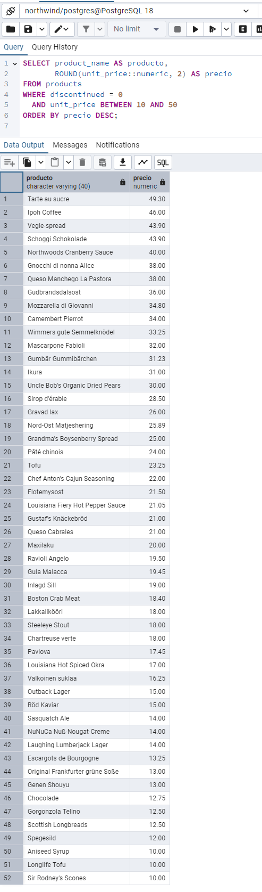
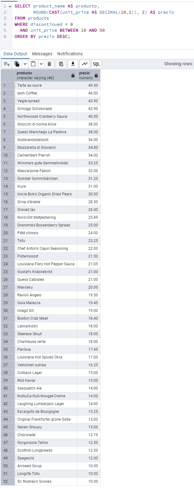
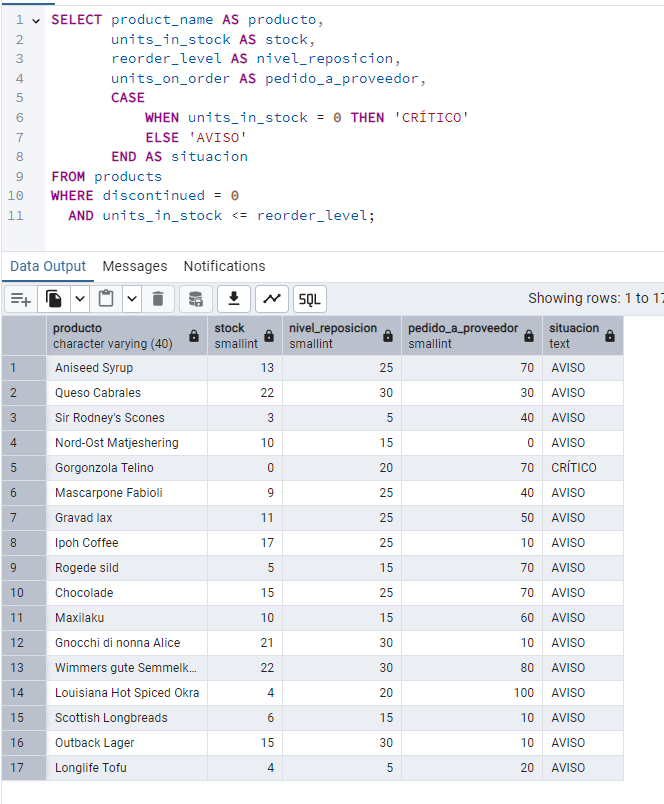
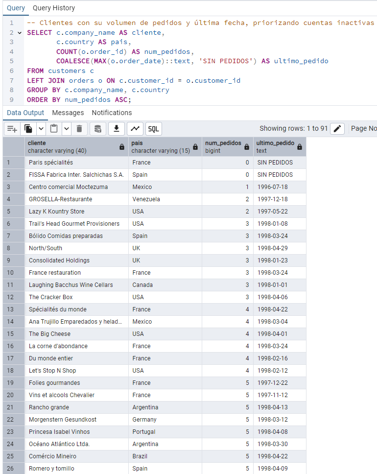
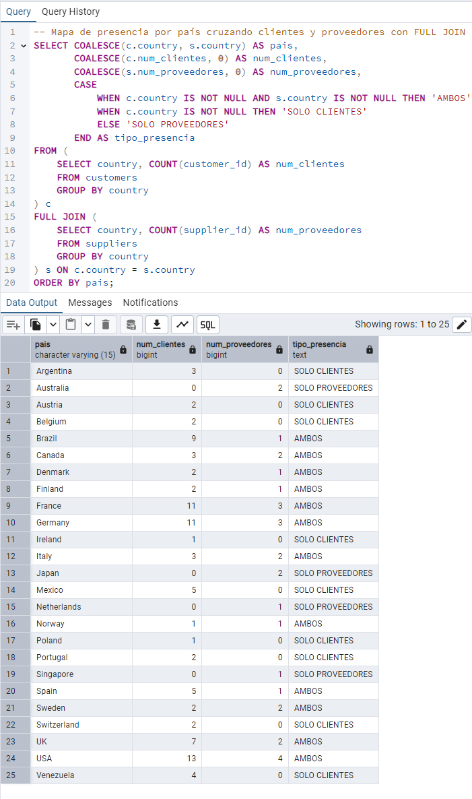
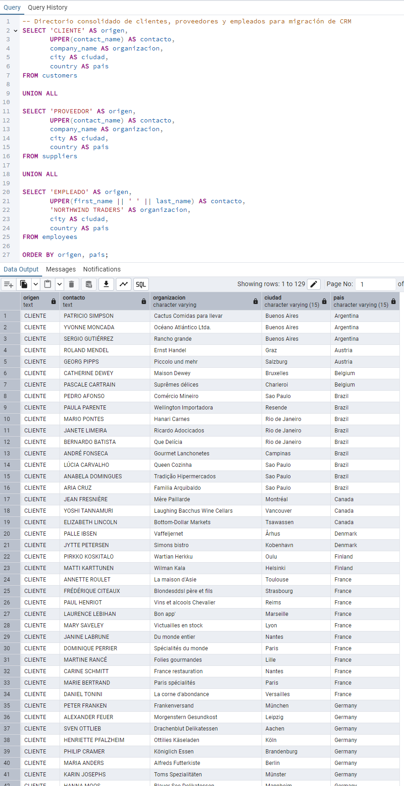
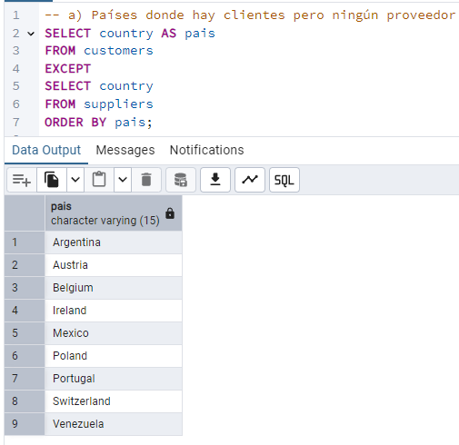
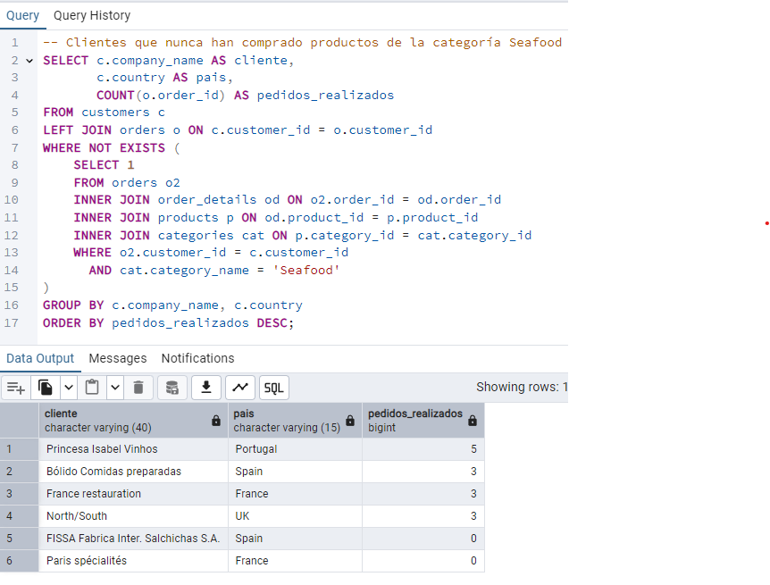

# SQL — PostgreSQL (Northwind) — Chuleta de examen

> **Cómo usar esto en el examen:** 1) busca la técnica que necesitas en la matriz de abajo → 2) salta directo al ejercicio que la usa → 3) mira el enunciado, el código y la captura, y adapta el patrón al enunciado nuevo. No lo leas de arriba a abajo, es para buscar y volver al trabajo.

---

# 1. Matrices de referencia por tipo de técnica

Divididas en subíndices — busca primero el bloque (JOINs, subconsultas...) y luego la fila.

### 1.1 Filtrado y agregación

| Técnica | Para qué sirve | Resuelta en |
|---|---|---|
| `WHERE`, `BETWEEN`, `IN`, `LIKE` | Filtrar filas antes de agrupar: por rango, lista o patrón de texto | 1, 3, 4 |
| `NULL` y `COALESCE()` | Sustituir un valor ausente por un valor por defecto para que no rompa cálculos ni desaparezca filas sin avisar | 3, 7, 9, 10, 19 |
| Funciones de agregación y `ROUND()` | Resumir muchas filas en un número (`SUM`, `COUNT`, `AVG`...) con precisión correcta | 1, 2, 6, 14 |
| `GROUP BY` y `HAVING` | Agrupar filas y filtrar sobre el resultado ya agregado (no sobre las filas originales) | 2, 6 |
| `CASE WHEN` | Columna calculada con lógica condicional tipo if/elif/else | 3, 10, 17, 20 |

### 1.2 JOINs (tablas / adiciones externas)

| Técnica | Para qué sirve | Resuelta en |
|---|---|---|
| `INNER JOIN`, alias, `USING` | Combinar tablas trayendo solo las filas que coinciden en ambas | 4, 5, 6 |
| `LEFT JOIN` | Combinar tablas conservando todas las filas de la izquierda aunque no haya match a la derecha | 7, 9 |
| `SELF JOIN` | Unir una tabla consigo misma para relacionar filas entre sí (jerarquías) | 8 |
| `CROSS JOIN` | Generar todas las combinaciones posibles entre dos conjuntos (rejillas sin huecos) | 9 |
| `FULL JOIN` | Conservar filas de ambos lados aunque no haya match | 10 |

### 1.3 Operadores de conjunto y semi/anti join

| Técnica | Para qué sirve | Resuelta en |
|---|---|---|
| `UNION ALL` | Apilar resultados de varias consultas con las mismas columnas, sin eliminar duplicados | 11 |
| `EXCEPT` | Filas de la primera consulta que NO están en la segunda | 12 |
| `INTERSECT` | Filas que están en ambas consultas a la vez | 12 |
| Semi join y anti join | Filtrar filas de una tabla según si existen (o no) en otra, sin traer columnas de la segunda | 12, 13 |

### 1.4 Subconsultas

| Técnica | Para qué sirve | Resuelta en |
|---|---|---|
| Subconsulta en `WHERE` | Usar el resultado de otra consulta como condición de filtro | 13, 14, 16 |
| Subconsulta en `SELECT` | Calcular un valor extra por fila con una subconsulta escalar | 14, 16 |
| Subconsulta en `FROM` | Tratar el resultado de una consulta como si fuera una tabla (necesita alias) | 15 |
| Subconsultas correlacionadas | Subconsulta que referencia una columna de la fila externa; se evalúa por cada fila | 13, 16 |

### 1.5 CTE y funciones de ventana

| Técnica | Para qué sirve | Resuelta en |
|---|---|---|
| CTE (`WITH`) | Nombrar una subconsulta para reutilizarla y encadenar pasos de forma legible | 17, 18, 19, 20 |
| `NTILE()` | Repartir filas ordenadas en N grupos de tamaño similar (cuartiles...) | 17 |
| `RANK()` / `ROW_NUMBER()` | Numerar filas según un orden; `RANK` deja huecos en empates, `ROW_NUMBER` no | 18 |
| `PARTITION BY` | Reinicia el cálculo de una función de ventana para cada grupo, sin colapsar filas | 18 |
| Marcos de ventana (`ROWS BETWEEN`) | Define exactamente qué filas entran en el cálculo (ej. media móvil) | 19 |
| `LAG()` | Trae el valor de una fila anterior en el mismo resultado, sin self join | 19 |

### 1.6 Pivotado, fechas y texto

| Técnica | Para qué sirve | Resuelta en |
|---|---|---|
| Pivotado y `ROLLUP` | Convierte filas en columnas y añade una fila de totales automática | 20 |
| Funciones de texto | Mayúsculas, concatenación, recorte de cadenas | 11 |
| Funciones de fecha (`EXTRACT`, `DATE_TRUNC`) | Extraer parte de una fecha o truncarla a un periodo (mes, año) | 9, 19, 20 |

---

# 2. Chuleta de sintaxis rápida

### 2.1 Filtrado y agregación
```sql
WHERE precio BETWEEN 10 AND 50          -- incluye ambos extremos
WHERE pais IN ('Italia','Francia')
WHERE nombre LIKE 'A%'                  -- empieza por A
ROUND(valor::numeric, 2)                -- castea ANTES de redondear (evita errores de real)
CASE WHEN stock = 0 THEN 'CRÍTICO' ELSE 'AVISO' END AS situacion
```
```sql
SELECT pais, COUNT(*) AS num, COUNT(DISTINCT ciudad) AS num_ciudades
FROM clientes
GROUP BY pais
HAVING COUNT(*) >= 5                    -- HAVING filtra DESPUÉS de agrupar
ORDER BY num DESC;
```

### 2.2 JOINs
```sql
-- INNER: solo lo que coincide en ambas
FROM a INNER JOIN b ON a.id = b.a_id
FROM a INNER JOIN b USING(id)           -- si la columna se llama igual en ambas tablas

-- LEFT: todo lo de la izquierda, aunque no haya match (NULL a la derecha)
FROM clientes c LEFT JOIN pedidos p ON p.cliente_id = c.id
-- OJO: COUNT(*) cuenta también las filas sin match → usa COUNT(p.id)

-- SELF JOIN: la misma tabla dos veces, con alias obligatorios
FROM empleados emp LEFT JOIN empleados jefe ON emp.reports_to = jefe.id

-- CROSS JOIN: producto cartesiano, para rejillas sin huecos
FROM categorias CROSS JOIN anios        -- luego LEFT JOIN con los datos reales

-- FULL JOIN: cuidado con la columna de unión, puede venir NULL por cualquier lado
SELECT COALESCE(a.pais, b.pais) AS pais FROM a FULL JOIN b ON a.pais = b.pais
```

### 2.3 Operadores de conjunto y semi/anti join
```sql
SELECT x FROM a
UNION ALL                               -- no elimina duplicados (UNION sí, y es más caro)
SELECT x FROM b;

SELECT pais FROM clientes
EXCEPT                                  -- lo que hay en la primera y no en la segunda
SELECT pais FROM proveedores;

SELECT pais FROM clientes
INTERSECT                               -- lo que hay en ambas
SELECT pais FROM proveedores;
```
```sql
-- NOT EXISTS: la forma segura (preferible)
WHERE NOT EXISTS (SELECT 1 FROM pedidos p WHERE p.cliente_id = c.id)

-- NOT IN: PELIGRO si la subconsulta puede devolver NULL → resultado vacío sin error
WHERE id NOT IN (SELECT cliente_id FROM pedidos WHERE cliente_id IS NOT NULL)
```

### 2.4 Subconsultas
```sql
-- Escalar en WHERE
WHERE precio > (SELECT AVG(precio) FROM productos)

-- Escalar en SELECT
SELECT precio, (SELECT AVG(precio) FROM productos) AS precio_medio FROM productos

-- En FROM: SIEMPRE necesita alias
FROM (SELECT cliente_id, SUM(importe) AS total FROM pedidos GROUP BY cliente_id) AS resumen

-- Correlacionada: referencia una columna de la fila externa
WHERE precio = (SELECT MAX(precio) FROM productos p2 WHERE p2.categoria_id = p1.categoria_id)
```

### 2.5 CTE y funciones de ventana
```sql
WITH paso1 AS (
    SELECT ...
),
paso2 AS (
    SELECT ... FROM paso1 ...           -- una CTE puede usar las anteriores
)
SELECT ... FROM paso2;
```
```sql
RANK()       OVER (PARTITION BY categoria ORDER BY facturacion DESC)  -- dejar huecos en empate
ROW_NUMBER() OVER (PARTITION BY categoria ORDER BY facturacion DESC)  -- nunca empata
NTILE(4)     OVER (ORDER BY facturacion DESC)                         -- cuartiles
SUM(x) OVER (ORDER BY mes)                                            -- acumulado (RANGE por defecto)
AVG(x) OVER (ORDER BY mes ROWS BETWEEN 2 PRECEDING AND CURRENT ROW)   -- media móvil 3 periodos, marco EXPLÍCITO
LAG(x)  OVER (ORDER BY mes)                                           -- valor de la fila anterior
-- OJO: no se puede filtrar una función de ventana en WHERE → mételo en una CTE y filtra fuera
```

### 2.6 Pivotado, fechas y texto
```sql
SUM(importe) FILTER (WHERE anio = 1997) AS f_1997     -- sintaxis moderna de PostgreSQL
GROUP BY ROLLUP(categoria)                             -- añade fila de totales, categoria queda NULL en esa fila
COALESCE(categoria, 'TOTAL GENERAL') AS categoria       -- para que la fila de totales se lea bien
```
```sql
EXTRACT(YEAR FROM fecha)
DATE_TRUNC('month', fecha)
UPPER(texto)  ||  ' - '  ||  otro_texto        -- concatenación con ||
```

---

# 3. Ejercicios
## Sección 1. Fundamentos: filtrado y agregación

### Pregunta 1 — Catálogo comercial activo

Obtén los productos que **no** están descatalogados y cuyo precio unitario esté entre 10 y 50 euros, ambos incluidos. Muestra el nombre del producto y su precio redondeado a dos decimales, ordenado de mayor a menor precio.

**Columnas esperadas:** `producto`, `precio`

> **Pista:** La columna `discontinued` es de tipo `integer`, no booleana. Un producto activo tiene valor 0.
> 
> 

* **Lo que se pide:** Productos no descatalogados con precio unitario entre 10 y 50€ (ambos incluidos). Nombre y precio redondeado a 2 decimales, ordenado de mayor a menor precio.
* **Técnicas:** `WHERE`, `BETWEEN`, `ROUND()`, alias de columna, `ORDER BY`

```sql
-- Productos activos con precio unitario entre 10 y 50 euros
SELECT product_name AS producto,
       ROUND(unit_price::numeric, 2) AS precio
FROM products
WHERE discontinued = 0
  AND unit_price BETWEEN 10 AND 50
ORDER BY precio DESC;

```

**Explicación:**
* Filtramos los productos comerciales activos exigiendo `discontinued = 0`, considerando que el catálogo almacena este estado como entero numérico y no como booleano.
* Acotamos el rango comercial mediante el operador inclusivo `BETWEEN 10 AND 50`, que contempla ambos límites.
* **Tip (Casteo a `::numeric`):** Las columnas con valores de precio vienen declaradas en tipo `real`, por lo que es necesario castear con `::numeric` antes del redondeo para no propagar imprecisiones de coma flotante.
* **Tip (Alias en `ORDER BY`):** PostgreSQL permite reutilizar directamente el alias de columna asignado (`precio`) dentro de la cláusula `ORDER BY` para resolver la ordenación descendente.
* ⚠️ **Trampa técnica:** La columna `unit_price` es de tipo `real` (coma flotante de precisión simple); si omites el casteo explícito `::numeric`, PostgreSQL arrojará un error de ejecución (`function round(real, integer) does not exist`) porque la sobrecarga de dos argumentos de `ROUND()` exige obligatoriamente una entrada de tipo `numeric`.

**Comentario:**
Leyendo el enunciado identifiqué que se debían filtrar únicamente referencias comerciales activas, traduciéndolo en `discontinued = 0` según la pista técnica sobre el tipo entero. A continuación acoté el rango monetario solicitado mediante `BETWEEN 10 AND 50`, garantizando la inclusión de ambos extremos. Apliqué `ROUND(unit_price::numeric, 2)` con alias `precio` para cumplir con el formato monetario exigido y el casteo preventivo de coma flotante. Por último, utilicé `ORDER BY precio DESC` para presentar el catálogo ordenado de mayor a menor coste tal como solicitaba el negocio.



---

### Pregunta 2 — Concentración geográfica de la cartera

Dirección quiere saber en qué mercados está realmente concentrada la base de clientes antes de decidir dónde abrir delegación. Cuenta cuántos clientes hay en cada país y muestra únicamente aquellos países con **5 o más clientes**, ordenados de mayor a menor. Indica también cuántas ciudades distintas hay en cada uno de esos países.

**Columnas esperadas:** `pais`, `num_clientes`, `num_ciudades`

> **Pista:** `HAVING` filtra después de agrupar; `WHERE` filtra antes. Aquí la condición se aplica sobre el resultado de un conteo, así que solo una de las dos cláusulas sirve.

* **Lo que se pide:** Países con 5 o más clientes, recuento total de clientes por país y recuento de ciudades únicas, ordenados descendentemente por volumen de clientes.
* **Técnicas:** `GROUP BY`, `COUNT()`, `COUNT(DISTINCT ...)`, `HAVING`

```sql
-- Países con 5 o más clientes y recuento de ciudades únicas
SELECT country AS pais,
       COUNT(customer_id) AS num_clientes,
       COUNT(DISTINCT city) AS num_ciudades
FROM customers
GROUP BY country
HAVING COUNT(customer_id) >= 5
ORDER BY num_clientes DESC;

```

**Explicación:**
* Agrupamos la tabla `customers` por `country` para consolidar las métricas territoriales de la cartera.
* `COUNT(customer_id)` calcula el número de clientes registrados en cada país.
* `COUNT(DISTINCT city)` evita contar dos veces la misma ciudad cuando contiene múltiples clientes (como Londres o São Paulo).
* **Tip (WHERE vs HAVING):** `WHERE` filtra registros individuales antes de agrupar; `HAVING` filtra métricas agregadas después de aplicar el `GROUP BY`. Al condicionar sobre una agregación (`COUNT >= 5`), `WHERE` arrojaría un error de sintaxis.
* **Tip (COUNT vs COUNT DISTINCT):** `COUNT(columna)` cuenta cuántos registros no nulos existen; `COUNT(DISTINCT columna)` evalúa el conjunto y descarta valores repetidos antes de computar.
* ⚠️ **Trampa técnica:** Intentar filtrar el conteo dentro del `WHERE` (`WHERE COUNT(...) >= 5`) provocará un error de ejecución inmediato (`aggregate functions are not allowed in WHERE`), ya que `WHERE` opera fila a fila antes de conformar los grupos; además, omitir el `DISTINCT` dentro de `COUNT(city)` falseará el reporte al contabilizar cada fila de cliente como si fuera una ciudad distinta en lugar de aislar las localidades geográficas únicas.

**Comentario:**
A partir del enunciado identifiqué que se debían consolidar métricas por territorio, agrupando la tabla `customers` mediante `GROUP BY country`. Calculé el volumen de cuentas con `COUNT(customer_id)` y apliqué `COUNT(DISTINCT city)` para no duplicar ciudades con múltiples clientes. Dado que el requisito de negocio exigía filtrar países con 5 o más clientes, descarté `WHERE` y apliqué `HAVING COUNT(customer_id) >= 5` sobre el agregado. Finalmente, ordené con `ORDER BY num_clientes DESC` para presentar la concentración geográfica de mayor a menor como requería la petición.



---

### Pregunta 3 — Alerta de reposición

Localiza los productos activos cuyas unidades en stock sean **inferiores o iguales** a su nivel de reposición. Muestra el nombre, las unidades en stock, el nivel de reposición, las unidades ya pedidas al proveedor y una columna de texto que indique `'CRÍTICO'` cuando el stock sea 0 y `'AVISO'` en el resto de casos.

**Columnas esperadas:** `producto`, `stock`, `nivel_reposicion`, `pedido_a_proveedor`, `situacion`

> **Pista:** Comprueba antes si alguna de estas columnas admite nulos. Un `NULL` en una comparación no devuelve ni verdadero ni falso, y la fila desaparece del resultado sin avisarte.
> 
> 

* **Lo que se pide:** Productos en riesgo de rotura de stock (`discontinued = 0` y `stock <= nivel_reposicion`) con una columna condicional de alerta.
* **Técnicas:** `WHERE` con comparación entre columnas, `CASE WHEN`.

```sql
-- Productos activos en riesgo de stock y clasificación de alerta
SELECT product_name AS producto,
       units_in_stock AS stock,
       reorder_level AS nivel_reposicion,
       units_on_order AS pedido_a_proveedor,
       CASE
           WHEN units_in_stock = 0 THEN 'CRÍTICO'
           ELSE 'AVISO'
       END AS situacion
FROM products
WHERE discontinued = 0
  AND units_in_stock <= reorder_level;

```

**Explicación:**
* Comparamos dos columnas numéricas dentro del `WHERE` (`units_in_stock <= reorder_level`) junto al filtro de catálogo activo `discontinued = 0`.
* La estructura `CASE WHEN` bifurca el estado: evalúa primero la condición de stock nulo para etiquetar `'CRÍTICO'` y deriva cualquier otro valor residual a `'AVISO'`.
* **Tip (Lógica trivaluada y NULLs):** En SQL, cualquier comparación contra `NULL` resulta en `UNKNOWN` (falso para el `WHERE`), omitiendo la fila silenciosamente. Tras revisar `products`, estas columnas no contienen nulos; en tablas con nulos potenciales se blindaría usando `COALESCE(units_in_stock, 0) <= COALESCE(reorder_level, 0)`.
* **Tip (Evaluación secuencial de CASE):** `CASE WHEN` evalúa de arriba a abajo y se detiene en la primera coincidencia que encuentra, por lo que las condiciones más restrictivas (como el cero exacto) siempre deben declararse antes que las genéricas o el `ELSE`.
* ⚠️ **Trampa técnica:** Si alguna de las columnas comparadas (`units_in_stock` o `reorder_level`) contiene un `NULL`, la comparación lógica devuelve `UNKNOWN` y PostgreSQL descarta la fila silenciosamente sin arrojar ningún error de sintaxis; asimismo, olvidar la cláusula `ELSE` en un `CASE WHEN` hace que cualquier registro que no cumpla la primera condición pase a valer `NULL` automáticamente en vez de `'AVISO'`.

**Comentario:**
A partir del enunciado, filtré en `WHERE` las referencias activas mediante `discontinued = 0` y el riesgo de inventario comparando directamente `units_in_stock <= reorder_level`. Verifiqué previamente que ninguna de estas columnas contuviera valores nulos para evitar descartes accidentales por la lógica trivaluada de SQL. Seguidamente, categoricé la severidad mediante la estructura condicional `CASE WHEN units_in_stock = 0 THEN 'CRÍTICO' ELSE 'AVISO' END` asignándole el alias `situacion`. Finalmente, proyecté las cinco columnas solicitadas con sus correspondientes nombres comerciales de negocio.



---

## Sección 2. INNER JOIN

### Pregunta 4 — Ficha completa de producto

Para los productos suministrados por empresas de **Italia, Francia o España**, muestra el nombre del producto, el nombre de la categoría, el nombre del proveedor, su país y su ciudad. Ordena por país y, dentro de cada país, por nombre de producto.

**Columnas esperadas:** `producto`, `categoria`, `proveedor`, `pais`, `ciudad`

> **Pista:** `products` no se une directamente con nada geográfico. Mira el diagrama: la información de país está en `suppliers`.
> 
> 

* **Lo que se pide:** Ficha de productos suministrados desde Italia, Francia o España con su categoría, nombre de proveedor y ubicación geográfica, ordenados por país y luego por producto.
* **Técnicas:** `INNER JOIN` de tres tablas, alias de tabla, `WHERE ... IN`.

```sql
SELECT p.product_name AS producto,
       c.category_name AS categoria,
       s.company_name AS proveedor,
       s.country AS pais,
       s.city AS ciudad
FROM products p
INNER JOIN categories c ON p.category_id = c.category_id
INNER JOIN suppliers s ON p.supplier_id = s.supplier_id
WHERE s.country IN ('Italy', 'France', 'Spain')
ORDER BY s.country, p.product_name;

```

**Explicación:**
* Usamos `products` como tabla central para cruzar simultáneamente con `categories` (vía `category_id`) y con `suppliers` (vía `supplier_id`).
* Filtramos geográficamente en la tabla del proveedor mediante `WHERE s.country IN ('Italy', 'France', 'Spain')`, ya que `products` no contiene datos de localización.
* **Tip (`INNER JOIN` múltiple):** Cada cláusula `INNER JOIN` requiere su propia condición `ON`; se evalúan de forma acumulativa conservando únicamente las filas que coincidan en todas las tablas.
* **Tip (`IN` vs `OR`):** La cláusula `IN (...)` simplifica la lectura y optimización del código frente a encadenar comparaciones con `s.country = 'Italy' OR s.country = 'France'...'`.
* ⚠️ **Trampa técnica:** La tabla `products` no contiene columnas geográficas; intentar filtrar por `WHERE country IN (...)` sin calificar el alias (`s.country`) o buscarlo en la tabla incorrecta causará un error de columna inexistente (`column "country" does not exist`). Además, los literales de texto en SQL distinguen mayúsculas de minúsculas (*case-sensitive*), por lo que escribir `'spain'` o `'italy'` en minúsculas devolvería un conjunto vacío sin avisar.

**Comentario:**
Al revisar el enunciado observé que la información geográfica no reside en `products` sino en `suppliers`, lo que obligaba a cruzar tres tablas tomando `products` como eje central. Relacioné `products` con `categories` y `suppliers` mediante dos `INNER JOIN` sucesivos empleando sus respectivas claves ajenas y alias de tabla. Añadí el filtro `WHERE s.country IN ('Italy', 'France', 'Spain')` para limitar los países proveedores demandados de forma limpia. Por último, ordené por `s.country` y `p.product_name` para estructurar la salida alfabéticamente por territorio y catálogo como requería el enunciado.


---

### Pregunta 5 — Detalle valorizado de un pedido

Atención al cliente recibe una reclamación sobre el pedido **10248** y necesita reconstruir la factura línea a línea. Muestra, para ese pedido, el nombre del producto, el precio unitario aplicado, la cantidad, el descuento y el importe final de cada línea. Añade el nombre del cliente y la fecha del pedido.

**Columnas esperadas:** `cliente`, `fecha_pedido`, `producto`, `precio_unitario`, `cantidad`, `descuento`, `importe_linea`

> **Pista:** `orders` y `order_details` comparten el nombre de columna `order_id`; `order_details` y `products` comparten `product_id`. Cuando los nombres coinciden a ambos lados, `USING(columna)` es más limpio que `ON a.col = b.col` y además evita que la columna aparezca duplicada en el resultado.

* **Lo que se pide:** Detalle de líneas del pedido 10248 con datos del cliente, fecha del pedido, producto adquirido y cálculo del importe neto exacto por línea redondeado a 2 decimales.
* **Técnicas:** `INNER JOIN` con `USING`, aritmética entre columnas, `ROUND()`

```sql
-- Detalle de las líneas del pedido 10248 con importe neto calculado
SELECT c.company_name AS cliente,
       o.order_date AS fecha_pedido,
       p.product_name AS producto,
       od.unit_price AS precio_unitario,
       od.quantity AS cantidad,
       od.discount AS descuento,
       ROUND((od.unit_price::numeric) * od.quantity * (1 - od.discount::numeric), 2) AS importe_linea
FROM orders o
INNER JOIN customers c USING (customer_id)
INNER JOIN order_details od USING (order_id)
INNER JOIN products p USING (product_id)
WHERE o.order_id = 10248;

```

**Explicación:**
* Se vincula `orders` con `customers` para extraer el nombre de la empresa compradora y la fecha, con `order_details` para las unidades y precios facturados, y con `products` para obtener la denominación comercial de cada artículo.
* El importe neto de cada línea se calcula con la expresión estandarizada `precio * cantidad * (1 - descuento)`.
* **Tip (`USING`):** Cuando las columnas de enlace comparten el mismo nombre en ambas tablas (`order_id`, `product_id`, `customer_id`), la cláusula `USING (columna)` sustituye a `ON a.col = b.col`, evitando código redundante y duplicidad de columnas en el resultado.
* **Tip (Casteo a `::numeric`):** Dado que `unit_price` y `discount` se definen originalmente como tipo `real`, el casteo `::numeric` es obligatorio antes de operar y aplicar `ROUND(..., 2)` para suprimir inconsistencias de coma flotante.
* ⚠️ **Trampa técnica:** Si intentas ejecutar `ROUND()` directamente sobre columnas de tipo `real` sin el casteo explícito `::numeric`, PostgreSQL devolverá un error de función no encontrada (`function round(real, integer) does not exist`); además, aplicar el redondeo a destiempo o individualmente a cada factor en vez de a toda la operación de la línea alterará los centésimos del total.

**Comentario:**
A partir del enunciado identifiqué que la reconstrucción de la factura requería enlazar `orders`, `customers`, `order_details` y `products` para reunir la cabecera del pedido, los datos del cliente y el desglose de productos. Aproveché la coincidencia de nombres en las claves para aplicar `INNER JOIN ... USING(...)`, simplificando las uniones de las cuatro tablas. Implementé la fórmula acordada para `importe_linea` utilizando el casteo `::numeric` antes del `ROUND(..., 2)` para evitar fallos de precisión monetaria por el tipo `real`. Finalmente, restringí el resultado con `WHERE o.order_id = 10248` para aislar exclusivamente las líneas del pedido reclamado.


---

### Pregunta 6 — Ranking de categorías por facturación

Calcula la facturación total de cada categoría durante toda la historia de la compañía. Muestra el nombre de la categoría, el número de líneas de pedido que ha generado, el número de productos distintos vendidos y la facturación total. Incluye únicamente las categorías que superen los **100.000 euros** de facturación, ordenadas de mayor a menor.

**Columnas esperadas:** `categoria`, `num_lineas`, `num_productos`, `facturacion`

> **Pista:** El `HAVING` se aplica sobre la expresión agregada completa, no sobre el alias. En PostgreSQL puedes repetir la expresión o envolver la consulta.

* **Lo que se pide:** Agrupar el rendimiento comercial por familia de producto calculando líneas totales, productos únicos y facturación acumulada superior a 100.000€, ordenado de mayor a menor.
* **Técnicas:** `INNER JOIN` de tres tablas, `GROUP BY`, `SUM()`, `COUNT(DISTINCT ...)`, `HAVING`, `ROUND()`

```sql
-- Facturación histórica agregada por categoría para familias que superan 100.000€
SELECT c.category_name AS categoria,
       COUNT(od.product_id) AS num_lineas,
       COUNT(DISTINCT od.product_id) AS num_productos,
       SUM(ROUND((od.unit_price::numeric) * od.quantity * (1 - od.discount::numeric), 2)) AS facturacion
FROM categories c
INNER JOIN products p USING (category_id)
INNER JOIN order_details od USING (product_id)
GROUP BY c.category_name
HAVING SUM(ROUND((od.unit_price::numeric) * od.quantity * (1 - od.discount::numeric), 2)) > 100000
ORDER BY facturacion DESC;

```

**Explicación:**
* Se enlazan `categories`, `products` y `order_details` para asociar cada línea de venta con su respectiva categoría.
* `COUNT(od.product_id)` cuenta el total de transacciones de línea generadas, mientras que `COUNT(DISTINCT od.product_id)` calcula cuántos artículos distintos de esa familia tuvieron ventas efectivas.
* Se agrega la facturación monetaria aplicando la fórmula estandarizada con casteo a `::numeric` para eliminar inconsistencias de coma flotante del tipo `real`.
* **Tip (`HAVING` vs alias):** Como PostgreSQL procesa `HAVING` antes de resolver los alias del `SELECT`, no se puede filtrar directamente por `HAVING facturacion > 100000`; es obligatorio repetir la función de agregación completa `SUM(...)` dentro del `HAVING`.
* ⚠️ **Trampa técnica:** Intentar filtrar en el `HAVING` usando el alias comercial (`HAVING facturacion > 100000`) provocará un error de ejecución (`column "facturacion" does not exist`) debido al orden de evaluación lógico de SQL; asimismo, olvidar el `DISTINCT` dentro de `COUNT(DISTINCT od.product_id)` inflará la métrica de catálogo igualándola erróneamente al número total de transacciones de línea.

**Comentario:**
A partir del enunciado identifiqué que debía unir `categories`, `products` y `order_details` para vincular cada venta con su categoría comercial correspondiente. Agrupé los registros por `category_name`, extrayendo el volumen de líneas con `COUNT(od.product_id)` y la diversidad de catálogo vendido con `COUNT(DISTINCT od.product_id)`. Para obtener la facturación total acumulé las líneas con `SUM(...)` implementando el casteo monetario `::numeric` obligatorio de la práctica. Dado que el corte de 100.000€ actúa sobre el total agregado, apliqué `HAVING` repitiendo la expresión de suma y ordené el informe con `ORDER BY facturacion DESC`.


---

## Sección 3. Uniones externas, reflexivas y cruzadas

### Pregunta 7 — Clientes sin actividad comercial

Lista **todos** los clientes con el número de pedidos que ha realizado cada uno y la fecha de su último pedido. Los clientes sin ningún pedido deben aparecer igualmente, con un 0 en el conteo y el texto `'SIN PEDIDOS'` en lugar de la fecha. Ordena de forma que los clientes inactivos aparezcan primero.

**Columnas esperadas:** `cliente`, `pais`, `num_pedidos`, `ultimo_pedido`

> **Pista:** `COUNT(*)` cuenta filas, incluidas las que el `LEFT JOIN` rellenó con nulos, y te dará 1 para los clientes sin pedidos. `COUNT(columna)` ignora los nulos. Esa diferencia es exactamente el objetivo del ejercicio.
> 
> 

* **Lo que se pide:** Listado completo de clientes incluyendo cuentas sin actividad de compra, mostrando volumen total de pedidos (0 para inactivos) y la fecha del pedido más reciente o `'SIN PEDIDOS'`, ordenado ascendentemente por actividad.
* **Técnicas:** `LEFT JOIN`, `COUNT()` sobre columna de la tabla derecha, `COALESCE()`, `MAX()`

```sql
-- Clientes con su volumen de pedidos y última fecha, priorizando cuentas inactivas
SELECT c.company_name AS cliente,
       c.country AS pais,
       COUNT(o.order_id) AS num_pedidos,
       COALESCE(MAX(o.order_date)::text, 'SIN PEDIDOS') AS ultimo_pedido
FROM customers c
LEFT JOIN orders o ON c.customer_id = o.customer_id
GROUP BY c.company_name, c.country
ORDER BY num_pedidos ASC;

```

**Explicación:**
* Se utiliza `LEFT JOIN` para conservar el 100% de los registros de la tabla izquierda (`customers`), aun cuando no existan coincidencias en la tabla derecha (`orders`).
* **Tip (`COUNT(columna)` vs `COUNT(*)`):** `COUNT(*)` cuenta filas físicas totales producidas tras el cruce (asignando erróneamente 1 pedido al cliente inactivo). `COUNT(o.order_id)` evalúa solo valores no nulos de la tabla derecha, computando 0 para las cuentas sin compras.
* **Tip (`COALESCE()` y coherencia de tipos):** `COALESCE` exige que todos sus argumentos compartan el mismo tipo de dato. Por ello, convertimos la fecha resultante de `MAX(o.order_date)` a cadena con `::text` antes de asociarla al literal `'SIN PEDIDOS'`.
* **Tip (`MAX()`):** Al aplicarse sobre tipos fecha, la función de agregación `MAX` rescata cronológicamente la operación más reciente registrada.
* ⚠️ **Trampa técnica:** Usar `COUNT(*)` tras un `LEFT JOIN` provocará un error lógico silencioso al computar 1 pedido en lugar de 0 a las cuentas inactivas debido a la fila sintética de nulos generada por el join; asimismo, pasar directamente `MAX(o.order_date)` a `COALESCE` sin el casteo explícito `::text` arrojará un error de ejecución por incompatibilidad de tipos entre fecha y texto.

**Comentario:**
A partir del enunciado identifiqué que la exigencia de conservar clientes sin compras requería obligatoriamente un `LEFT JOIN` desde `customers` hacia `orders` en lugar de un cruce interno. Descarté `COUNT(*)` para evitar contar la fila artificial rellena con nulos generada por el join, empleando `COUNT(o.order_id)` para asegurar que los clientes inactivos arrojaran cero pedidos. Para recuperar la última compra utilicé `MAX(o.order_date)` y resolví los valores ausentes envolviendo el cálculo en `COALESCE`, casteando a `::text` para compatibilizar la fecha con la etiqueta `'SIN PEDIDOS'`. Por último, ordené con `ORDER BY num_pedidos ASC` para colocar a las cuentas inactivas en la cabecera del resultado.



---

### Pregunta 8 — Organigrama de la fuerza de ventas

Recursos Humanos necesita el organigrama del departamento comercial en formato tabla. Muestra cada empleado con su nombre completo, su cargo, el nombre completo de la persona a la que reporta y el cargo de esa persona. El empleado que no reporta a nadie debe aparecer también, con el texto `'DIRECCIÓN GENERAL'` en el campo del responsable.

**Columnas esperadas:** `empleado`, `cargo`, `responsable`, `cargo_responsable`

> **Pista:** La misma tabla aparece dos veces en el `FROM`, así que los alias dejan de ser una comodidad y pasan a ser imprescindibles. Piensa en `emp` y `jefe` como si fueran dos tablas distintas.
> 
> 

* **Lo que se pide:** Jerarquía organizativa de empleados relacionando a cada trabajador con su superior mediante un auto-cruce, preservando al empleado raíz sin responsable mediante un texto por defecto.
* **Técnicas:** `SELF JOIN` con `LEFT JOIN`, alias de tabla obligatorios, concatenación de texto, `COALESCE()`

```sql
-- Organigrama de la fuerza de ventas vinculando empleados con sus responsables
SELECT e.first_name || ' ' || e.last_name AS empleado,
       e.title AS cargo,
       COALESCE(m.first_name || ' ' || m.last_name, 'DIRECCIÓN GENERAL') AS responsable,
       m.title AS cargo_responsable
FROM employees e
LEFT JOIN employees m ON e.reports_to = m.employee_id;

```

**Explicación:**
* Se une la tabla `employees` consigo misma asignándole dos roles diferentes: `e` actúa como el empleado subordinado y `m` como el responsable directo (*manager*).
* El cruce se realiza mediante `LEFT JOIN` sobre `e.reports_to = m.employee_id` para garantizar que el empleado en la cúspide (cuyo `reports_to` es `NULL`) no desaparezca del resultado.
* **Tip (`SELF JOIN` y alias obligatorios):** Al invocar la misma tabla dos veces en el `FROM`, el motor relacional no puede distinguir qué columna pertenece a quién a menos que se definan alias distintos (`e` y `m`).
* **Tip (Concatenación y `NULL`):** En PostgreSQL el operador `||` propaga nulos: cuando un operando es nulo, toda la concatenación evalúa a `NULL`, permitiendo que `COALESCE` capture la ausencia de responsable.
* ⚠️ **Trampa técnica:** Realizar un `INNER JOIN` en lugar de un `LEFT JOIN` expulsará de la consulta al Director General (`reports_to IS NULL`), perdiendo la cúspide de la jerarquía; además, si concatenas con la función `CONCAT(m.first_name, ' ', m.last_name)` en vez de `||`, `CONCAT` convertirá los nulos en cadenas vacías devolviendo un espacio en blanco `' '` (que no es nulo), anulando silenciosamente a `COALESCE` e impidiendo que aparezca `'DIRECCIÓN GENERAL'`.

**Comentario:**
A partir del enunciado identifiqué que la jerarquía de mandos reside en la autorreferencia de la tabla `employees`, donde `reports_to` apunta a otro `employee_id` dentro del mismo catálogo. Crucé la tabla consigo misma mediante un `SELF JOIN` apoyado en `LEFT JOIN` para asegurar que el directivo sin superior no fuera excluido del informe. Concatené los nombres y apellidos con el operador `||` para aprovechar la propagación de nulos al evaluar a la persona responsable. Finalmente, apliqué `COALESCE` sobre el nombre del responsable para sustituir el valor nulo por `'DIRECCIÓN GENERAL'` y proyecté las cuatro columnas requeridas.


---

### Pregunta 9 — Rejilla de cobertura categoría × año

Control de gestión quiere una rejilla completa de facturación por categoría y año, **sin huecos**: si una categoría no vendió nada en un año concreto, debe aparecer con un 0, no desaparecer de la tabla. Genera todas las combinaciones posibles de las 8 categorías con los 3 años del histórico (24 filas) y asocia a cada combinación su facturación. Ordena por categoría y año.

**Columnas esperadas:** `categoria`, `anio`, `facturacion`

> **Pista:** Este es el patrón clásico para informes con huecos. Primero construyes el "esqueleto" de todas las combinaciones posibles con un `CROSS JOIN`, y solo después cuelgas los datos reales con un `LEFT JOIN`. Si lo haces al revés, las combinaciones sin datos nunca aparecerán.
> 
> 

* **Lo que se pide:** Generar la matriz completa de 24 filas (8 categorías × 3 años del histórico: 1996, 1997 y 1998) asociando la facturación real acumulada o imputando un 0 si no hubo ventas, ordenado por categoría y año.
* **Técnicas:** CTE (`WITH`), `CROSS JOIN` para generar la rejilla, `LEFT JOIN` contra ventas preagregadas, `COALESCE()`, `EXTRACT()`.

```sql
-- Rejilla completa categoría × año con facturación acumulada sin huecos
WITH anios AS (
    SELECT 1996 AS anio 
    UNION ALL SELECT 1997 
    UNION ALL SELECT 1998
),
ventas_reales AS (
    SELECT p.category_id,
           EXTRACT(YEAR FROM o.order_date)::int AS anio,
           SUM(ROUND((od.unit_price::numeric) * od.quantity * (1 - od.discount::numeric), 2)) AS facturacion
    FROM orders o
    INNER JOIN order_details od USING (order_id)
    INNER JOIN products p USING (product_id)
    GROUP BY p.category_id, EXTRACT(YEAR FROM o.order_date)::int
)
SELECT c.category_name AS categoria,
       a.anio,
       COALESCE(v.facturacion, 0) AS facturacion
FROM categories c
CROSS JOIN anios a
LEFT JOIN ventas_reales v 
       ON c.category_id = v.category_id 
      AND a.anio = v.anio
ORDER BY c.category_name, a.anio;

```

**Explicación:**
* Construimos una primera CTE `anios` con los tres periodos históricos y una segunda CTE `ventas_reales` que preagrega con `INNER JOIN` la facturación real exacta por categoría y año.
* Cruzamos `categories` con `anios` mediante `CROSS JOIN` para erigir la matriz obligatoria de 24 combinaciones (8 categorías × 3 años).
* Conectamos la rejilla con `ventas_reales` mediante `LEFT JOIN` por categoría y año simultáneamente; si una categoría no tuvo transacciones en ese ejercicio, `v.facturacion` será `NULL`.
* **Tip (`COALESCE()`):** Transforma los valores ausentes (`NULL`) de las combinaciones sin facturación en un `0` numérico explícito.
* ⚠️ **Trampa técnica:** Unir `order_details` antes de filtrar el año en `orders` mediante `LEFT JOIN` sucesivos acumula en memoria las líneas de venta de toda la historia; como el `SUM()` toma los importes de `order_details` y no de `orders`, la consulta sumará erróneamente las ventas de los 3 años combinados en cada fila anual.

**Comentario:**
A partir del enunciado identifiqué que la construcción de una rejilla sin huecos exigía desacoplar la generación de combinaciones del cálculo financiero. Generé el armazón de 24 registros cruzando `categories` con una CTE `anios` vía `CROSS JOIN`. Para evitar arrastrar líneas de detalle ajenas al periodo analizado, preagregué la facturación real por categoría y año en una CTE auxiliar (`ventas_reales`). Finalmente, enlacé ambas estructuras con un `LEFT JOIN` por categoría y año, apliqué `COALESCE(v.facturacion, 0)` para cubrir huecos a cero y ordené por categoría y año.


---

### Pregunta 10 — Mapa de países: clientes frente a proveedores

Expansión internacional quiere una única tabla que muestre, para cada país en el que la compañía tiene presencia, cuántos clientes y cuántos proveedores hay. Deben aparecer los países que solo tienen clientes, los que solo tienen proveedores y los que tienen ambos.

**Columnas esperadas:** `pais`, `num_clientes`, `num_proveedores`, `tipo_presencia`

> **Pista:** En un `FULL JOIN` la columna de unión puede venir nula por cualquiera de los dos lados. Si escribes `SELECT a.country`, perderás el nombre de los países que solo existen en la tabla `b`.
> 
> 

* **Lo que se pide:** Tabla unificada con todos los mercados donde opera la empresa, indicando el número de clientes, el número de proveedores y una etiqueta ('SOLO CLIENTES', 'SOLO PROVEEDORES' o 'AMBOS') según el tipo de implantación.
* **Técnicas:** `FULL JOIN` entre dos subconsultas agregadas, `COALESCE()`, `CASE WHEN`

```sql
-- Mapa de presencia por país cruzando clientes y proveedores con FULL JOIN
SELECT COALESCE(c.country, s.country) AS pais,
       COALESCE(c.num_clientes, 0) AS num_clientes,
       COALESCE(s.num_proveedores, 0) AS num_proveedores,
       CASE
           WHEN c.country IS NOT NULL AND s.country IS NOT NULL THEN 'AMBOS'
           WHEN c.country IS NOT NULL THEN 'SOLO CLIENTES'
           ELSE 'SOLO PROVEEDORES'
       END AS tipo_presencia
FROM (
    SELECT country, COUNT(customer_id) AS num_clientes
    FROM customers
    GROUP BY country
) c
FULL JOIN (
    SELECT country, COUNT(supplier_id) AS num_proveedores
    FROM suppliers
    GROUP BY country
) s ON c.country = s.country
ORDER BY pais;

```

**Explicación:**
* Agrupamos por separado `customers` y `suppliers` por país en sendas subconsultas derivadas para obtener los recuentos aislados antes de combinarlos.
* Realizamos un `FULL JOIN` para conservar tanto los países exclusivos de clientes como los exclusivos de proveedores y aquellos donde coinciden ambos.
* **Tip (`COALESCE()` para columnas clave):** Al enlazar con `FULL JOIN`, `c.country` será nulo en países con solo proveedores y `s.country` será nulo en países con solo clientes; `COALESCE(c.country, s.country)` rescata siempre el nombre del país no nulo.
* **Tip (`COALESCE()` en métricas):** Cuando un país no tiene contraparte en una de las tablas, el join genera un `NULL`; `COALESCE(..., 0)` sustituye ese vacío por un cero numérico para mantener la consistencia del informe.
* ⚠️ **Trampa técnica:** Unir `customers` y `suppliers` directamente con `FULL JOIN` antes de agrupar genera una multiplicación cartesiana de registros por país, inflando drásticamente los conteos; además, seleccionar únicamente `c.country` como país provocará que mercados como Japón o Países Bajos (que solo tienen proveedores) aparezcan con valor `NULL` en el nombre del país.

**Comentario:**
A partir del enunciado identifiqué que la coexistencia de países exclusivos de clientes, de proveedores o compartidos requería un `FULL JOIN` entre ambas fuentes. Para evitar distorsiones por productos cartesianos, agregué previamente los clientes y proveedores por país dentro de dos subconsultas independientes en el `FROM`. Utilicé `COALESCE(c.country, s.country)` para garantizar el nombre territorial independientemente del lado en el que existiera el registro, e imputé ceros en los conteos vacíos. Finalmente, clasifiqué la implantación comercial con `CASE WHEN` según la presencia de nulos y ordené alfabéticamente por país.



---
## Sección 4. Operadores de conjunto

### Pregunta 11 — Directorio unificado de contactos

Sistemas va a migrar el CRM y necesita una exportación única con todos los contactos de la compañía, vengan de donde vengan. Construye una sola tabla que reúna los contactos de clientes, los de proveedores y los empleados. Cada fila debe indicar el origen ('CLIENTE', 'PROVEEDOR', 'EMPLEADO'), el nombre de la persona de contacto en mayúsculas, la organización a la que pertenece, la ciudad y el país. Para los empleados, la organización es el literal 'NORTHWIND TRADERS' y el nombre de contacto se forma concatenando nombre y apellidos. Ordena por origen y luego por país.

**Columnas esperadas:** `origen`, `contacto`, `organizacion`, `ciudad`, `pais`

> **Pista:** Las tres consultas deben devolver el mismo número de columnas, en el mismo orden y con tipos compatibles. Razona por qué aquí conviene `UNION ALL` y no `UNION`: ¿qué pasaría si un cliente y un proveedor compartieran nombre de contacto y ciudad?
> 
> 

* **Lo que se pide:** Consolidar en un único directorio maestro los contactos de clientes, proveedores y empleados con su procedencia, nombre en mayúsculas, empresa, ciudad y país, ordenado por origen y país.
* **Técnicas:** `UNION ALL`, `UPPER()`, concatenación con `||` o `CONCAT()`, literales como columna.

```sql
-- Directorio consolidado de clientes, proveedores y empleados para migración de CRM
SELECT 'CLIENTE' AS origen,
       UPPER(contact_name) AS contacto,
       company_name AS organizacion,
       city AS ciudad,
       country AS pais
FROM customers

UNION ALL

SELECT 'PROVEEDOR' AS origen,
       UPPER(contact_name) AS contacto,
       company_name AS organizacion,
       city AS ciudad,
       country AS pais
FROM suppliers

UNION ALL

SELECT 'EMPLEADO' AS origen,
       UPPER(first_name || ' ' || last_name) AS contacto,
       'NORTHWIND TRADERS' AS organizacion,
       city AS ciudad,
       country AS pais
FROM employees

ORDER BY origen, pais;

```

**Explicación:**
* Apilamos verticalmente los registros de tres tablas independientes (`customers`, `suppliers` y `employees`) mediante el operador de conjunto `UNION ALL`, manteniendo estrictamente el mismo esquema de 5 columnas en cada consulta.
* Homogeneizamos el texto convirtiendo los nombres a mayúsculas con `UPPER()` y uniendo el nombre y apellido del personal interno mediante `first_name || ' ' || last_name`.
* Introducimos constantes alfanuméricas fijas en la cláusula `SELECT` para tipificar el origen del registro y asignar `'NORTHWIND TRADERS'` a la plantilla de empleados.
* **Tip (`UNION ALL` vs `UNION`):** `UNION` realiza una operación costosa de ordenación y filtrado en memoria para eliminar registros idénticos. `UNION ALL` preserva la totalidad de los datos sin alterar filas legítimas y resulta óptimo en rendimiento.
* **Tip (Nombres de columnas en `UNION`):** Los alias definidos en el primer bloque `SELECT` determinan las cabeceras finales de todo el conjunto de resultados; los alias declarados en las consultas subsiguientes son ignorados por el motor relacional.
* ⚠️ **Trampa técnica:** Alterar el orden posicional de las columnas entre las consultas (por ejemplo, invertir `ciudad` y `pais` en una de ellas) mezclará la información sin arrojar error si comparten el tipo texto; además, emplear `UNION` en vez de `UNION ALL` provocaría la pérdida silenciosa de registros si existieran dos personas homónimas que compartiesen la misma ciudad dentro de una entidad.

**Comentario:**
A partir del enunciado identifiqué la necesidad de consolidar tres entidades distintas en una estructura tabular uniforme de cinco columnas. Construí tres bloques `SELECT` proyectando los literales de procedencia ('CLIENTE', 'PROVEEDOR', 'EMPLEADO') y formateando los nombres con `UPPER()`, concatenando nombre y apellidos en los empleados. Enlacé los tres bloques con `UNION ALL` para evitar el coste innecesario de deduplicación y asegurar que ningún contacto fuera descartado. Finalmente, definí el ordenamiento global con `ORDER BY origen, pais` para catalogar la salida por procedencia y mercado geográfico.



---

### Pregunta 12 — Mercados con desequilibrio

Compras y Ventas mantienen una discusión recurrente: ¿en qué países vendemos sin tener proveedor local, y en cuáles coincidimos? Resuelve las dos preguntas en dos consultas independientes: **a)** Países donde hay clientes pero **ningún** proveedor. **b)** Países donde hay **a la vez** clientes y proveedores. Ordena ambos resultados alfabéticamente.

**Columnas esperadas:** `pais`

> **Pista:** Los operadores de conjunto eliminan duplicados automáticamente, a diferencia de `UNION ALL`. Compara el resultado del apartado (a) con el que obtendrías usando un `LEFT JOIN ... WHERE ... IS NULL`: llegan al mismo sitio por caminos distintos, y conviene que sepas escribir los dos.
> 
> 

* **Lo que se pide:** Dos consultas separadas que aíslen, mediante teoría de conjuntos, los países donde existen clientes pero no proveedores (diferencia de conjuntos) y los países donde coinciden ambos perfiles (intersección), ordenados alfabéticamente.
* **Técnicas:** `EXCEPT`, `INTERSECT`

```sql
-- a) Países donde hay clientes pero ningún proveedor
SELECT country AS pais
FROM customers
EXCEPT
SELECT country
FROM suppliers
ORDER BY pais;

-- b) Países donde hay a la vez clientes y proveedores
SELECT country AS pais
FROM customers
INTERSECT
SELECT country
FROM suppliers
ORDER BY pais;

```

**Explicación:**
* En el apartado (a), `EXCEPT` realiza una resta conjuntista: toma los países de `customers` y suprime todos aquellos que figuran en `suppliers`. Su alternativa relacional directa es un anti-join (`FROM customers c LEFT JOIN suppliers s ON c.country = s.country WHERE s.country IS NULL`).
* En el apartado (b), `INTERSECT` extrae la intersección pura: devuelve únicamente los países que coinciden simultáneamente en los dos conjuntos.
* **Tip (Deduplicación implícita):** A diferencia de `UNION ALL`, tanto `EXCEPT` como `INTERSECT` eliminan registros duplicados automáticamente sin necesidad de especificar `DISTINCT`.
* **Tip (`ORDER BY` global):** La cláusula `ORDER BY` se coloca siempre al final de la sentencia y ordena el conjunto ya procesado y consolidado; los alias definidos en la primera consulta son los válidos para la ordenación.
* ⚠️ **Trampa técnica:** `EXCEPT` no es una operación conmutativa ($A - B \neq B - A$): si colocas `suppliers` arriba y `customers` abajo, obtendrás los países con proveedores que no compran (como Japón o Países Bajos), invirtiendo la lógica del negocio; asimismo, intentar poner un `ORDER BY` intermedio antes del operador de conjunto provocará un error de sintaxis en PostgreSQL.

**Comentario:**
A partir del enunciado identifiqué la necesidad de resolver dos escenarios geográficos mediante operaciones de teoría de conjuntos independientes sobre el campo `country`. Para el apartado (a), implementé `EXCEPT` restando los países de `suppliers` a los de `customers` para aislar los mercados donde vendemos sin contar con aprovisionamiento local. Para el apartado (b), utilicé `INTERSECT` entre ambas tablas para rescatar únicamente los territorios en los que coinciden ambas entidades. Aproveché la eliminación automática de duplicados inherente a estos operadores y cerré cada consulta con `ORDER BY pais` para entregar las listas ordenadas alfabéticamente.




---

## Sección 5. Subconsultas

### Pregunta 13 — Clientes que nunca han comprado pescado

El responsable de la categoría Seafood quiere una lista de cuentas sobre las que hacer campaña de captación. Localiza los clientes que **nunca** han incluido un producto de la categoría 'Seafood' en ninguno de sus pedidos. Muestra el nombre del cliente, su país y el número total de pedidos que sí ha realizado, de mayor a menor.

**Columnas esperadas:** `cliente`, `pais`, `pedidos_realizados`

> **Pista:** Hay tres formas de escribir un anti join: `NOT EXISTS`, `NOT IN` y `LEFT JOIN ... WHERE ... IS NULL`. Escribe la versión con `NOT EXISTS` y después prueba con `NOT IN`. Si la subconsulta de `NOT IN` puede devolver algún `NULL`, el resultado será una tabla vacía sin ningún mensaje de error. Es uno de los fallos más difíciles de detectar en SQL.
> 
> 

* **Lo que se pide:** Clientes que no han adquirido jamás referencias de 'Seafood', reportando su denominación comercial, país de origen y la cantidad de pedidos totales completados (computando 0 si nunca han comprado), clasificados de mayor a menor actividad.
* **Técnicas:** Anti join con `NOT EXISTS`, subconsulta correlacionada, `INNER JOIN` múltiple en subconsulta, `LEFT JOIN`, `COUNT()`.

```sql
-- Clientes que nunca han comprado productos de la categoría Seafood
SELECT c.company_name AS cliente,
       c.country AS pais,
       COUNT(o.order_id) AS pedidos_realizados
FROM customers c
LEFT JOIN orders o ON c.customer_id = o.customer_id
WHERE NOT EXISTS (
    SELECT 1
    FROM orders o2
    INNER JOIN order_details od ON o2.order_id = od.order_id
    INNER JOIN products p ON od.product_id = p.product_id
    INNER JOIN categories cat ON p.category_id = cat.category_id
    WHERE o2.customer_id = c.customer_id
      AND cat.category_name = 'Seafood'
)
GROUP BY c.company_name, c.country
ORDER BY pedidos_realizados DESC;

```

**Explicación:**
* Implementamos una subconsulta correlacionada con `NOT EXISTS` que rastrea si para el cliente evaluado (`o2.customer_id = c.customer_id`) existe alguna línea con `cat.category_name = 'Seafood'`.
* La consulta exterior utiliza `LEFT JOIN` contra `orders` para conservar y cuantificar la actividad histórica de los clientes, contemplando incluso a aquellos que nunca han emitido órdenes de compra.
* **Tip (`NOT EXISTS` y cortocircuito):** `NOT EXISTS` opera bajo evaluación booleana por cortocircuito (*short-circuit evaluation*): en cuanto localiza una coincidencia en la subconsulta descarta la fila externa inmediatamente sin necesidad de recorrer todo el historial del cliente.
* **Tip (`COUNT(o.order_id)`):** Al evaluar la clave no nula de la tabla derecha tras el `LEFT JOIN`, garantiza que los clientes sin ninguna orden de compra figuren con un cómputo de 0 y no de 1.
* ⚠️ **Trampa técnica:** Sustituir `NOT EXISTS` por `NOT IN` es uno de los errores silenciosos más peligrosos en SQL: si la columna devuelta por la subconsulta llega a arrojar un solo valor `NULL`, la lógica trivaluada evalúa toda la expresión como `UNKNOWN`, provocando que el `WHERE` descarte todas las filas y entregue un **resultado vacío sin advertencia ni error de sintaxis**; asimismo, olvidar la condición de correlación `o2.customer_id = c.customer_id` comprobará si se vendió pescado en toda la empresa a nivel global, arrojando falsamente cero clientes.

**Comentario:**
A partir del enunciado identifiqué un patrón clásico de anti join para descartar clientes con transacciones en una familia de productos específica. Opté por `NOT EXISTS` con subconsulta correlacionada en el `WHERE` por ser la alternativa más segura y eficiente frente a `NOT IN`, enlazando internamente `orders`, `order_details`, `products` y `categories` para aislar los consumos de `'Seafood'`. En el bloque externo utilicé un `LEFT JOIN` hacia `orders` con `COUNT(o.order_id)` para reflejar adecuadamente la actividad global del cliente (mostrando 0 si nunca ha comprado). Finalmente, agrupé por empresa y país y ordené descendentemente por el total de pedidos realizados.



---

### Pregunta 14 — Productos por encima de la media

El comité de precios quiere identificar el segmento premium del catálogo. Muestra los productos activos cuyo precio unitario supere el precio medio de **todo** el catálogo. Incluye en cada fila el precio del producto, el precio medio general y la diferencia entre ambos, todo redondeado a dos decimales. Ordena por diferencia descendente.

**Columnas esperadas:** `producto`, `precio`, `precio_medio_catalogo`, `diferencia`

> **Pista:** Una subconsulta escalar es aquella que devuelve exactamente una fila y una columna, y por eso se puede usar donde iría un valor. Fíjate en que la misma subconsulta aparece en dos sitios; más adelante verás cómo evitar esa repetición con un CTE.
> 
> 

* **Lo que se pide:** Listar los artículos no descatalogados cuyo importe unitario sea superior al promedio aritmético global de todo el catálogo, proyectando precio, promedio general y brecha respecto a la media, redondeados a 2 decimales y ordenados de mayor a menor diferencia.
* **Técnicas:** Subconsulta escalar en `WHERE`, subconsulta escalar en `SELECT`, aritmética, casteo `::numeric`, `ROUND()`, `ORDER BY`.

```sql
-- Productos activos cuyo precio supera la media global del catálogo
SELECT product_name AS producto,
       ROUND(unit_price::numeric, 2) AS precio,
       ROUND((SELECT AVG(unit_price::numeric) FROM products), 2) AS precio_medio_catalogo,
       ROUND((unit_price::numeric) - (SELECT AVG(unit_price::numeric) FROM products), 2) AS diferencia
FROM products
WHERE discontinued = 0
  AND unit_price > (SELECT AVG(unit_price::numeric) FROM products)
ORDER BY diferencia DESC;

```

**Explicación:**
* La subconsulta escalar `(SELECT AVG(unit_price::numeric) FROM products)` se evalúa para devolver un único registro numérico que representa el precio medio íntegro del catálogo sin restricciones.
* En el `WHERE`, usamos dicha subconsulta como valor de corte junto a la condición `discontinued = 0` para filtrar únicamente los productos activos premium.
* En el `SELECT`, reutilizamos la subconsulta para exponer la columna de referencia (`precio_medio_catalogo`) y para ejecutar la resta aritmética directa con `unit_price` (`diferencia`).
* **Tip (Subconsultas escalares):** Al producir estrictamente una fila y una columna, el motor SQL permite incrustarlas directamente en proyecciones del `SELECT`, cláusulas `WHERE` u operaciones aritméticas como si fuesen constantes numéricas fijas.
* **Tip (Casteo y precisión):** Castear `unit_price::numeric` dentro de `AVG()` evita errores al invocar `ROUND(..., 2)`, ya que `AVG` sobre tipos `real` genera `double precision`, tipo incompatible con la signatura de redondeo de dos parámetros.
* ⚠️ **Trampa técnica:** Intentar calcular la diferencia reutilizando los alias definidos en la misma cláusula `SELECT` (`ROUND(precio - precio_medio_catalogo, 2)`) provocará un error de columna inexistente (`column "precio" does not exist`), ya que las expresiones del `SELECT` se procesan en paralelo y no pueden llamarse entre sí; asimismo, añadir `WHERE discontinued = 0` dentro de la subconsulta distorsionará el promedio global, ya que el enunciado exige la media de **todo el catálogo** y no solo la de las referencias vigentes.

**Comentario:**
A partir del enunciado identifiqué la necesidad de aplicar una subconsulta escalar en dos ámbitos independientes de la consulta. Por un lado, la utilicé en el `WHERE` como valor umbral para conservar únicamente los productos activos cuyo precio estuviese por encima del promedio del inventario completo. Por otro lado, la proyecté dos veces en el `SELECT`: primero para mostrar el valor del precio medio general y segundo para computar la resta aritmética con el precio del artículo. Apliqué el casteo preventivo `::numeric` y `ROUND(..., 2)` en todas las métricas monetarias para evitar inconsistencias de coma flotante y ordené de forma descendente por el alias `diferencia`.


---

### Pregunta 15 — Ticket medio por cliente

Dirección comercial quiere segmentar la cartera por valor medio de pedido, no por volumen total. Calcula, para cada cliente que haya comprado alguna vez, el número de pedidos, el importe total acumulado y el importe medio por pedido. Muestra los 15 clientes con mayor ticket medio. El cálculo tiene dos niveles: primero hay que obtener el importe de cada pedido sumando sus líneas, y solo después promediar esos importes por cliente. Promediar directamente las líneas daría un resultado distinto y equivocado.

**Columnas esperadas:** `cliente`, `pais`, `num_pedidos`, `importe_total`, `ticket_medio`

> **Pista:** Toda subconsulta en `FROM` necesita un alias en PostgreSQL, aunque no lo uses. Si lo olvidas, el error que verás es `subquery in FROM must have an alias`.
> 
> 

* **Lo que se pide:** Arquitectura de agregación en dos niveles para calcular el valor monetario consolidado por orden de compra y posteriormente promediar el gasto por cliente, aislando las 15 cuentas con mayor ticket medio.
* **Técnicas:** Subconsulta en `FROM` (tabla derivada con alias obligatorio), agregación multinivel, `ROUND()`, `LIMIT`.

```sql
-- Top 15 clientes por importe medio de pedido agregando en dos niveles
SELECT c.company_name AS cliente,
       c.country AS pais,
       COUNT(op.order_id) AS num_pedidos,
       ROUND(SUM(op.importe_pedido), 2) AS importe_total,
       ROUND(AVG(op.importe_pedido), 2) AS ticket_medio
FROM customers c
INNER JOIN (
    SELECT o.order_id,
           o.customer_id,
           SUM(ROUND((od.unit_price::numeric) * od.quantity * (1 - od.discount::numeric), 2)) AS importe_pedido
    FROM orders o
    INNER JOIN order_details od USING (order_id)
    GROUP BY o.order_id, o.customer_id
) op ON c.customer_id = op.customer_id
GROUP BY c.customer_id, c.company_name, c.country
ORDER BY ticket_medio DESC
LIMIT 15;

```

**Explicación:**
* La subconsulta derivada interna (`op`) consolida en primer nivel el importe monetario neto de cada compra individual agrupando por `order_id`.
* La consulta exterior ejecuta el segundo nivel de agregación sobre los pedidos ya totalizados, calculando el recuento de órdenes con `COUNT()`, el acumulado con `SUM()` y la media de compra con `AVG()` por cliente.
* **Tip (Agregación multinivel vs promedio de líneas):** Calcular directamente `AVG()` sobre `order_details` representaría el importe medio por artículo individual facturado, falseando el valor global de la cesta de la compra requerida por Dirección.
* **Tip (Alias en tablas derivadas):** Toda subconsulta ubicada en la cláusula `FROM` actúa como una tabla virtual temporal y requiere un identificador explícito (`op`) para que el planificador de PostgreSQL pueda referenciarla.
* ⚠️ **Trampa técnica:** Omitir el alias al cerrar el paréntesis de la subconsulta en el `FROM` (`) op ON ...`) provocará un error de sintaxis bloqueante (`subquery in FROM must have an alias`); además, intentar calcular la media sin preagregar a nivel de `order_id` producirá un desvío analítico silencioso en el `ticket_medio` al ponderar cada producto como si fuese una compra independiente.

**Comentario:**
A partir del enunciado identifiqué que el ticket medio exigía evaluar carritos completos y no transacciones de línea sueltas, lo que me obligó a plantear una agregación en dos fases. Diseñé una tabla derivada en el `FROM` que calcula el importe total de cada orden individual aplicando la fórmula monetaria estandarizada con casteo a `::numeric`. Posteriormente, vinculé esa tabla con `customers`, computé el volumen total de pedidos, la facturación acumulada y el promedio por orden mediante `AVG(op.importe_pedido)`. Finalmente, agrupé asegurando la clave primaria `c.customer_id`, ordené descendentemente por el valor medio y restringí el reporte con `LIMIT 15`.


---

### Pregunta 16 — El producto más caro de cada categoría
**Enunciado:** Para cada categoría, el producto con el precio más alto: categoría, producto, precio y precio medio de su categoría. Resuelto con subconsulta correlacionada.
**Técnicas:** subconsulta correlacionada en `WHERE`, subconsulta correlacionada en `SELECT`, `INNER JOIN`

```sql

```


**Explicación:**
-
-

---

### Pregunta 17 — Segmentación ABC de la cartera de clientes
**Enunciado:** Con CTEs: facturación total por cliente, repartida en cuartiles, etiquetada (`A - Estratégico`...`D - Marginal`). Por segmento: nº clientes, facturación total y % sobre el total.
**Técnicas:** CTEs encadenadas, `NTILE()`, `CASE WHEN`, agregación sobre CTE
*(tienes una solución de referencia en el Apéndice si te atascas)*

```sql

```


**Explicación:**
-
-

---

### Pregunta 18 — Los tres productos más vendidos de cada categoría
**Enunciado:** Los 3 productos con mayor facturación de cada categoría: categoría, posición en categoría, producto, unidades, facturación y posición global en la empresa.
**Técnicas:** `RANK()` con `PARTITION BY`, `RANK()` sin `PARTITION BY`, CTE para poder filtrar
*(tienes una solución de referencia en el Apéndice si te atascas)*

```sql

```


**Explicación:**
-
-

---

### Pregunta 19 — Evolución mensual con acumulado y media móvil
**Enunciado:** Para cada mes de 1997: facturación, acumulado desde enero, media móvil de 3 meses, facturación del mes anterior y variación % respecto al anterior.
**Técnicas:** `DATE_TRUNC()`, `SUM() OVER` acumulado, marco explícito `ROWS BETWEEN`, `LAG()`
*(tienes una solución de referencia en el Apéndice si te atascas)*

```sql

```


**Explicación:**
-
-

---

### Pregunta 20 — Cuadro de mando anual por categoría
**Enunciado:** Una fila por categoría con facturación de 1996/1997/1998 en columnas, más total, fila de totales generales, peso % sobre el total y tendencia 1997→1998.
**Técnicas:** pivotado con `FILTER`, `ROLLUP`, `COALESCE()`, `CASE WHEN`, funciones de ventana para el peso
*(tienes una solución de referencia en el Apéndice si te atascas)*

```sql

```


**Explicación:**
-
-

---

## 4. Trampas generales — repaso de últimos 2 minutos

- `NULL` en cualquier comparación (`=`, `>`, `<`) no es ni verdadero ni falso → la fila desaparece sin error.
- `NOT IN` con una subconsulta que puede traer algún `NULL` → el resultado entero sale vacío, sin avisar. Usa `NOT EXISTS`.
- `HAVING` filtra **después** de `GROUP BY`; `WHERE` filtra **antes**. Si la condición usa una función de agregación, es `HAVING`.
- Las funciones de ventana no se pueden filtrar en `WHERE` de la misma consulta donde se calculan → CTE y filtras fuera.
- Toda subconsulta en `FROM` necesita alias, aunque no lo uses (`subquery in FROM must have an alias`).
- `::numeric` en todo cálculo monetario con `unit_price`, `discount`, `freight` (están en `real`, arrastran error de redondeo).
- `USING(columna)` solo si la columna se llama igual en ambas tablas; si no, `ON a.col = b.col`.
- `COUNT(*)` cuenta filas (incluidas las rellenadas por un LEFT JOIN); `COUNT(columna)` ignora los NULL de esa columna.

---

## 5. Apéndice — soluciones de referencia (7, 13, 17, 18, 19, 20)

Estas seis ya están resueltas y explicadas en detalle, por si te atascas con las técnicas más nuevas (anti join, CTE, NTILE, RANK+PARTITION, LAG, FILTER+ROLLUP). Puedes copiarlas tal cual a la Sección 3 (solo te faltaría la captura), o usarlas como referencia y escribir tú la tuya.

### Pregunta 7
```sql
SELECT c.company_name AS cliente,
       c.country AS pais,
       COUNT(o.order_id) AS num_pedidos,
       COALESCE(MAX(o.order_date)::text, 'SIN PEDIDOS') AS ultimo_pedido
FROM customers c
LEFT JOIN orders o ON o.customer_id = c.customer_id
GROUP BY c.company_name, c.country
ORDER BY num_pedidos ASC;
```
- `LEFT JOIN` y no `INNER JOIN` → si fuera INNER, los clientes sin pedidos desaparecerían.
- `COUNT(o.order_id)` y no `COUNT(*)` → `COUNT(*)` contaría 1 también para los clientes sin pedidos.
- `COALESCE(..., 'SIN PEDIDOS')` → sustituye el NULL de `MAX(order_date)` cuando no hay pedidos.


### Pregunta 13
```sql
SELECT c.company_name AS cliente,
       c.country AS pais,
       COUNT(o.order_id) AS pedidos_realizados
FROM customers c
LEFT JOIN orders o ON o.customer_id = c.customer_id
WHERE NOT EXISTS (
    SELECT 1
    FROM orders o2
    INNER JOIN order_details od ON od.order_id = o2.order_id
    INNER JOIN products p ON p.product_id = od.product_id
    INNER JOIN categories cat ON cat.category_id = p.category_id
    WHERE o2.customer_id = c.customer_id
      AND cat.category_name = 'Seafood'
)
GROUP BY c.company_name, c.country
ORDER BY pedidos_realizados DESC;
```
- `NOT EXISTS` + subconsulta correlacionada (`o2.customer_id = c.customer_id`) → comprueba cliente a cliente si existe algún pedido con Seafood.
- `NOT EXISTS` y no `NOT IN` → si `NOT IN` trae algún `NULL`, el resultado sale vacío sin error visible.

### Pregunta 17
```sql
WITH facturacion_cliente AS (
    SELECT c.customer_id,
           c.company_name,
           SUM(ROUND((od.unit_price::numeric) * od.quantity * (1 - od.discount::numeric), 2)) AS facturacion
    FROM customers c
    INNER JOIN orders o ON o.customer_id = c.customer_id
    INNER JOIN order_details od ON od.order_id = o.order_id
    GROUP BY c.customer_id, c.company_name
),
clientes_segmentados AS (
    SELECT *,
           NTILE(4) OVER (ORDER BY facturacion DESC) AS cuartil
    FROM facturacion_cliente
),
clientes_etiquetados AS (
    SELECT *,
           CASE cuartil
               WHEN 1 THEN 'A - Estratégico'
               WHEN 2 THEN 'B - Consolidado'
               WHEN 3 THEN 'C - Ocasional'
               WHEN 4 THEN 'D - Marginal'
           END AS segmento
    FROM clientes_segmentados
)
SELECT segmento,
       COUNT(*) AS num_clientes,
       ROUND(SUM(facturacion), 2) AS facturacion_segmento,
       ROUND(100.0 * SUM(facturacion) / SUM(SUM(facturacion)) OVER (), 2) AS porcentaje_sobre_total
FROM clientes_etiquetados
GROUP BY segmento
ORDER BY segmento;
```
- CTE 1 reduce pedidos+líneas a un número por cliente; CTE 2 reparte en cuartiles con `NTILE(4)`; CTE 3 traduce el cuartil a etiqueta.
- `SUM(SUM(facturacion)) OVER ()` → el SUM interior agrega por segmento, el `OVER()` sin PARTITION suma ese resultado ya agregado sobre TODAS las filas → total general para el %.

### Pregunta 18
```sql
WITH ventas_producto AS (
    SELECT p.product_id,
           p.product_name,
           c.category_name,
           SUM(od.quantity) AS unidades,
           ROUND(SUM((od.unit_price::numeric) * od.quantity * (1 - od.discount::numeric)), 2) AS facturacion
    FROM products p
    INNER JOIN categories c ON c.category_id = p.category_id
    INNER JOIN order_details od ON od.product_id = p.product_id
    GROUP BY p.product_id, p.product_name, c.category_name
),
ranking AS (
    SELECT *,
           RANK() OVER (PARTITION BY category_name ORDER BY facturacion DESC) AS posicion_en_categoria,
           RANK() OVER (ORDER BY facturacion DESC)                            AS posicion_global
    FROM ventas_producto
)
SELECT category_name AS categoria,
       posicion_en_categoria,
       product_name AS producto,
       unidades,
       facturacion,
       posicion_global
FROM ranking
WHERE posicion_en_categoria <= 3
ORDER BY category_name, posicion_en_categoria;
```
- Dos `RANK()`: uno con `PARTITION BY category_name` (podio por familia), otro sin partición (ranking global).
- El filtro `posicion_en_categoria <= 3` va en el SELECT final sobre la CTE, porque una ventana no se puede filtrar en el WHERE donde se calcula.

### Pregunta 19
```sql
WITH facturacion_mensual AS (
    SELECT DATE_TRUNC('month', o.order_date) AS mes,
           ROUND(SUM((od.unit_price::numeric) * od.quantity * (1 - od.discount::numeric)), 2) AS facturacion
    FROM orders o
    INNER JOIN order_details od ON od.order_id = o.order_id
    WHERE o.order_date >= '1997-01-01' AND o.order_date < '1998-01-01'
    GROUP BY DATE_TRUNC('month', o.order_date)
)
SELECT mes,
       facturacion,
       SUM(facturacion) OVER (ORDER BY mes) AS acumulado,
       ROUND(AVG(facturacion) OVER (ORDER BY mes ROWS BETWEEN 2 PRECEDING AND CURRENT ROW), 2) AS media_movil_3m,
       LAG(facturacion) OVER (ORDER BY mes) AS mes_anterior,
       ROUND(100.0 * (facturacion - LAG(facturacion) OVER (ORDER BY mes))
             / LAG(facturacion) OVER (ORDER BY mes), 2) AS variacion_pct
FROM facturacion_mensual
ORDER BY mes;
```
- `SUM(...) OVER (ORDER BY mes)` sin marco → acumulado por defecto. `AVG(...) ROWS BETWEEN 2 PRECEDING AND CURRENT ROW` → marco explícito, obligatorio para la media móvil.
- `LAG(facturacion)` trae el valor de la fila anterior sin self join. La primera fila da NULL en `mes_anterior` y en `variacion_pct` (correcto).

### Pregunta 20
```sql
WITH facturacion_categoria_anio AS (
    SELECT c.category_name,
           EXTRACT(YEAR FROM o.order_date)::int AS anio,
           (od.unit_price::numeric) * od.quantity * (1 - od.discount::numeric) AS importe
    FROM categories c
    INNER JOIN products p ON p.category_id = c.category_id
    INNER JOIN order_details od ON od.product_id = p.product_id
    INNER JOIN orders o ON o.order_id = od.order_id
)
SELECT COALESCE(category_name, 'TOTAL GENERAL') AS categoria,
       ROUND(SUM(importe) FILTER (WHERE anio = 1996), 2) AS f_1996,
       ROUND(SUM(importe) FILTER (WHERE anio = 1997), 2) AS f_1997,
       ROUND(SUM(importe) FILTER (WHERE anio = 1998), 2) AS f_1998,
       ROUND(SUM(importe), 2) AS total,
       ROUND(100.0 * SUM(importe) / SUM(SUM(importe)) OVER (), 2) AS peso_pct,
       CASE
           WHEN SUM(importe) FILTER (WHERE anio = 1998) > SUM(importe) FILTER (WHERE anio = 1997) THEN 'CRECIÓ'
           WHEN SUM(importe) FILTER (WHERE anio = 1998) < SUM(importe) FILTER (WHERE anio = 1997) THEN 'DECRECIÓ'
           ELSE 'IGUAL'
       END AS tendencia
       -- OJO: 1996 solo tiene medio año (jul-dic) y 1998 solo hasta mayo, la tendencia no es comparación justa sin normalizar.
FROM facturacion_categoria_anio
GROUP BY ROLLUP(category_name)
ORDER BY category_name NULLS LAST;
```
- `SUM(importe) FILTER (WHERE anio = 1997)` es el pivotado: suma solo cuando se cumple la condición, una columna por año.
- `GROUP BY ROLLUP(category_name)` añade la fila de totales (con `category_name` en NULL); `COALESCE` la etiqueta como `'TOTAL GENERAL'`.
